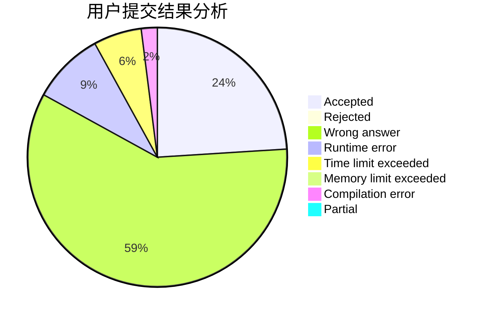
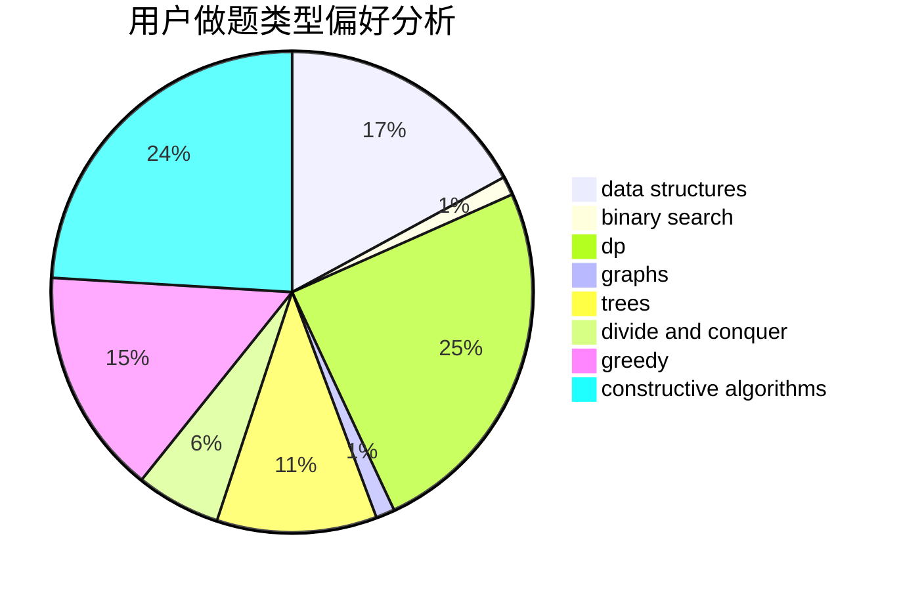
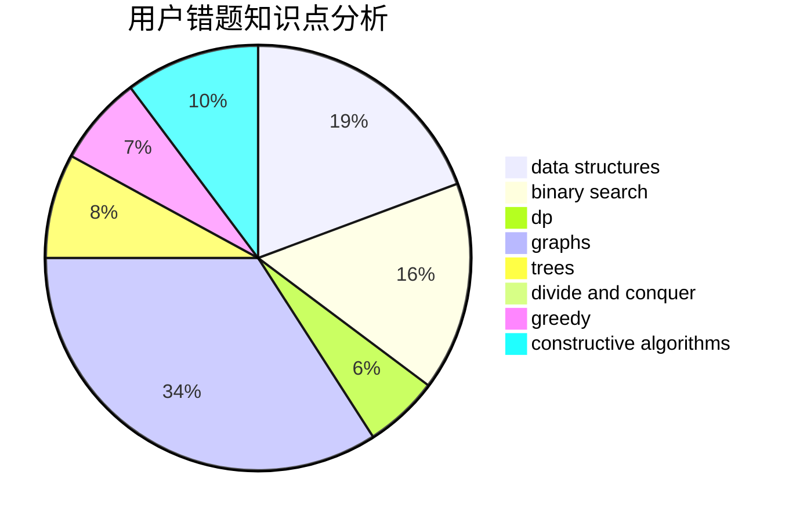

# _Happy_New_Year_

<!-- tabs:start -->

#### **用户提交结果分析**

#### **用户做题类型偏好分析**

#### **用户错题知识点分析**

<!-- tabs:end -->
# 推荐题目
[676D](https://codeforces.com/contest/676/problem/D)		graphs,
                        implementation,
                        shortest paths		  
[870A](https://codeforces.com/contest/870/problem/A)		brute force,
                        implementation		  
[1156D](https://codeforces.com/contest/1156/problem/D)		dfs and similar,
                        divide and conquer,
                        dp,
                        dsu,
                        trees		  
[528C](https://codeforces.com/contest/528/problem/C)		dsu,graphs,sortings,trees		  
[804D](https://codeforces.com/contest/804/problem/D)		binary search,
                        brute force,
                        dfs and similar,
                        dp,
                        sortings,
                        trees		  
[803B](https://codeforces.com/contest/803/problem/B)		constructive algorithms		  
[967B](https://codeforces.com/contest/967/problem/B)		math,
                        sortings		  
[908C](https://codeforces.com/contest/908/problem/C)		brute force,
                        geometry,
                        implementation,
                        math		  
[683A](https://codeforces.com/contest/683/problem/A)		*special problem,
                        geometry		  
[438B](https://codeforces.com/contest/438/problem/B)		dsu,graphs,sortings,trees		  
