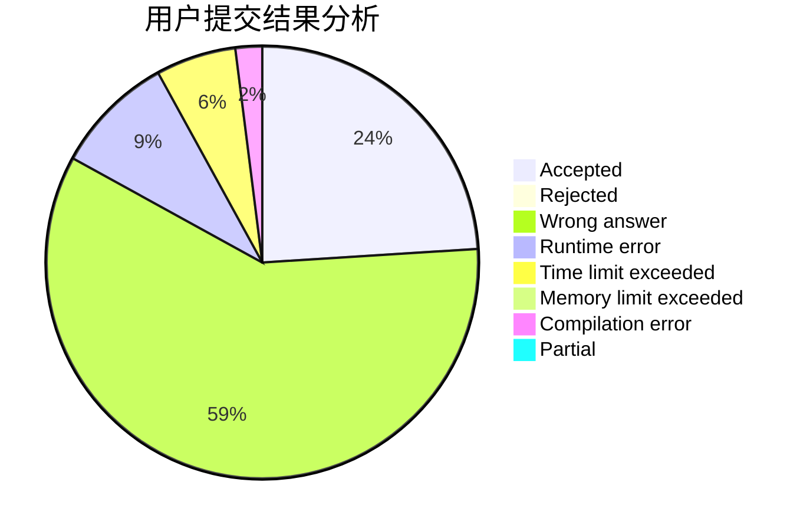
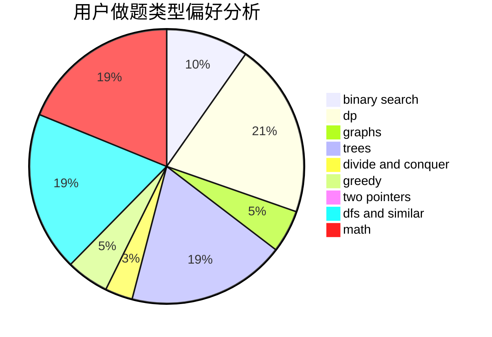

# _Happy_New_Year_

<!-- tabs:start -->

#### **用户提交结果分析**

#### **用户做题类型偏好分析**

<!-- tabs:end -->
# 推荐题目
[676D](https://codeforces.com/contest/676/problem/D)
[870A](https://codeforces.com/contest/870/problem/A)
[1156D](https://codeforces.com/contest/1156/problem/D)
[528C](https://codeforces.com/contest/528/problem/C)
[804D](https://codeforces.com/contest/804/problem/D)
[803B](https://codeforces.com/contest/803/problem/B)
[967B](https://codeforces.com/contest/967/problem/B)
[908C](https://codeforces.com/contest/908/problem/C)
[683A](https://codeforces.com/contest/683/problem/A)
[438B](https://codeforces.com/contest/438/problem/B)
