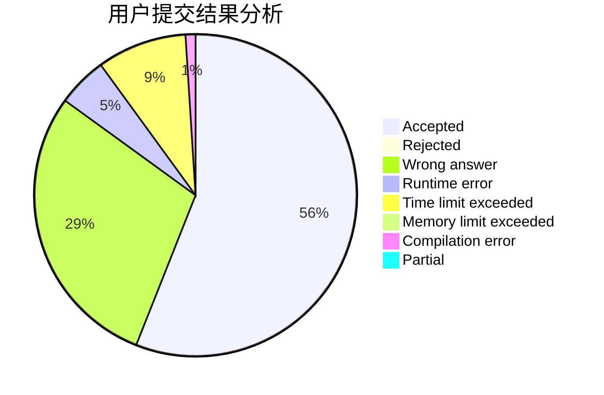
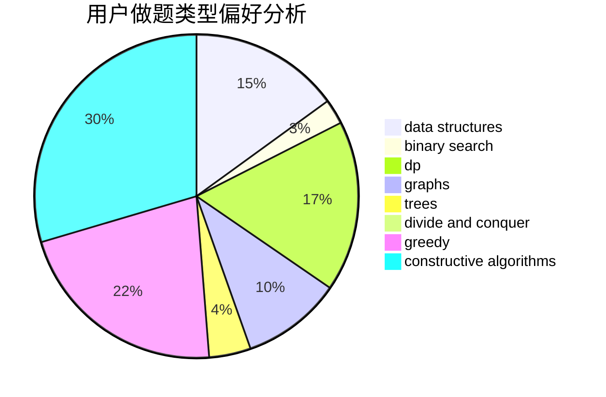
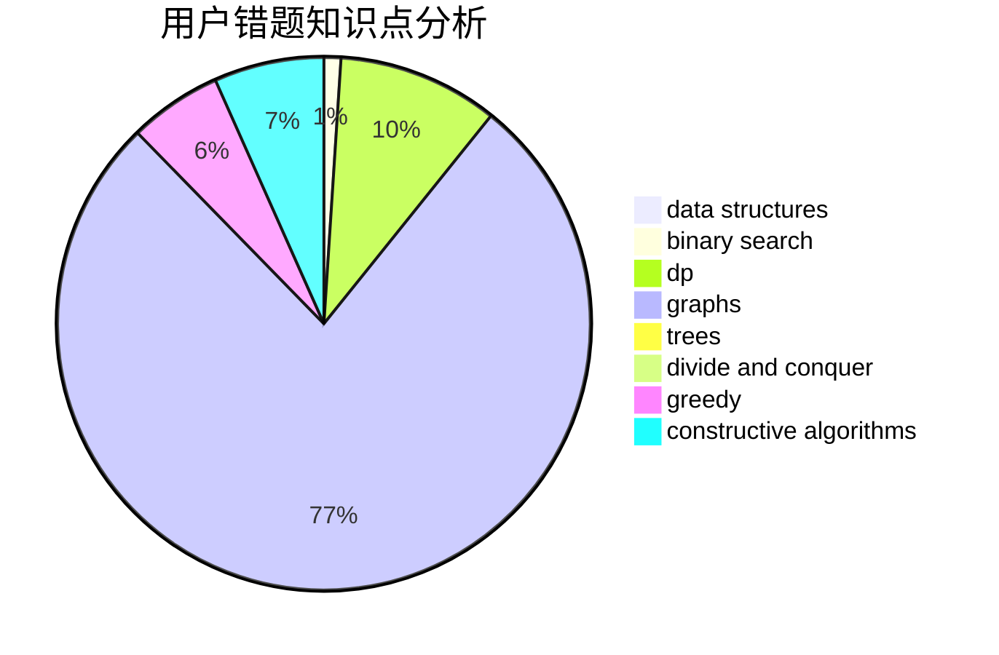

# _Isaunoya_

<!-- tabs:start -->

#### **用户提交结果分析**

#### **用户做题类型偏好分析**

#### **用户错题知识点分析**

<!-- tabs:end -->
# 推荐题目
[1484C](https://codeforces.com/contest/1484/problem/C)		dsu,graphs,sortings,trees		  
[1164S](https://codeforces.com/contest/1164/problem/S)		dsu,graphs,sortings,trees		  
[522C](https://codeforces.com/contest/522/problem/C)		greedy		  
[1387C](https://codeforces.com/contest/1387/problem/C)		*special problem,
                        dp,
                        shortest paths,
                        string suffix structures		  
[276E](https://codeforces.com/contest/276/problem/E)		data structures,
                        graphs,
                        trees		  
[317E](https://codeforces.com/contest/317/problem/E)		constructive algorithms,
                        shortest paths		  
[13561](https://codeforces.com/contest/1356/problem/1)		dsu,graphs,sortings,trees		  
[1411D](https://codeforces.com/contest/1411/problem/D)		brute force,
                        greedy,
                        implementation,
                        strings		  
[476C](https://codeforces.com/contest/476/problem/C)		math		  
[1045C](https://codeforces.com/contest/1045/problem/C)		dfs and similar,
                        graphs,
                        trees		  
