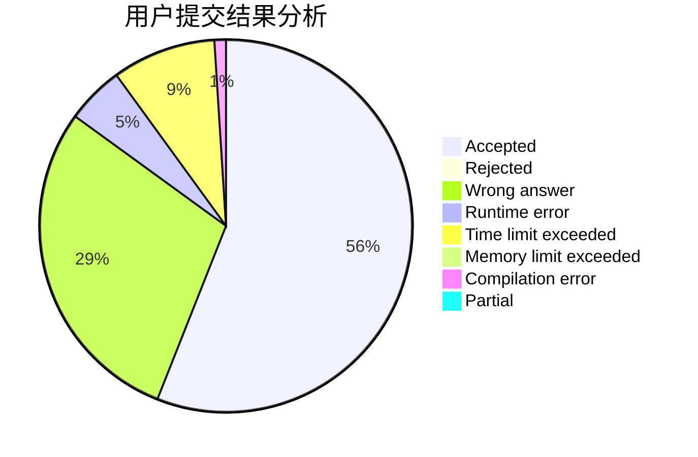
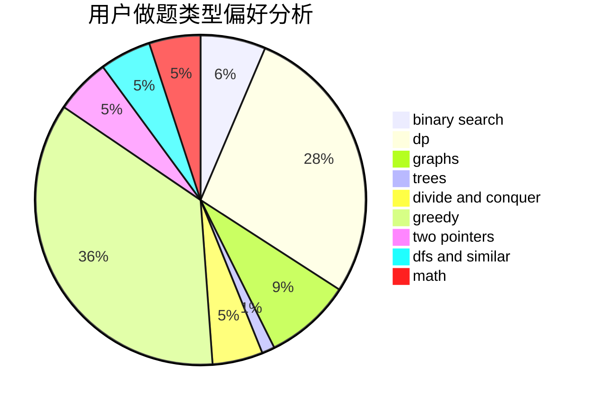

# _Isaunoya_

<!-- tabs:start -->

#### **用户提交结果分析**

#### **用户做题类型偏好分析**

<!-- tabs:end -->
# 推荐题目
[1484C](https://codeforces.com/contest/1484/problem/C)
[1164S](https://codeforces.com/contest/1164/problem/S)
[522C](https://codeforces.com/contest/522/problem/C)
[1387C](https://codeforces.com/contest/1387/problem/C)
[276E](https://codeforces.com/contest/276/problem/E)
[317E](https://codeforces.com/contest/317/problem/E)
[13561](https://codeforces.com/contest/1356/problem/1)
[1411D](https://codeforces.com/contest/1411/problem/D)
[476C](https://codeforces.com/contest/476/problem/C)
[1045C](https://codeforces.com/contest/1045/problem/C)
