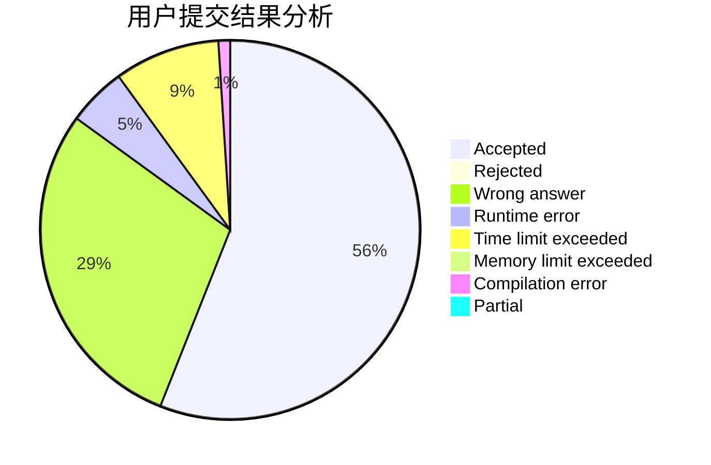
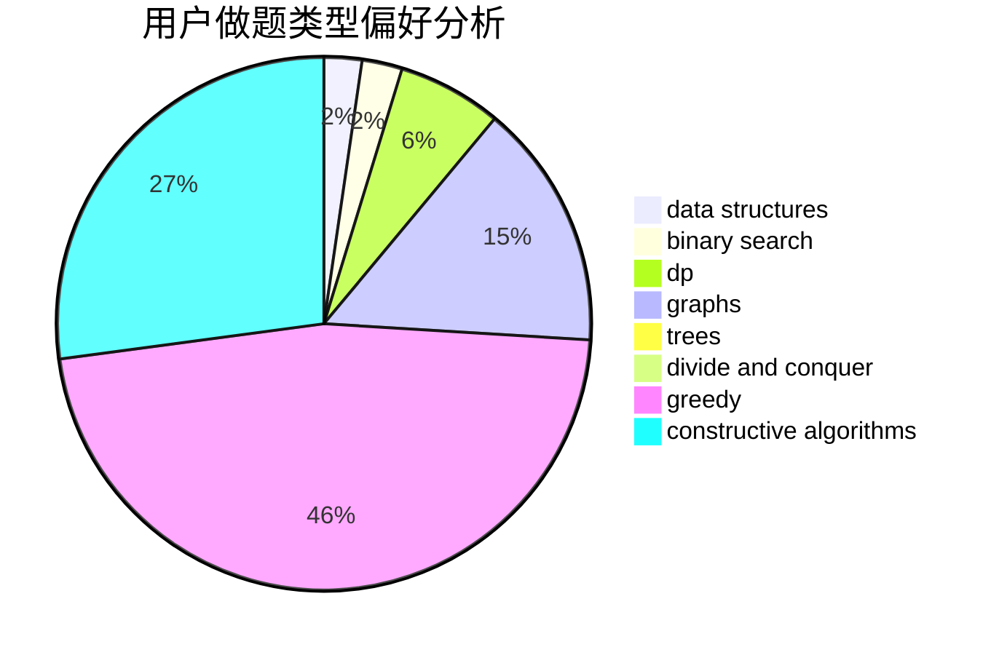
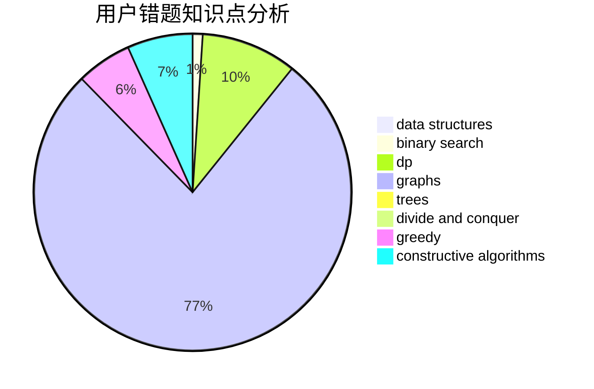

# _Isaunoya_

<!-- tabs:start -->

#### **用户提交结果分析**

#### **用户做题类型偏好分析**

#### **用户错题知识点分析**

<!-- tabs:end -->
# 推荐题目
[1475F](https://codeforces.com/contest/1475/problem/F)		2-sat,
                        brute force,
                        constructive algorithms		  
[1163C1](https://codeforces.com/contest/1163C/problem/1)		brute force,
                        geometry		  
[500F](https://codeforces.com/contest/500/problem/F)		divide and conquer,
                        dp		  
[1378A3](https://codeforces.com/contest/1378A/problem/3)		dsu,graphs,sortings,trees		  
[259D](https://codeforces.com/contest/259/problem/D)		dsu,graphs,sortings,trees		  
[2A](https://codeforces.com/contest/2/problem/A)		hashing,
                        implementation		  
[1349C](https://codeforces.com/contest/1349/problem/C)		dfs and similar,
                        graphs,
                        implementation,
                        shortest paths		  
[1401B](https://codeforces.com/contest/1401/problem/B)		constructive algorithms,
                        greedy,
                        math		  
[455B](https://codeforces.com/contest/455/problem/B)		dfs and similar,
                        dp,
                        games,
                        implementation,
                        strings,
                        trees		  
[1044B](https://codeforces.com/contest/1044/problem/B)		dfs and similar,
                        interactive,
                        trees		  
