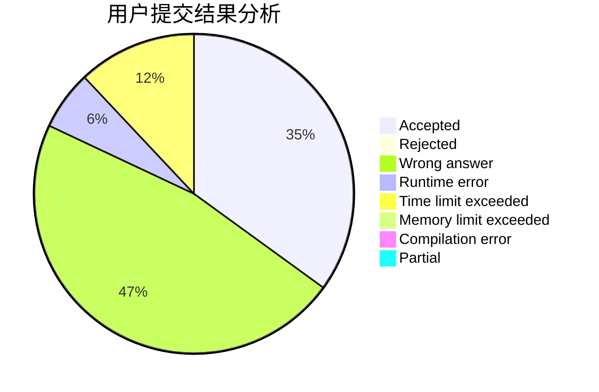
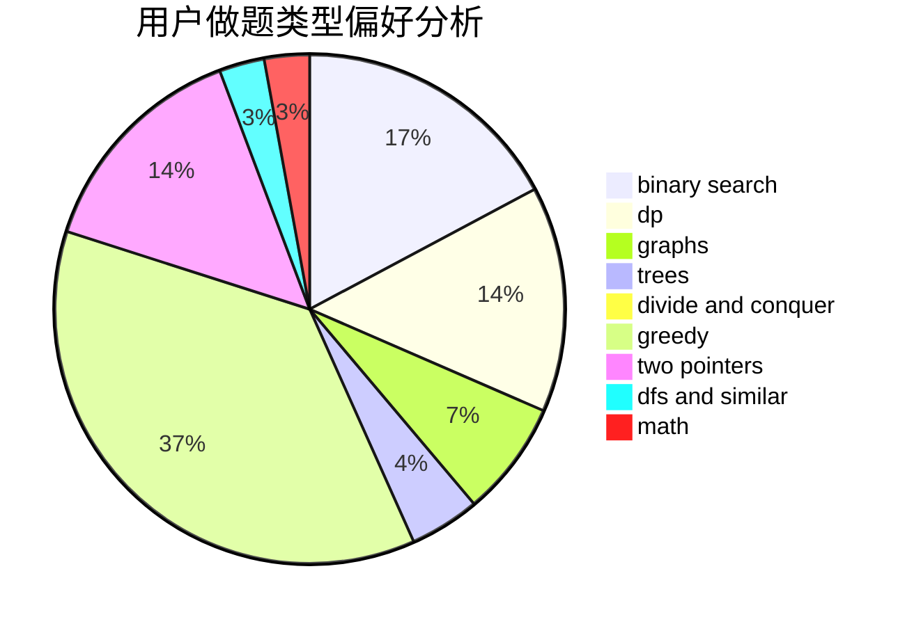

# _JJ

<!-- tabs:start -->

#### **用户提交结果分析**

#### **用户做题类型偏好分析**

<!-- tabs:end -->
# 推荐题目
[1101C](https://codeforces.com/contest/1101/problem/C)
[782E](https://codeforces.com/contest/782/problem/E)
[12471](https://codeforces.com/contest/1247/problem/1)
[1228B](https://codeforces.com/contest/1228/problem/B)
[1182C](https://codeforces.com/contest/1182/problem/C)
[1142D](https://codeforces.com/contest/1142/problem/D)
[1019C](https://codeforces.com/contest/1019/problem/C)
[845D](https://codeforces.com/contest/845/problem/D)
[109B](https://codeforces.com/contest/109/problem/B)
[279E](https://codeforces.com/contest/279/problem/E)
