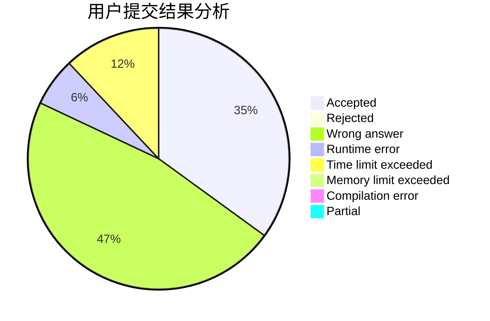
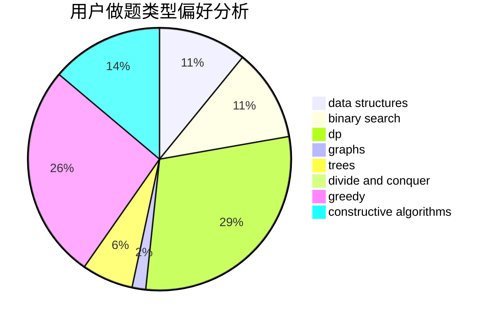
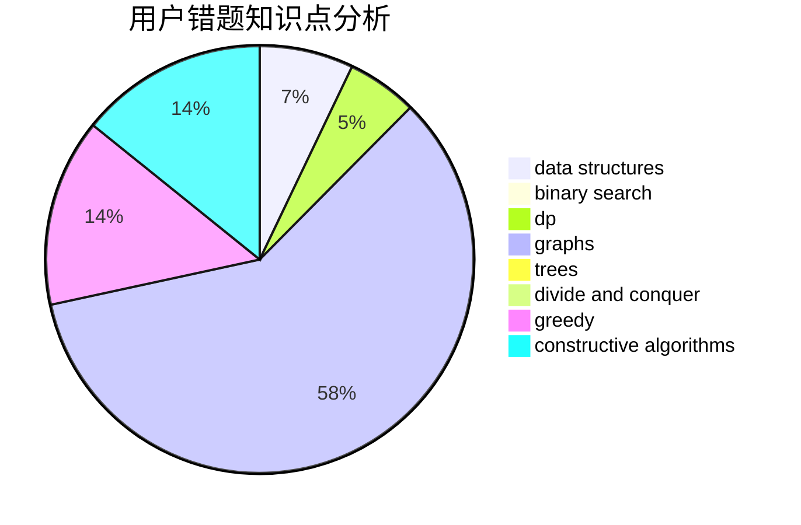

# _JJ

<!-- tabs:start -->

#### **用户提交结果分析**

#### **用户做题类型偏好分析**

#### **用户错题知识点分析**

<!-- tabs:end -->
# 推荐题目
[1100F](https://codeforces.com/contest/1100/problem/F)		data structures,
                        divide and conquer,
                        greedy,
                        math		  
[764B](https://codeforces.com/contest/764/problem/B)		constructive algorithms,
                        implementation		  
[1241C](https://codeforces.com/contest/1241/problem/C)		dsu,graphs,sortings,trees		  
[1220B](https://codeforces.com/contest/1220/problem/B)		math,
                        number theory		  
[1179D](https://codeforces.com/contest/1179/problem/D)		data structures,
                        dp,
                        trees		  
[1140F](https://codeforces.com/contest/1140/problem/F)		data structures,
                        divide and conquer,
                        dsu		  
[1017F](https://codeforces.com/contest/1017/problem/F)		brute force,
                        math		  
[827A](https://codeforces.com/contest/827/problem/A)		data structures,
                        greedy,
                        sortings,
                        strings		  
[1099E](https://codeforces.com/contest/1099/problem/E)		dsu,graphs,sortings,trees		  
[261B](https://codeforces.com/contest/261/problem/B)		dp,
                        math,
                        probabilities		  
