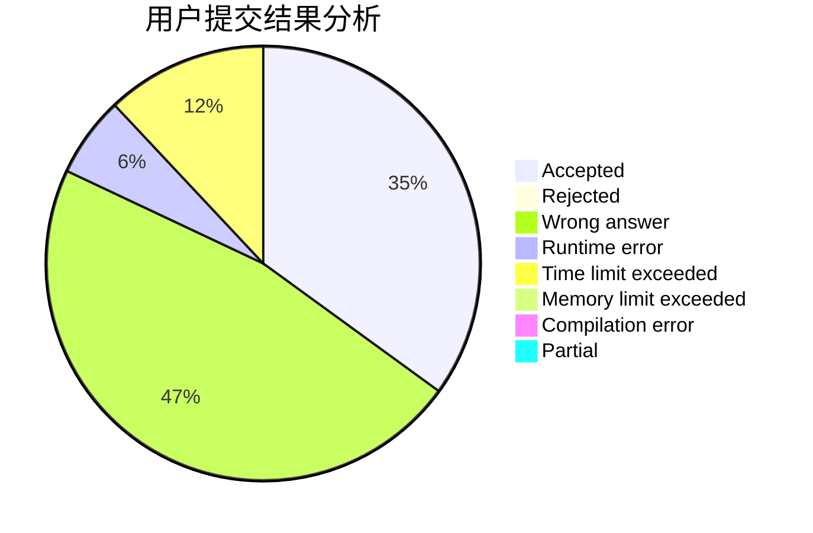
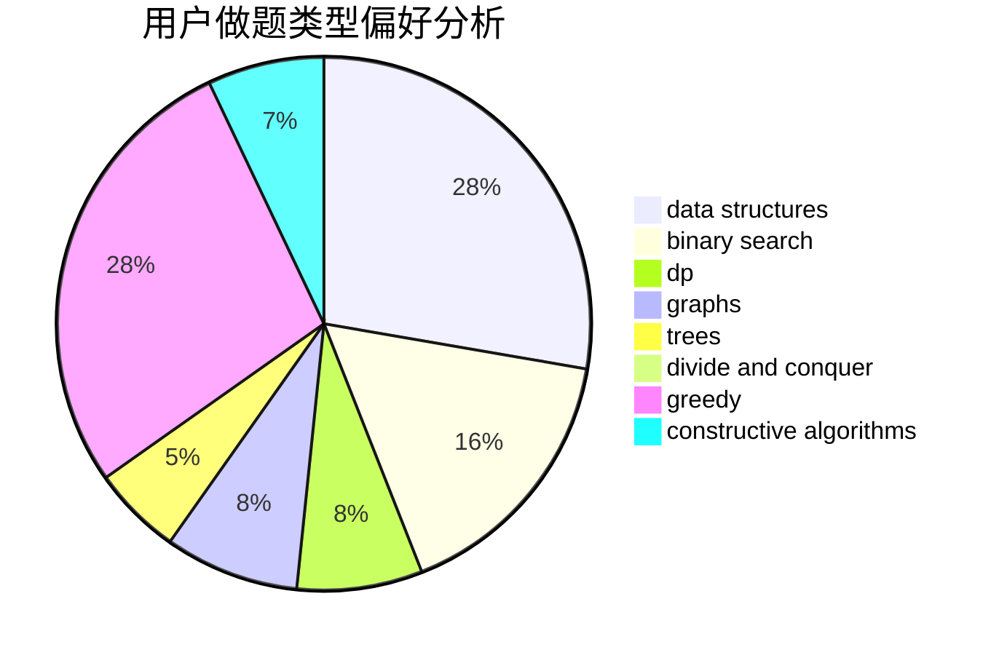
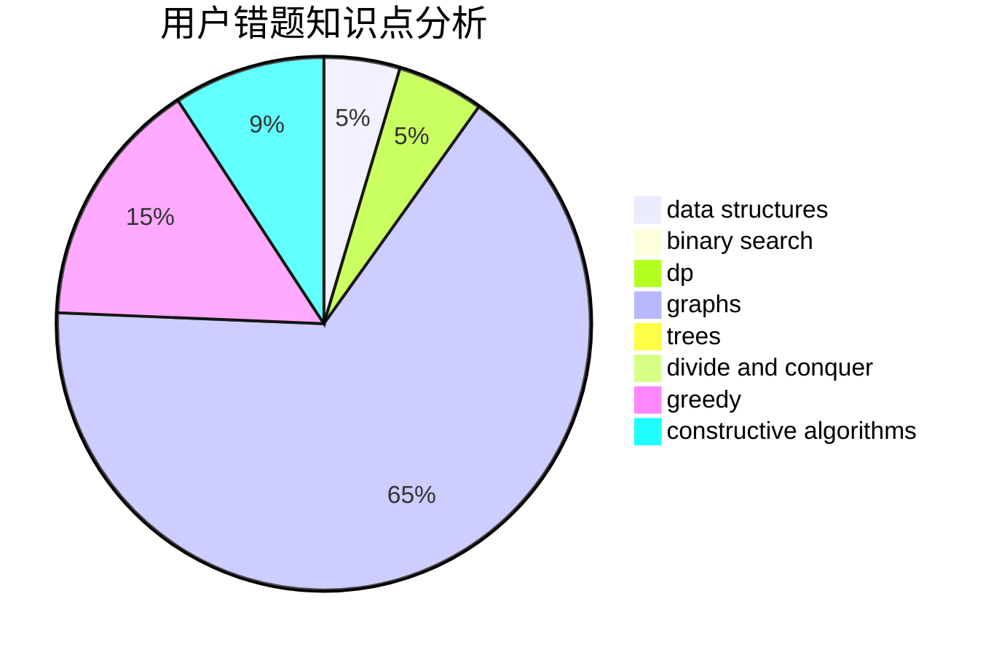

# _JJ

<!-- tabs:start -->

#### **用户提交结果分析**

#### **用户做题类型偏好分析**

#### **用户错题知识点分析**

<!-- tabs:end -->
# 推荐题目
[1101C](https://codeforces.com/contest/1101/problem/C)		sortings		  
[782E](https://codeforces.com/contest/782/problem/E)		dsu,graphs,sortings,trees		  
[12471](https://codeforces.com/contest/1247/problem/1)		dsu,graphs,sortings,trees		  
[1228B](https://codeforces.com/contest/1228/problem/B)		implementation,
                        math		  
[1182C](https://codeforces.com/contest/1182/problem/C)		data structures,
                        greedy,
                        strings		  
[1142D](https://codeforces.com/contest/1142/problem/D)		dp		  
[1019C](https://codeforces.com/contest/1019/problem/C)		constructive algorithms,
                        graphs		  
[845D](https://codeforces.com/contest/845/problem/D)		data structures,
                        dp,
                        greedy		  
[109B](https://codeforces.com/contest/109/problem/B)		brute force,
                        probabilities		  
[279E](https://codeforces.com/contest/279/problem/E)		dp,
                        games,
                        greedy,
                        number theory		  
