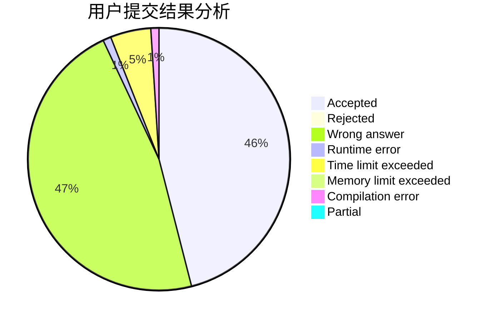
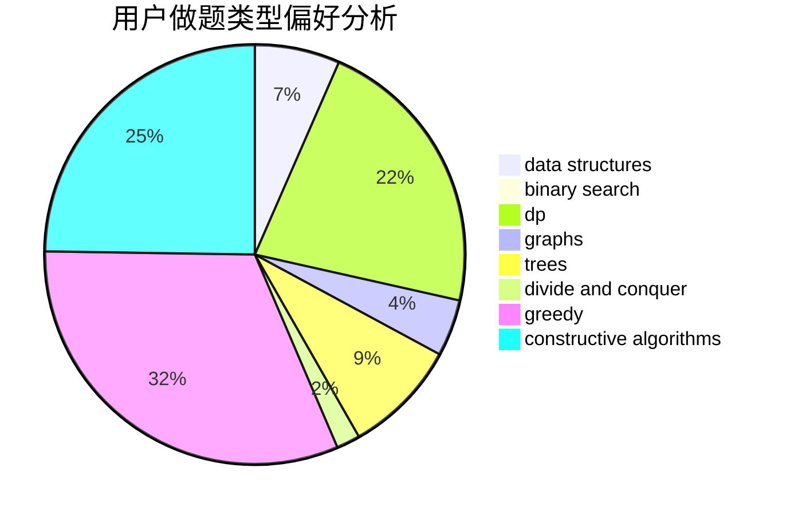
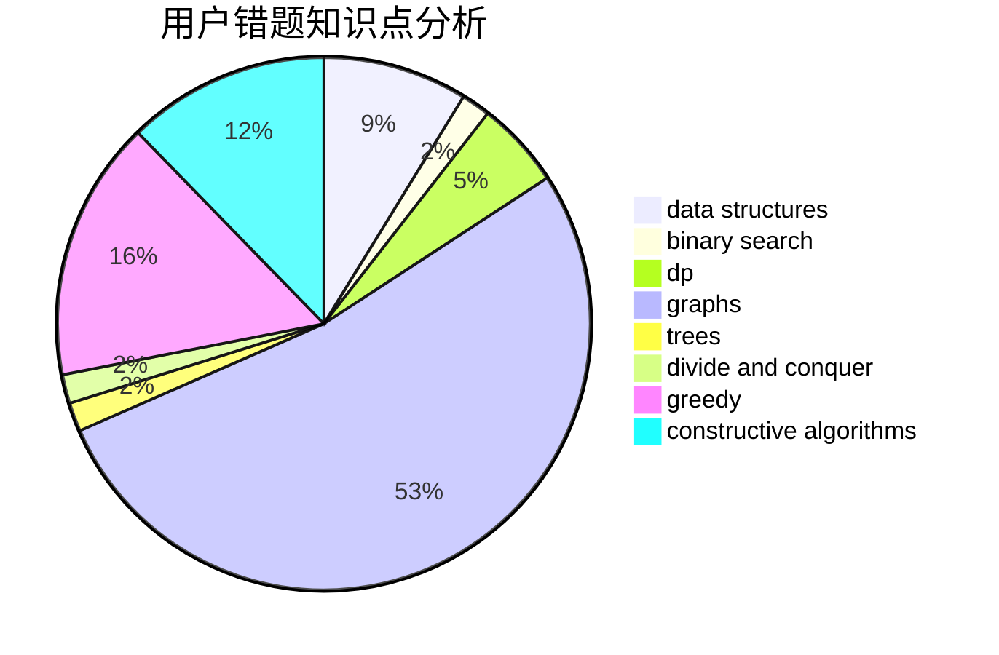

# _JY

<!-- tabs:start -->

#### **用户提交结果分析**

#### **用户做题类型偏好分析**

#### **用户错题知识点分析**

<!-- tabs:end -->
# 推荐题目
[1099F](https://codeforces.com/contest/1099/problem/F)		binary search,
                        data structures,
                        dfs and similar,
                        dp,
                        games,
                        trees		  
[377B](https://codeforces.com/contest/377/problem/B)		binary search,
                        data structures,
                        greedy,
                        sortings		  
[992D](https://codeforces.com/contest/992/problem/D)		brute force,
                        implementation,
                        math		  
[884A](https://codeforces.com/contest/884/problem/A)		implementation		  
[843D](https://codeforces.com/contest/843/problem/D)		graphs,
                        shortest paths		  
[598C](https://codeforces.com/contest/598/problem/C)		geometry,
                        sortings		  
[287C](https://codeforces.com/contest/287/problem/C)		dsu,graphs,sortings,trees		  
[356A](https://codeforces.com/contest/356/problem/A)		data structures,
                        dsu		  
[1060A](https://codeforces.com/contest/1060/problem/A)		brute force		  
[659E](https://codeforces.com/contest/659/problem/E)		data structures,
                        dfs and similar,
                        dsu,
                        graphs,
                        greedy		  
