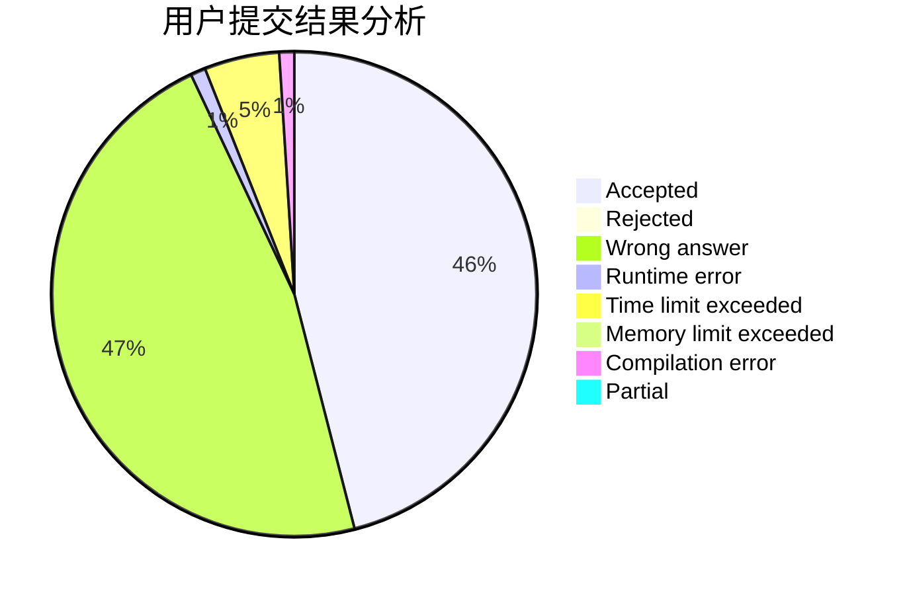
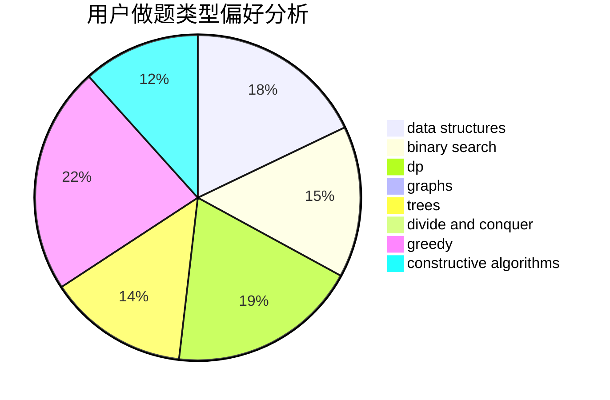
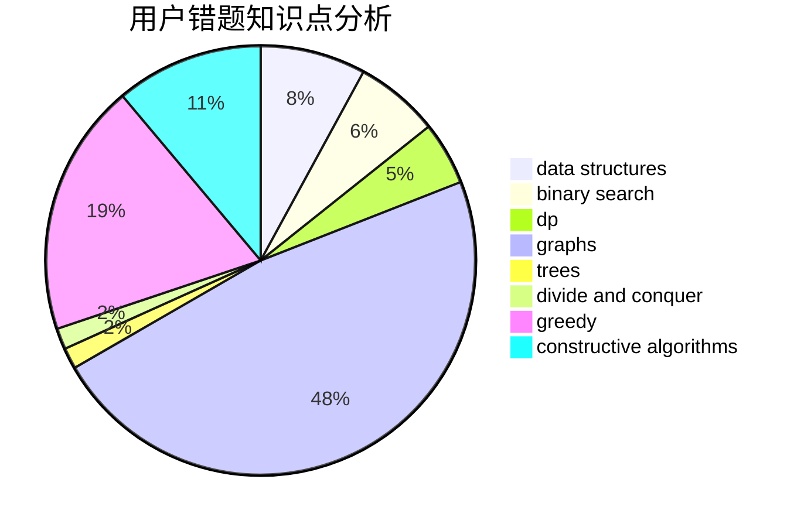

# _JY

<!-- tabs:start -->

#### **用户提交结果分析**

#### **用户做题类型偏好分析**

#### **用户错题知识点分析**

<!-- tabs:end -->
# 推荐题目
[1099C](https://codeforces.com/contest/1099/problem/C)		constructive algorithms,
                        implementation		  
[34D](https://codeforces.com/contest/34/problem/D)		dfs and similar,
                        graphs		  
[978F](https://codeforces.com/contest/978/problem/F)		binary search,
                        data structures,
                        implementation		  
[864D](https://codeforces.com/contest/864/problem/D)		greedy,
                        implementation,
                        math		  
[825C](https://codeforces.com/contest/825/problem/C)		greedy,
                        implementation		  
[576C](https://codeforces.com/contest/576/problem/C)		constructive algorithms,
                        divide and conquer,
                        geometry,
                        greedy,
                        sortings		  
[271A](https://codeforces.com/contest/271/problem/A)		brute force		  
[325E](https://codeforces.com/contest/325/problem/E)		combinatorics,
                        dfs and similar,
                        dsu,
                        graphs,
                        greedy		  
[1059D](https://codeforces.com/contest/1059/problem/D)		binary search,
                        geometry,
                        ternary search		  
[629E](https://codeforces.com/contest/629/problem/E)		combinatorics,
                        data structures,
                        dfs and similar,
                        dp,
                        probabilities,
                        trees		  
