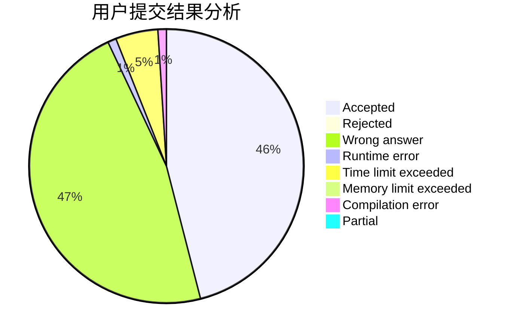
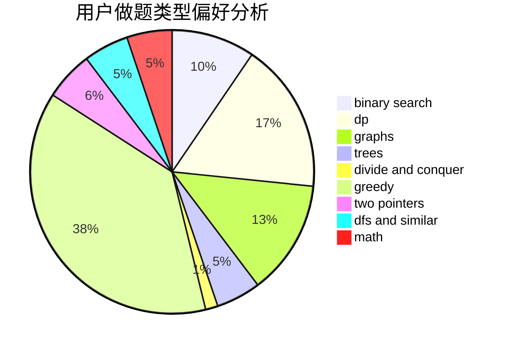

# _JY

<!-- tabs:start -->

#### **用户提交结果分析**

#### **用户做题类型偏好分析**

<!-- tabs:end -->
# 推荐题目
[1099F](https://codeforces.com/contest/1099/problem/F)
[377B](https://codeforces.com/contest/377/problem/B)
[992D](https://codeforces.com/contest/992/problem/D)
[884A](https://codeforces.com/contest/884/problem/A)
[843D](https://codeforces.com/contest/843/problem/D)
[598C](https://codeforces.com/contest/598/problem/C)
[287C](https://codeforces.com/contest/287/problem/C)
[356A](https://codeforces.com/contest/356/problem/A)
[1060A](https://codeforces.com/contest/1060/problem/A)
[659E](https://codeforces.com/contest/659/problem/E)
