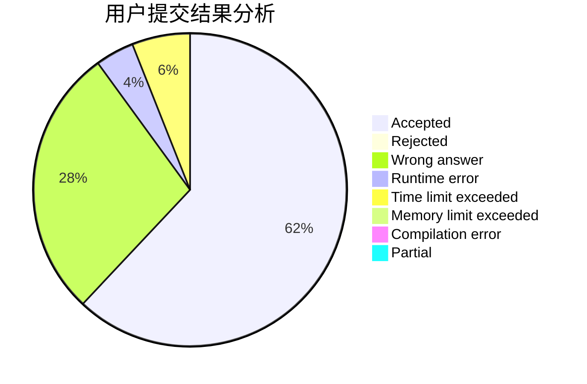
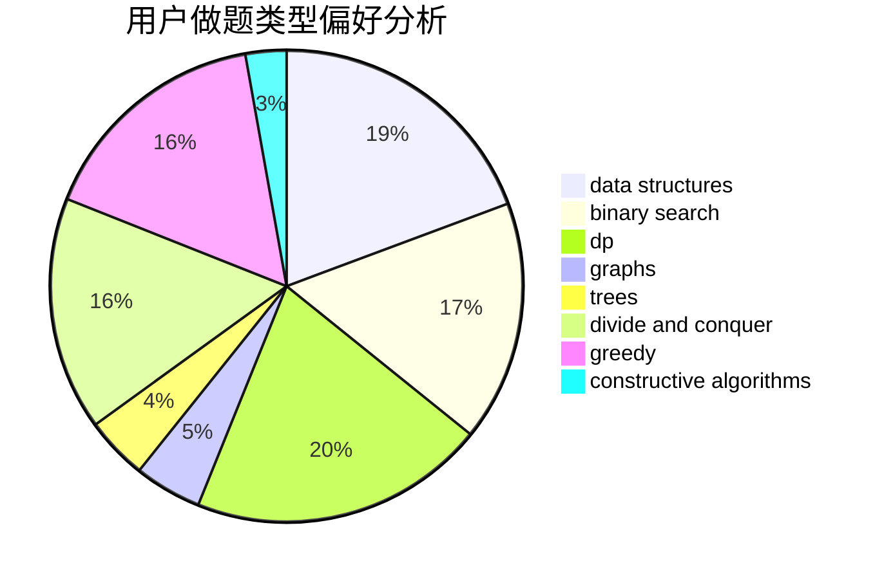
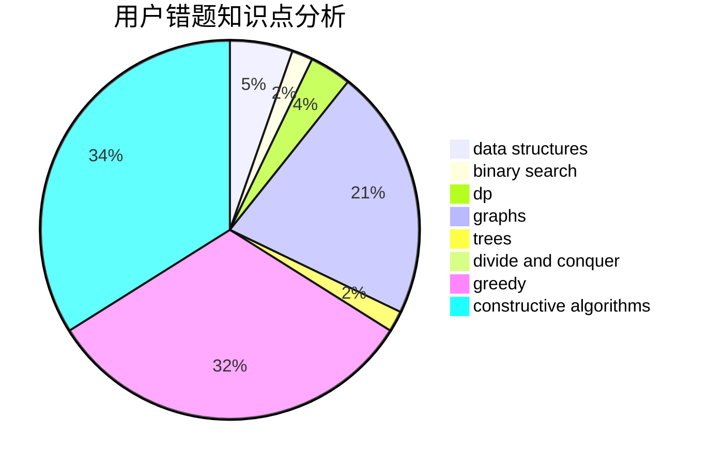

# _Karry5307_
<!-- tabs:start -->
#### **用户提交结果分析**

#### **用户做题类型偏好分析**

#### **用户错题知识点分析**

<!-- tabs:end -->
# 推荐题目
[Points on the line](http://codeforces.com/problemset/problem/940/A)		brute force,
                        greedy,
                        sortings		  
[Andryusha and Nervous Barriers](https://codeforces.com/contest/781/problem/E)		data structures,
                        dp		  
[Move Brackets](http://codeforces.com/problemset/problem/1374/C)		greedy,
                        strings		  
[Collective Mindsets (medium)](http://codeforces.com/problemset/problem/690/A2)		nan		  
[Megacity](http://codeforces.com/problemset/problem/424/B)		binary search,
                        greedy,
                        implementation,
                        sortings		  
[Tricky Sum](http://codeforces.com/problemset/problem/598/A)		math		  
[Pluses everywhere](http://codeforces.com/problemset/problem/520/E)		combinatorics,
                        dp,
                        math,
                        number theory		  
[Important Exam](http://codeforces.com/problemset/problem/1201/A)		implementation,
                        strings		  
[Two-Paths](http://codeforces.com/problemset/problem/1000/G)		data structures,
                        dp,
                        trees		  
[Line](http://codeforces.com/problemset/problem/7/C)		math,
                        number theory		  
<!-- tabs:start -->
#### **data structures**
[Points on the line](https://codeforces.com/contest/781/problem/E)		data structures,
                        dp		  
[Andryusha and Nervous Barriers](http://codeforces.com/problemset/problem/1000/G)		data structures,
                        dp,
                        trees		  
[Move Brackets](https://codeforces.com/contest/1432/problem/D)		data structures,
                        dp,
                        strings		  
[Collective Mindsets (medium)](http://codeforces.com/problemset/problem/766/D)		data structures,
                        dfs and similar,
                        dp,
                        dsu,
                        graphs		  
[Megacity](https://codeforces.com/contest/831/problem/E)		data structures,
                        implementation,
                        sortings		  
[Tricky Sum](http://codeforces.com/problemset/problem/877/E)		bitmasks,
                        data structures,
                        trees		  
[Pluses everywhere](http://codeforces.com/problemset/problem/1137/E)		data structures,
                        greedy		  
[Important Exam](http://codeforces.com/problemset/problem/980/E)		data structures,
                        greedy,
                        trees		  
[Two-Paths](http://codeforces.com/problemset/problem/1172/E)		data structures		  
[Line](https://codeforces.com/contest/1483/problem/F)		data structures,
                        string suffix structures,
                        trees		  
#### **binary search**
[Points on the line](http://codeforces.com/problemset/problem/424/B)		binary search,
                        greedy,
                        implementation,
                        sortings		  
[Andryusha and Nervous Barriers](http://codeforces.com/problemset/problem/611/F)		binary search,
                        implementation		  
[Move Brackets](http://codeforces.com/problemset/problem/750/A)		binary search,
                        brute force,
                        implementation,
                        math		  
[Collective Mindsets (medium)](http://codeforces.com/problemset/problem/1111/C)		binary search,
                        brute force,
                        divide and conquer,
                        math		  
[Megacity](https://codeforces.com/contest/937/problem/C)		binary search,
                        implementation,
                        math		  
[Tricky Sum](http://codeforces.com/problemset/problem/862/E)		binary search,
                        data structures,
                        sortings		  
[Pluses everywhere](http://codeforces.com/problemset/problem/616/D)		binary search,
                        data structures,
                        two pointers		  
[Important Exam](http://codeforces.com/problemset/problem/1492/C)		binary search,
                        data structures,
                        dp,
                        greedy,
                        two pointers		  
[Two-Paths](http://codeforces.com/problemset/problem/1463/D)		binary search,
                        constructive algorithms,
                        greedy,
                        two pointers		  
[Line](http://codeforces.com/problemset/problem/1490/G)		binary search,
                        data structures,
                        math		  
#### **dp**
[Points on the line](https://codeforces.com/contest/781/problem/E)		data structures,
                        dp		  
[Andryusha and Nervous Barriers](http://codeforces.com/problemset/problem/520/E)		combinatorics,
                        dp,
                        math,
                        number theory		  
[Move Brackets](http://codeforces.com/problemset/problem/1000/G)		data structures,
                        dp,
                        trees		  
[Collective Mindsets (medium)](http://codeforces.com/problemset/problem/138/D)		dp,
                        games		  
[Megacity](http://codeforces.com/problemset/problem/850/D)		constructive algorithms,
                        dp,
                        graphs,
                        greedy,
                        math		  
[Tricky Sum](https://codeforces.com/contest/1432/problem/D)		data structures,
                        dp,
                        strings		  
[Pluses everywhere](http://codeforces.com/problemset/problem/766/D)		data structures,
                        dfs and similar,
                        dp,
                        dsu,
                        graphs		  
[Important Exam](http://codeforces.com/problemset/problem/10/B)		dp,
                        implementation		  
[Two-Paths](https://codeforces.com/contest/506/problem/A)		dfs and similar,
                        dp,
                        two pointers		  
[Line](http://codeforces.com/problemset/problem/932/G)		dp,
                        string suffix structures,
                        strings		  
#### **graph**
[Points on the line](http://codeforces.com/problemset/problem/212/A)		flows,
                        graphs		  
[Andryusha and Nervous Barriers](http://codeforces.com/problemset/problem/850/D)		constructive algorithms,
                        dp,
                        graphs,
                        greedy,
                        math		  
[Move Brackets](http://codeforces.com/problemset/problem/114/B)		bitmasks,
                        brute force,
                        graphs		  
[Collective Mindsets (medium)](http://codeforces.com/problemset/problem/766/D)		data structures,
                        dfs and similar,
                        dp,
                        dsu,
                        graphs		  
[Megacity](http://codeforces.com/problemset/problem/1450/E)		constructive algorithms,
                        dfs and similar,
                        graphs,
                        shortest paths		  
[Tricky Sum](http://codeforces.com/problemset/problem/1408/E)		data structures,
                        dsu,
                        graphs,
                        greedy,
                        sortings,
                        trees		  
[Pluses everywhere](http://codeforces.com/problemset/problem/1487/C)		brute force,
                        constructive algorithms,
                        dfs and similar,
                        graphs,
                        greedy,
                        implementation,
                        math		  
[Important Exam](http://codeforces.com/problemset/problem/1437/C)		dp,
                        flows,
                        graph matchings,
                        greedy,
                        math,
                        sortings		  
[Two-Paths](http://codeforces.com/problemset/problem/1470/D)		constructive algorithms,
                        dfs and similar,
                        graph matchings,
                        graphs,
                        greedy		  
[Line](http://codeforces.com/problemset/problem/1476/C)		dp,
                        graphs,
                        greedy		  
#### **trees**
[Points on the line](http://codeforces.com/problemset/problem/1000/G)		data structures,
                        dp,
                        trees		  
[Andryusha and Nervous Barriers](http://codeforces.com/problemset/problem/750/F)		constructive algorithms,
                        implementation,
                        interactive,
                        trees		  
[Move Brackets](http://codeforces.com/problemset/problem/877/E)		bitmasks,
                        data structures,
                        trees		  
[Collective Mindsets (medium)](http://codeforces.com/problemset/problem/980/E)		data structures,
                        greedy,
                        trees		  
[Megacity](https://codeforces.com/contest/1483/problem/F)		data structures,
                        string suffix structures,
                        trees		  
[Tricky Sum](http://codeforces.com/problemset/problem/1408/E)		data structures,
                        dsu,
                        graphs,
                        greedy,
                        sortings,
                        trees		  
[Pluses everywhere](http://codeforces.com/problemset/problem/1479/D)		binary search,
                        bitmasks,
                        brute force,
                        data structures,
                        probabilities,
                        trees		  
[Important Exam](http://codeforces.com/problemset/problem/1511/C)		brute force,
                        data structures,
                        implementation,
                        trees		  
[Two-Paths](http://codeforces.com/problemset/problem/1499/F)		combinatorics,
                        dfs and similar,
                        dp,
                        trees		  
[Line](http://codeforces.com/problemset/problem/1491/E)		brute force,
                        dfs and similar,
                        divide and conquer,
                        number theory,
                        trees		  
#### **divide and conquer**
[Points on the line](http://codeforces.com/problemset/problem/1111/C)		binary search,
                        brute force,
                        divide and conquer,
                        math		  
[Andryusha and Nervous Barriers](http://codeforces.com/problemset/problem/1461/D)		binary search,
                        brute force,
                        data structures,
                        divide and conquer,
                        implementation,
                        sortings		  
[Move Brackets](http://codeforces.com/problemset/problem/1466/G)		combinatorics,
                        divide and conquer,
                        hashing,
                        math,
                        string suffix structures,
                        strings		  
[Collective Mindsets (medium)](http://codeforces.com/problemset/problem/1490/D)		dfs and similar,
                        divide and conquer,
                        implementation		  
[Megacity](https://codeforces.com/contest/1483/problem/C)		data structures,
                        divide and conquer,
                        dp		  
[Tricky Sum](http://codeforces.com/problemset/problem/1491/E)		brute force,
                        dfs and similar,
                        divide and conquer,
                        number theory,
                        trees		  
[Pluses everywhere](http://codeforces.com/problemset/problem/1303/G)		data structures,
                        divide and conquer,
                        geometry,
                        trees		  
[Important Exam](http://codeforces.com/problemset/problem/1494/D)		constructive algorithms,
                        data structures,
                        dfs and similar,
                        divide and conquer,
                        dsu,
                        greedy,
                        sortings,
                        trees		  
[Two-Paths](http://codeforces.com/problemset/problem/1482/E)		data structures,
                        divide and conquer,
                        dp		  
[Line](http://codeforces.com/problemset/problem/566/C)		dfs and similar,
                        divide and conquer,
                        trees		  
#### **greedy**
[Points on the line](http://codeforces.com/problemset/problem/940/A)		brute force,
                        greedy,
                        sortings		  
[Andryusha and Nervous Barriers](http://codeforces.com/problemset/problem/1374/C)		greedy,
                        strings		  
[Move Brackets](http://codeforces.com/problemset/problem/424/B)		binary search,
                        greedy,
                        implementation,
                        sortings		  
[Collective Mindsets (medium)](http://codeforces.com/problemset/problem/850/D)		constructive algorithms,
                        dp,
                        graphs,
                        greedy,
                        math		  
[Megacity](http://codeforces.com/problemset/problem/319/D)		greedy,
                        hashing,
                        string suffix structures,
                        strings		  
[Tricky Sum](http://codeforces.com/problemset/problem/730/D)		greedy,
                        implementation,
                        math		  
[Pluses everywhere](http://codeforces.com/problemset/problem/540/B)		greedy,
                        implementation		  
[Important Exam](http://codeforces.com/problemset/problem/1062/C)		greedy,
                        implementation,
                        math		  
[Two-Paths](http://codeforces.com/problemset/problem/1287/A)		greedy,
                        implementation		  
[Line](http://codeforces.com/problemset/problem/1009/B)		greedy,
                        implementation		  
#### **constructive algorithms**
[Points on the line](http://codeforces.com/problemset/problem/850/D)		constructive algorithms,
                        dp,
                        graphs,
                        greedy,
                        math		  
[Andryusha and Nervous Barriers](http://codeforces.com/problemset/problem/912/B)		bitmasks,
                        constructive algorithms,
                        number theory		  
[Move Brackets](http://codeforces.com/problemset/problem/750/F)		constructive algorithms,
                        implementation,
                        interactive,
                        trees		  
[Collective Mindsets (medium)](https://codeforces.com/contest/668/problem/B)		brute force,
                        constructive algorithms,
                        implementation		  
[Megacity](http://codeforces.com/problemset/problem/1443/A)		constructive algorithms,
                        math		  
[Tricky Sum](http://codeforces.com/problemset/problem/1400/A)		constructive algorithms,
                        strings		  
[Pluses everywhere](http://codeforces.com/problemset/problem/1450/E)		constructive algorithms,
                        dfs and similar,
                        graphs,
                        shortest paths		  
[Important Exam](http://codeforces.com/problemset/problem/1276/C)		brute force,
                        combinatorics,
                        constructive algorithms,
                        data structures,
                        greedy,
                        math		  
[Two-Paths](http://codeforces.com/problemset/problem/1493/A)		constructive algorithms,
                        greedy		  
[Line](http://codeforces.com/problemset/problem/1463/D)		binary search,
                        constructive algorithms,
                        greedy,
                        two pointers		  
#### **sortings**
[Points on the line](http://codeforces.com/problemset/problem/940/A)		brute force,
                        greedy,
                        sortings		  
[Andryusha and Nervous Barriers](http://codeforces.com/problemset/problem/424/B)		binary search,
                        greedy,
                        implementation,
                        sortings		  
[Move Brackets](https://codeforces.com/contest/831/problem/E)		data structures,
                        implementation,
                        sortings		  
[Collective Mindsets (medium)](http://codeforces.com/problemset/problem/853/B)		greedy,
                        sortings,
                        two pointers		  
[Megacity](http://codeforces.com/problemset/problem/862/E)		binary search,
                        data structures,
                        sortings		  
[Tricky Sum](http://codeforces.com/problemset/problem/1272/A)		brute force,
                        greedy,
                        math,
                        sortings		  
[Pluses everywhere](http://codeforces.com/problemset/problem/1408/E)		data structures,
                        dsu,
                        graphs,
                        greedy,
                        sortings,
                        trees		  
[Important Exam](https://codeforces.com/contest/1496/problem/C)		geometry,
                        greedy,
                        math,
                        sortings		  
[Two-Paths](http://codeforces.com/problemset/problem/1495/A)		geometry,
                        greedy,
                        math,
                        sortings		  
[Line](http://codeforces.com/problemset/problem/1497/A)		brute force,
                        data structures,
                        greedy,
                        sortings		  
<!-- tabs:end -->
