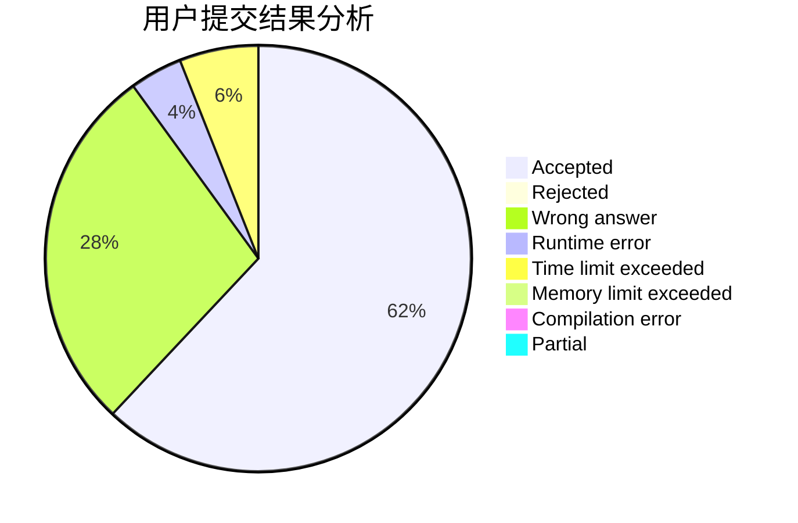
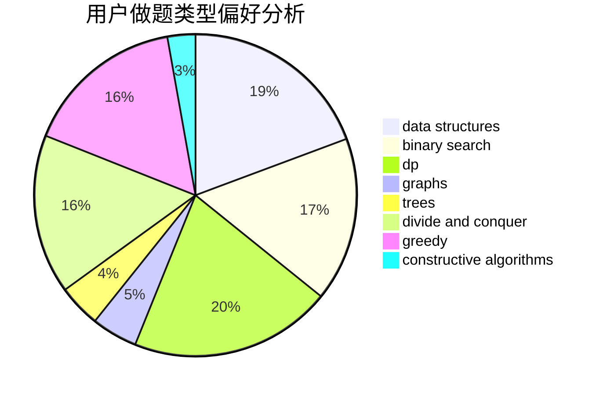
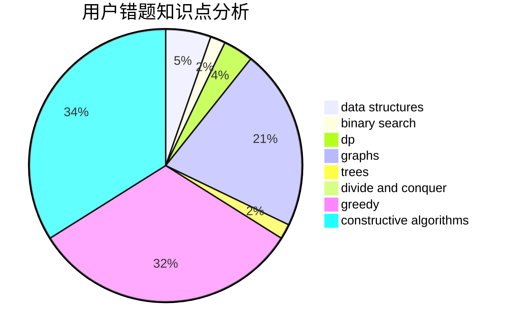

# _Karry5307_

<!-- tabs:start -->

#### **用户提交结果分析**

#### **用户做题类型偏好分析**

#### **用户错题知识点分析**

<!-- tabs:end -->
# 推荐题目
[940A](https://codeforces.com/contest/940/problem/A)		brute force,
                        greedy,
                        sortings		  
[1062C](https://codeforces.com/contest/1062/problem/C)		greedy,
                        implementation,
                        math		  
[520E](https://codeforces.com/contest/520/problem/E)		combinatorics,
                        dp,
                        math,
                        number theory		  
[781E](https://codeforces.com/contest/781/problem/E)		dsu,graphs,sortings,trees		  
[598A](https://codeforces.com/contest/598/problem/A)		math		  
[7C](https://codeforces.com/contest/7/problem/C)		math,
                        number theory		  
[109A](https://codeforces.com/contest/109/problem/A)		brute force,
                        implementation		  
[611F](https://codeforces.com/contest/611/problem/F)		binary search,
                        implementation		  
[690A2](https://codeforces.com/contest/690A/problem/2)		nan		  
[424B](https://codeforces.com/contest/424/problem/B)		binary search,
                        greedy,
                        implementation,
                        sortings		  
