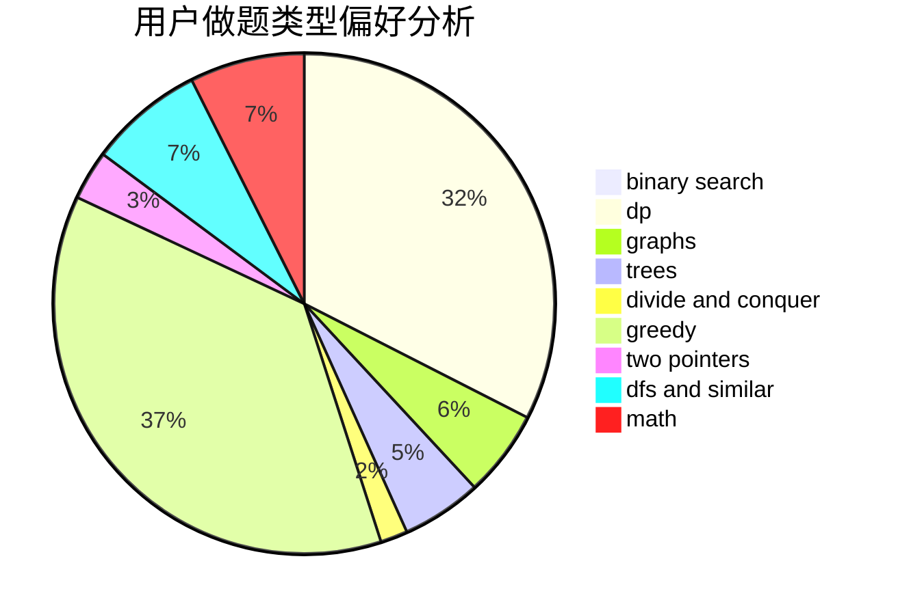

# _Karry5307_

<!-- tabs:start -->

#### **用户提交结果分析**

#### **用户做题类型偏好分析**

<!-- tabs:end -->
# 推荐题目
[961E](https://codeforces.com/contest/961/problem/E)
[1062F](https://codeforces.com/contest/1062/problem/F)
[546D](https://codeforces.com/contest/546/problem/D)
[7C](https://codeforces.com/contest/7/problem/C)
[615D](https://codeforces.com/contest/615/problem/D)
[814D](https://codeforces.com/contest/814/problem/D)
[10C](https://codeforces.com/contest/10/problem/C)
[630J](https://codeforces.com/contest/630/problem/J)
[710C](https://codeforces.com/contest/710/problem/C)
[447A](https://codeforces.com/contest/447/problem/A)
