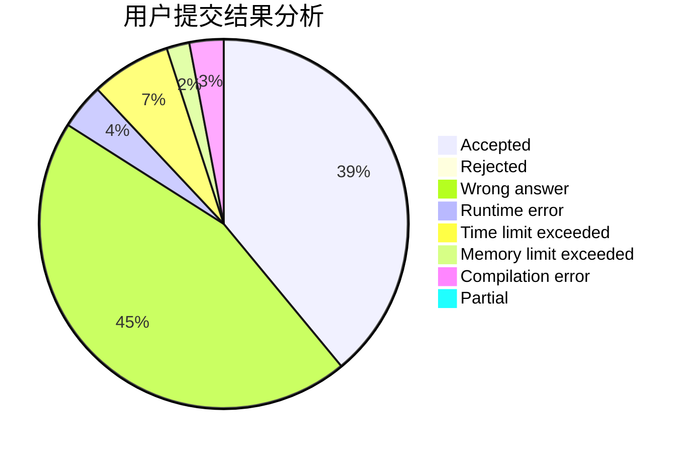
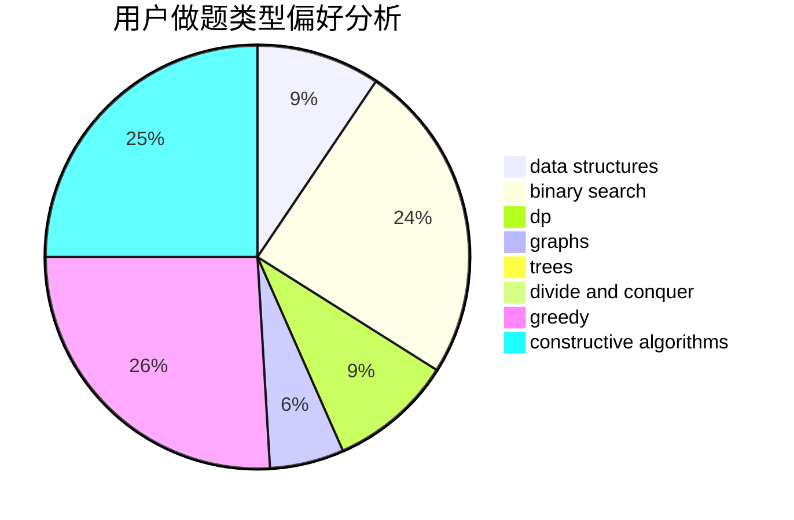

# Alphagocc

<!-- tabs:start -->

#### **用户提交结果分析**

#### **用户做题类型偏好分析**

#### **用户错题知识点分析**

<!-- tabs:end -->
# 推荐题目
[1408G](https://codeforces.com/contest/1408/problem/G)		combinatorics,
                        dp,
                        dsu,
                        fft,
                        graphs,
                        trees		  
[1228A](https://codeforces.com/contest/1228/problem/A)		brute force,
                        implementation		  
[1353D](https://codeforces.com/contest/1353/problem/D)		constructive algorithms,
                        data structures,
                        sortings		  
[285A](https://codeforces.com/contest/285/problem/A)		greedy,
                        implementation		  
[198C](https://codeforces.com/contest/198/problem/C)		binary search,
                        geometry		  
[1227F2](https://codeforces.com/contest/1227F/problem/2)		combinatorics,
                        math		  
[282E](https://codeforces.com/contest/282/problem/E)		bitmasks,
                        data structures,
                        trees		  
[1041A](https://codeforces.com/contest/1041/problem/A)		greedy,
                        implementation,
                        sortings		  
[283B](https://codeforces.com/contest/283/problem/B)		dfs and similar,
                        dp,
                        graphs		  
[283E](https://codeforces.com/contest/283/problem/E)		combinatorics,
                        data structures,
                        math		  
