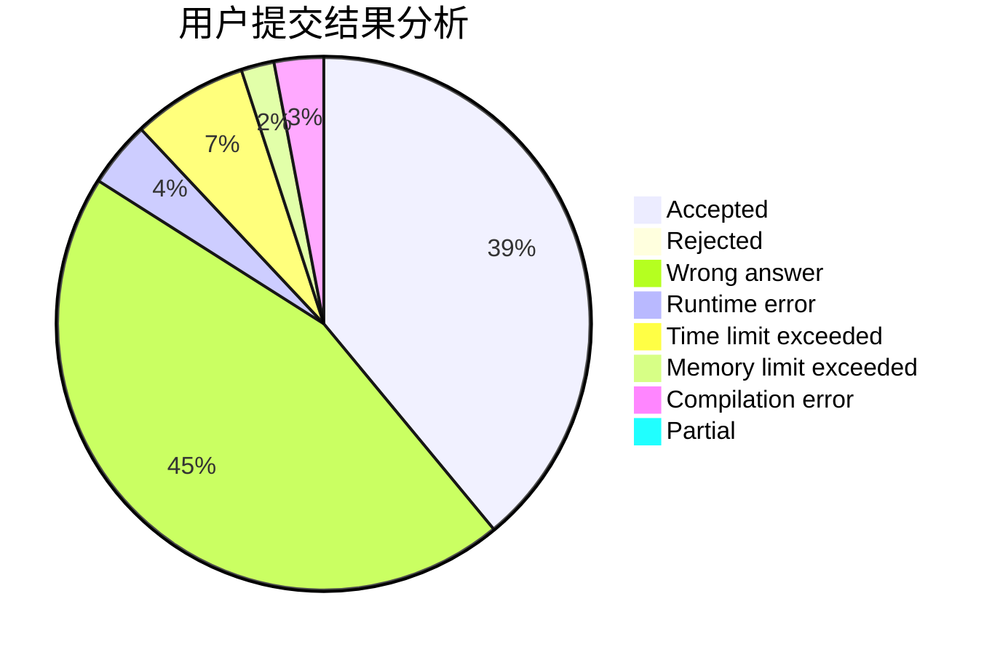
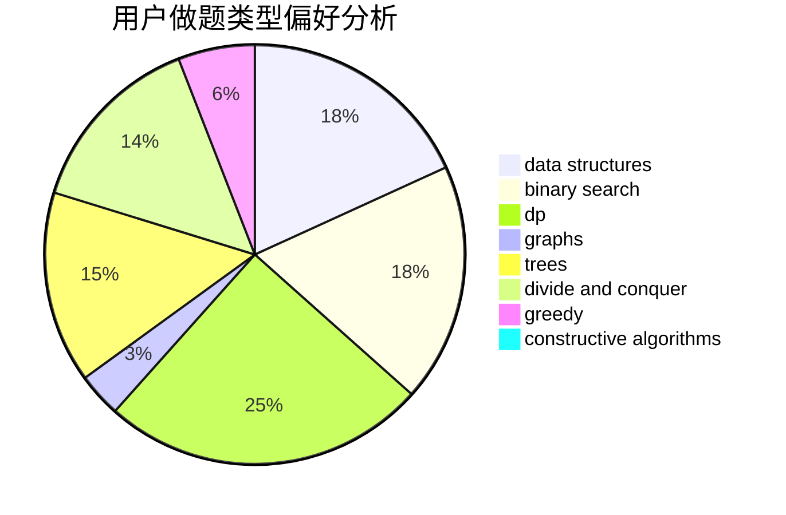
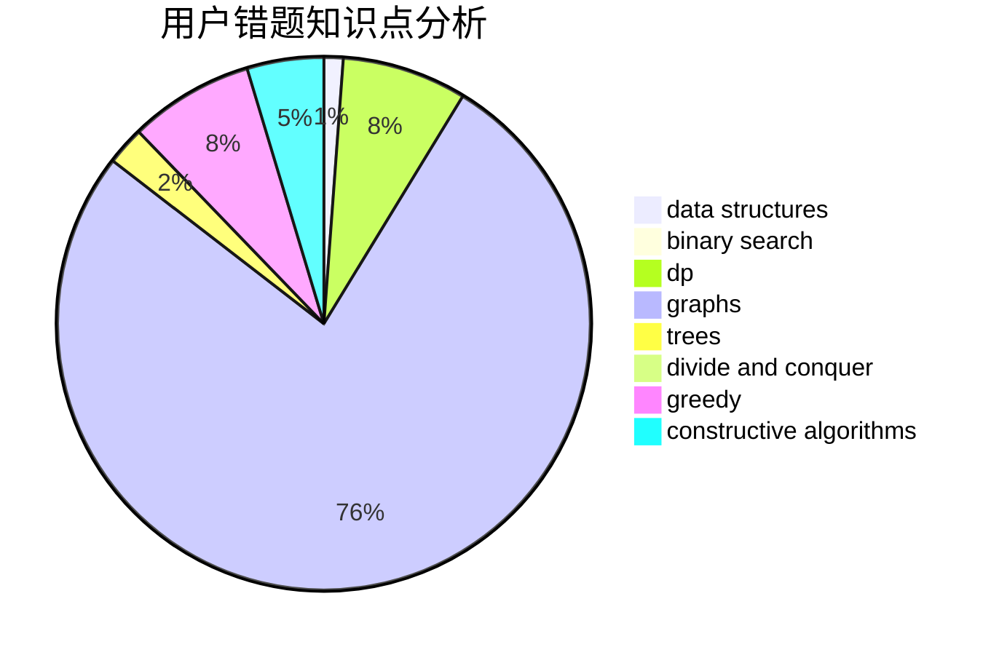

# Alphagocc

<!-- tabs:start -->

#### **用户提交结果分析**

#### **用户做题类型偏好分析**

#### **用户错题知识点分析**

<!-- tabs:end -->
# 推荐题目
[1419B](https://codeforces.com/contest/1419/problem/B)		brute force,
                        constructive algorithms,
                        greedy,
                        implementation,
                        math		  
[12371](https://codeforces.com/contest/1237/problem/1)		dsu,graphs,sortings,trees		  
[1360B](https://codeforces.com/contest/1360/problem/B)		greedy,
                        sortings		  
[2C](https://codeforces.com/contest/2/problem/C)		geometry		  
[21C](https://codeforces.com/contest/21/problem/C)		binary search,
                        dp,
                        sortings		  
[1236D](https://codeforces.com/contest/1236/problem/D)		brute force,
                        data structures,
                        greedy,
                        implementation		  
[299C](https://codeforces.com/contest/299/problem/C)		dsu,graphs,sortings,trees		  
[1041D](https://codeforces.com/contest/1041/problem/D)		binary search,
                        data structures,
                        two pointers		  
[29B](https://codeforces.com/contest/29/problem/B)		implementation		  
[29E](https://codeforces.com/contest/29/problem/E)		graphs,
                        shortest paths		  
