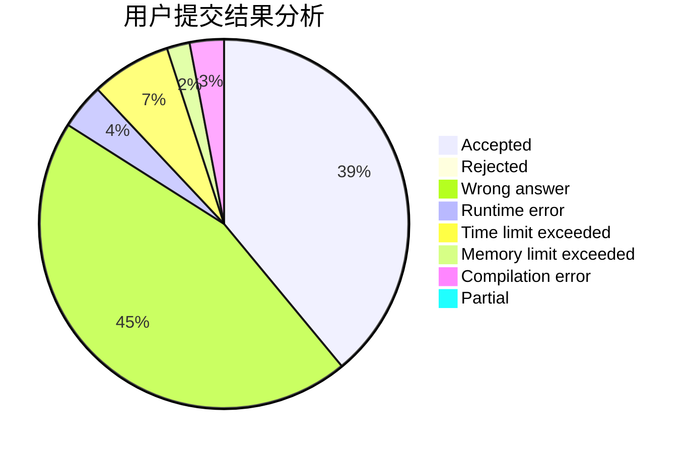
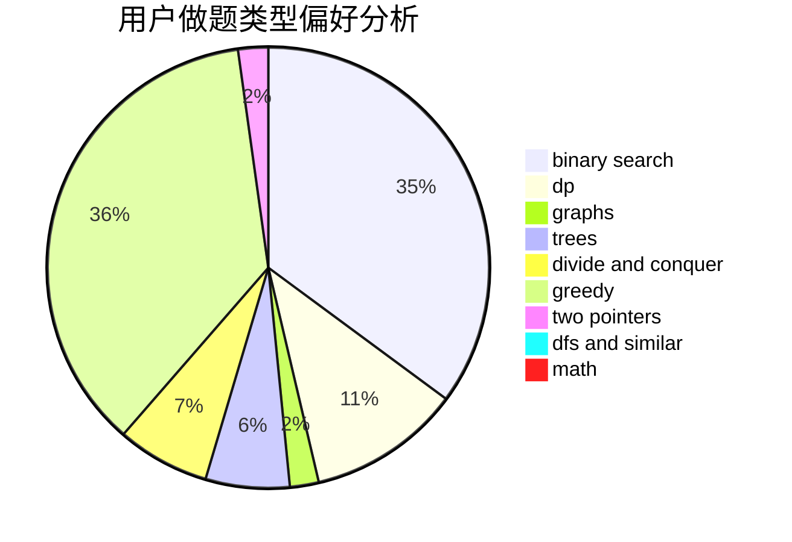

# Alphagocc

<!-- tabs:start -->

#### **用户提交结果分析**

#### **用户做题类型偏好分析**

<!-- tabs:end -->
# 推荐题目
[1419B](https://codeforces.com/contest/1419/problem/B)
[12371](https://codeforces.com/contest/1237/problem/1)
[1360B](https://codeforces.com/contest/1360/problem/B)
[2C](https://codeforces.com/contest/2/problem/C)
[21C](https://codeforces.com/contest/21/problem/C)
[1236D](https://codeforces.com/contest/1236/problem/D)
[299C](https://codeforces.com/contest/299/problem/C)
[1041D](https://codeforces.com/contest/1041/problem/D)
[29B](https://codeforces.com/contest/29/problem/B)
[29E](https://codeforces.com/contest/29/problem/E)
