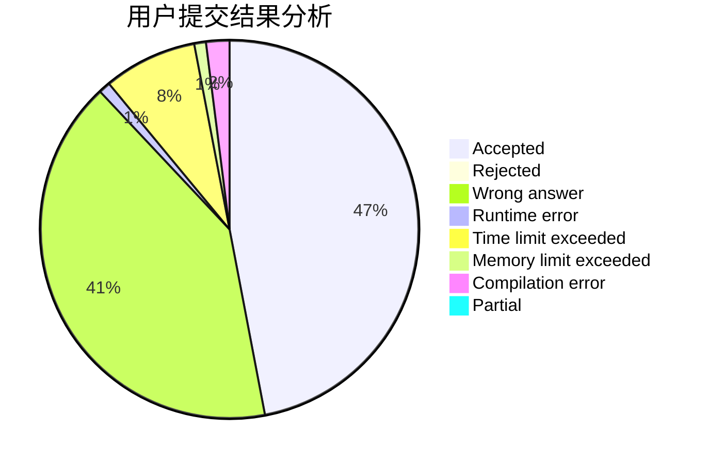
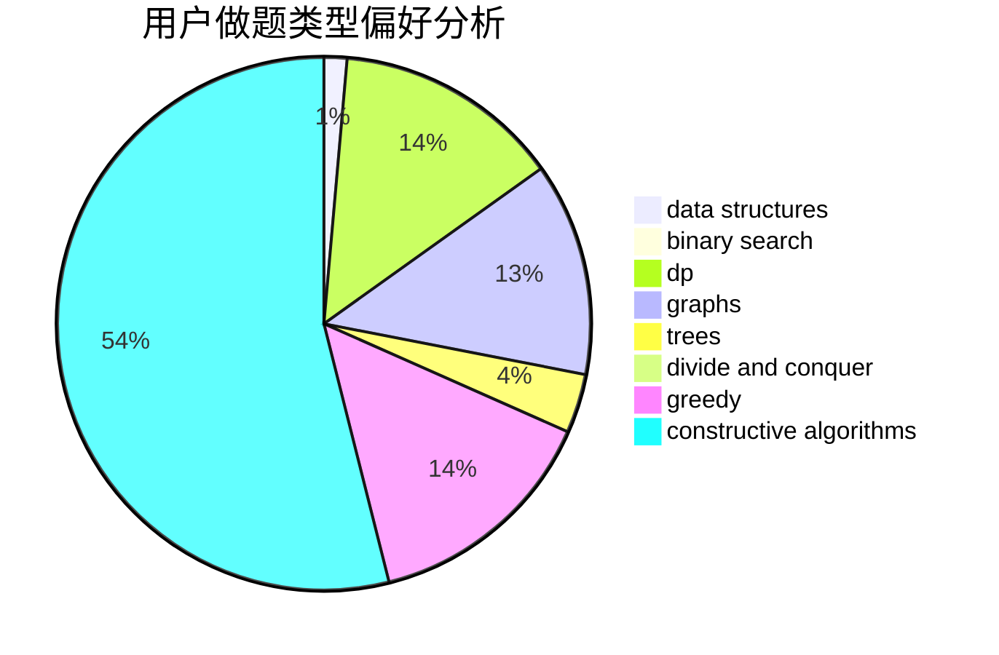

# _LH2000

<!-- tabs:start -->

#### **用户提交结果分析**

#### **用户做题类型偏好分析**

#### **用户错题知识点分析**

<!-- tabs:end -->
# 推荐题目
[359B](https://codeforces.com/contest/359/problem/B)		constructive algorithms,
                        dp,
                        math		  
[1217A](https://codeforces.com/contest/1217/problem/A)		binary search,
                        math		  
[276C](https://codeforces.com/contest/276/problem/C)		data structures,
                        greedy,
                        implementation,
                        sortings		  
[272E](https://codeforces.com/contest/272/problem/E)		combinatorics,
                        constructive algorithms,
                        graphs		  
[478B](https://codeforces.com/contest/478/problem/B)		combinatorics,
                        constructive algorithms,
                        greedy,
                        math		  
[627D](https://codeforces.com/contest/627/problem/D)		binary search,
                        dfs and similar,
                        dp,
                        graphs,
                        greedy,
                        trees		  
[1101E](https://codeforces.com/contest/1101/problem/E)		implementation		  
[1184E1](https://codeforces.com/contest/1184E/problem/1)		graphs,
                        trees		  
[651B](https://codeforces.com/contest/651/problem/B)		greedy,
                        sortings		  
[776C](https://codeforces.com/contest/776/problem/C)		binary search,
                        brute force,
                        data structures,
                        implementation,
                        math		  
