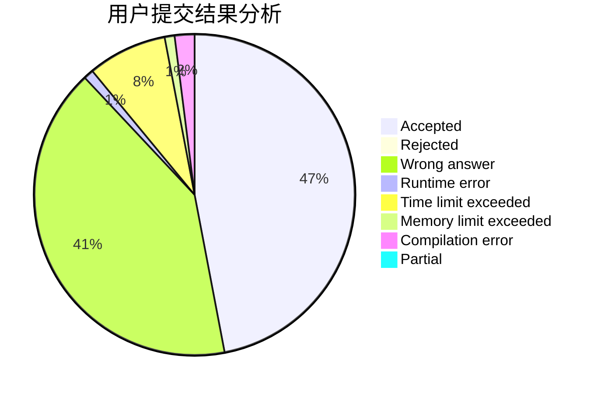
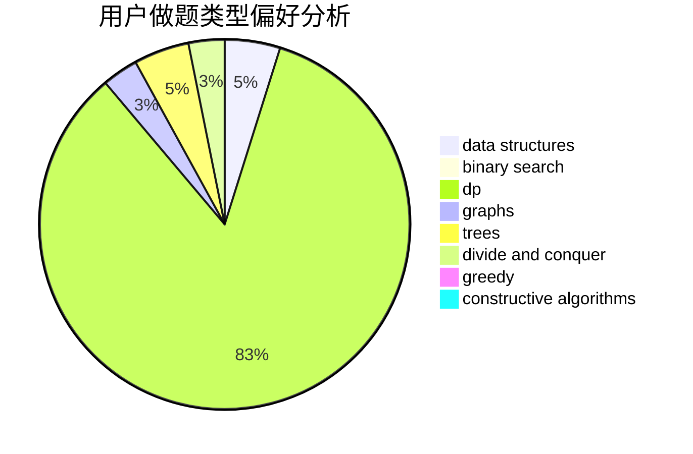

# _LH2000

<!-- tabs:start -->

#### **用户提交结果分析**

#### **用户做题类型偏好分析**

#### **用户错题知识点分析**

<!-- tabs:end -->
# 推荐题目
[385E](https://codeforces.com/contest/385/problem/E)		math,
                        matrices		  
[1223E](https://codeforces.com/contest/1223/problem/E)		dp,
                        sortings,
                        trees		  
[290C](https://codeforces.com/contest/290/problem/C)		*special problem,
                        graph matchings,
                        implementation,
                        trees		  
[288E](https://codeforces.com/contest/288/problem/E)		dp,
                        implementation,
                        math		  
[498B](https://codeforces.com/contest/498/problem/B)		dp,
                        probabilities,
                        two pointers		  
[653D](https://codeforces.com/contest/653/problem/D)		binary search,
                        flows,
                        graphs		  
[1102A](https://codeforces.com/contest/1102/problem/A)		math		  
[1188C](https://codeforces.com/contest/1188/problem/C)		dp		  
[675B](https://codeforces.com/contest/675/problem/B)		brute force,
                        constructive algorithms,
                        math		  
[794B](https://codeforces.com/contest/794/problem/B)		geometry,
                        math		  
