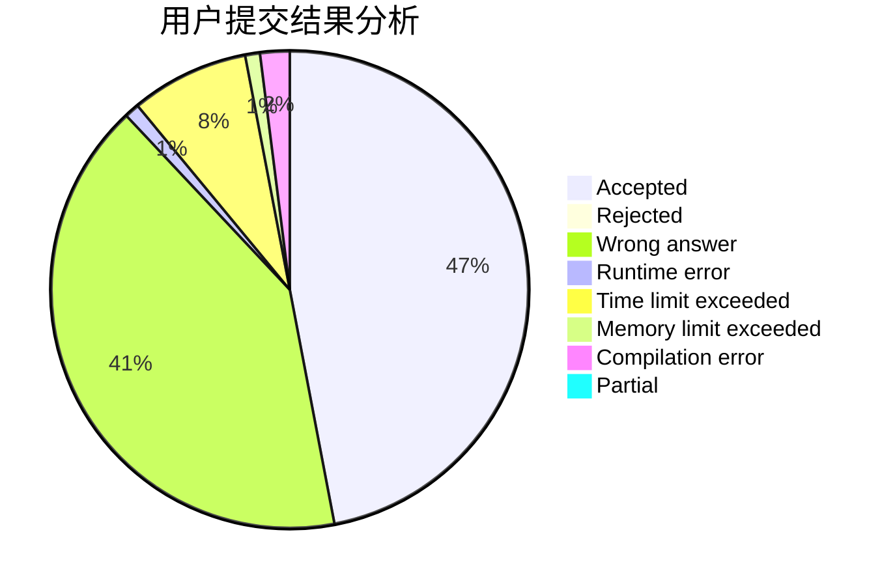
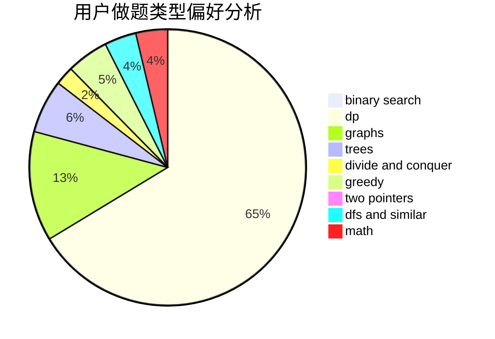

# _LH2000

<!-- tabs:start -->

#### **用户提交结果分析**

#### **用户做题类型偏好分析**

<!-- tabs:end -->
# 推荐题目
[385E](https://codeforces.com/contest/385/problem/E)
[1223E](https://codeforces.com/contest/1223/problem/E)
[290C](https://codeforces.com/contest/290/problem/C)
[288E](https://codeforces.com/contest/288/problem/E)
[498B](https://codeforces.com/contest/498/problem/B)
[653D](https://codeforces.com/contest/653/problem/D)
[1102A](https://codeforces.com/contest/1102/problem/A)
[1188C](https://codeforces.com/contest/1188/problem/C)
[675B](https://codeforces.com/contest/675/problem/B)
[794B](https://codeforces.com/contest/794/problem/B)
