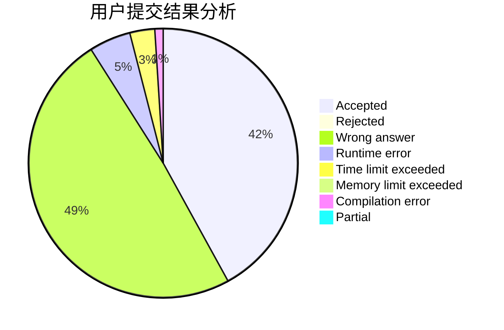
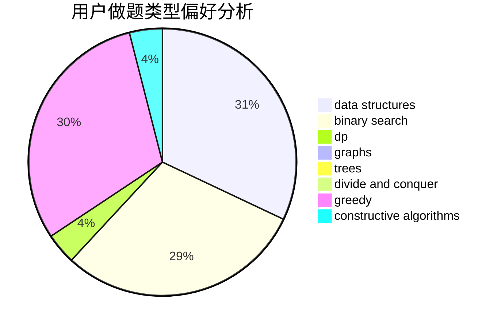
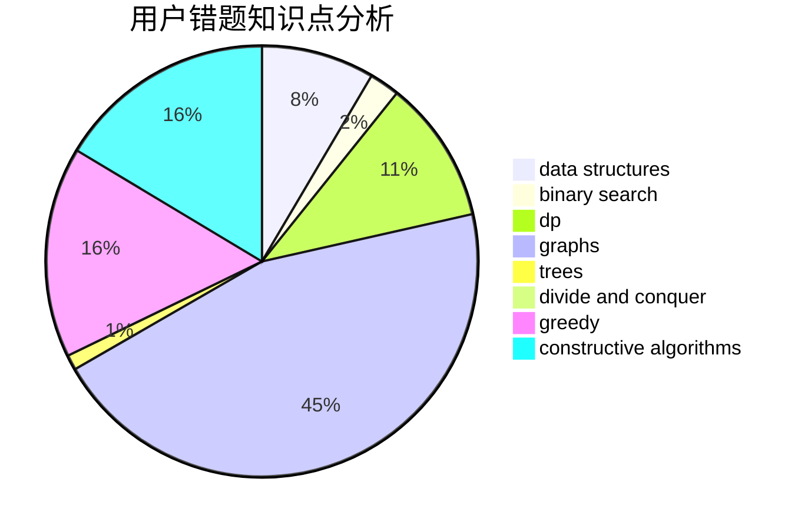

# _Leaving_

<!-- tabs:start -->

#### **用户提交结果分析**

#### **用户做题类型偏好分析**

#### **用户错题知识点分析**

<!-- tabs:end -->
# 推荐题目
[1282C](https://codeforces.com/contest/1282/problem/C)		greedy,
                        sortings,
                        two pointers		  
[963D](https://codeforces.com/contest/963/problem/D)		hashing,
                        string suffix structures,
                        strings		  
[928B](https://codeforces.com/contest/928/problem/B)		*special problem,
                        dp		  
[1326E](https://codeforces.com/contest/1326/problem/E)		data structures,
                        two pointers		  
[701A](https://codeforces.com/contest/701/problem/A)		greedy,
                        implementation		  
[528A](https://codeforces.com/contest/528/problem/A)		dsu,graphs,sortings,trees		  
[1202D](https://codeforces.com/contest/1202/problem/D)		combinatorics,
                        constructive algorithms,
                        math,
                        strings		  
[1108C](https://codeforces.com/contest/1108/problem/C)		brute force,
                        greedy,
                        math		  
[1167E](https://codeforces.com/contest/1167/problem/E)		binary search,
                        combinatorics,
                        data structures,
                        two pointers		  
[913E](https://codeforces.com/contest/913/problem/E)		bitmasks,
                        dp,
                        shortest paths		  
