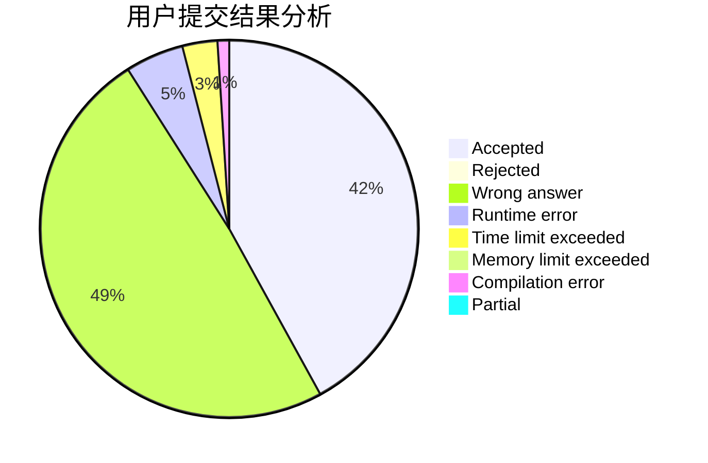
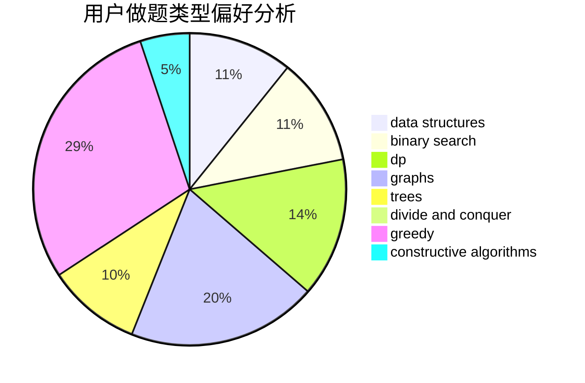
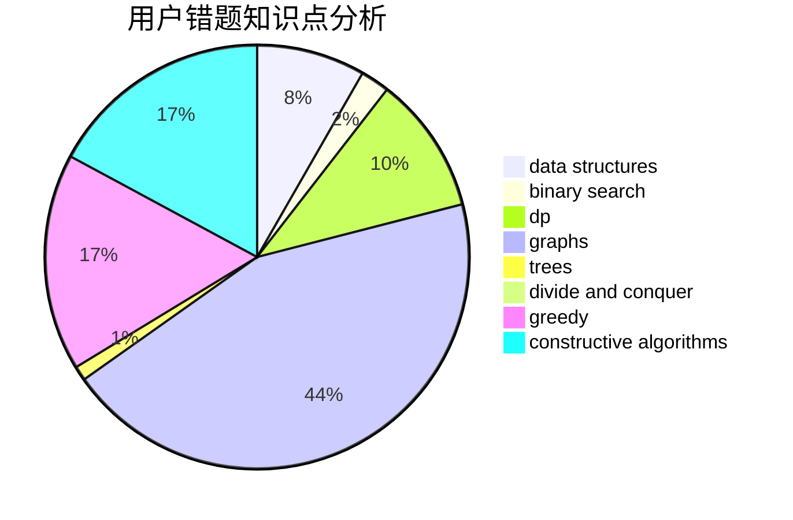

# _Leaving_

<!-- tabs:start -->

#### **用户提交结果分析**

#### **用户做题类型偏好分析**

#### **用户错题知识点分析**

<!-- tabs:end -->
# 推荐题目
[1276B](https://codeforces.com/contest/1276/problem/B)		combinatorics,
                        dfs and similar,
                        dsu,
                        graphs		  
[946G](https://codeforces.com/contest/946/problem/G)		data structures,
                        dp		  
[911C](https://codeforces.com/contest/911/problem/C)		brute force,
                        constructive algorithms		  
[131D](https://codeforces.com/contest/131/problem/D)		dfs and similar,
                        graphs		  
[677A](https://codeforces.com/contest/677/problem/A)		implementation		  
[508A](https://codeforces.com/contest/508/problem/A)		brute force		  
[1198F](https://codeforces.com/contest/1198/problem/F)		greedy,
                        number theory,
                        probabilities		  
[1108B](https://codeforces.com/contest/1108/problem/B)		brute force,
                        greedy,
                        math,
                        number theory		  
[1165C](https://codeforces.com/contest/1165/problem/C)		greedy		  
[896B](https://codeforces.com/contest/896/problem/B)		binary search,
                        constructive algorithms,
                        games,
                        greedy,
                        interactive		  
