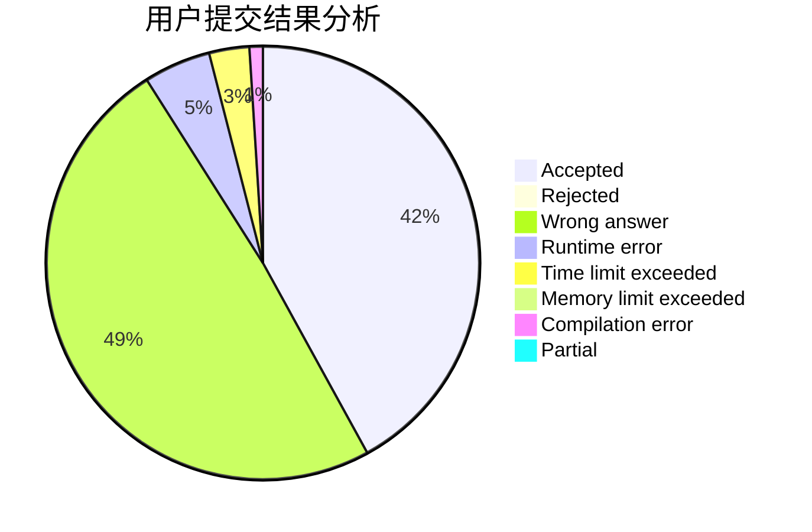
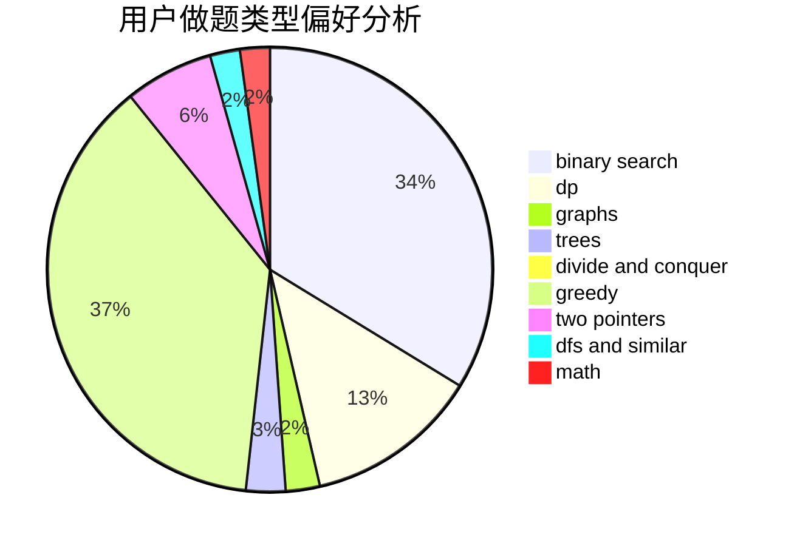

# _Leaving_

<!-- tabs:start -->

#### **用户提交结果分析**

#### **用户做题类型偏好分析**

<!-- tabs:end -->
# 推荐题目
[1282C](https://codeforces.com/contest/1282/problem/C)
[963D](https://codeforces.com/contest/963/problem/D)
[928B](https://codeforces.com/contest/928/problem/B)
[1326E](https://codeforces.com/contest/1326/problem/E)
[701A](https://codeforces.com/contest/701/problem/A)
[528A](https://codeforces.com/contest/528/problem/A)
[1202D](https://codeforces.com/contest/1202/problem/D)
[1108C](https://codeforces.com/contest/1108/problem/C)
[1167E](https://codeforces.com/contest/1167/problem/E)
[913E](https://codeforces.com/contest/913/problem/E)
