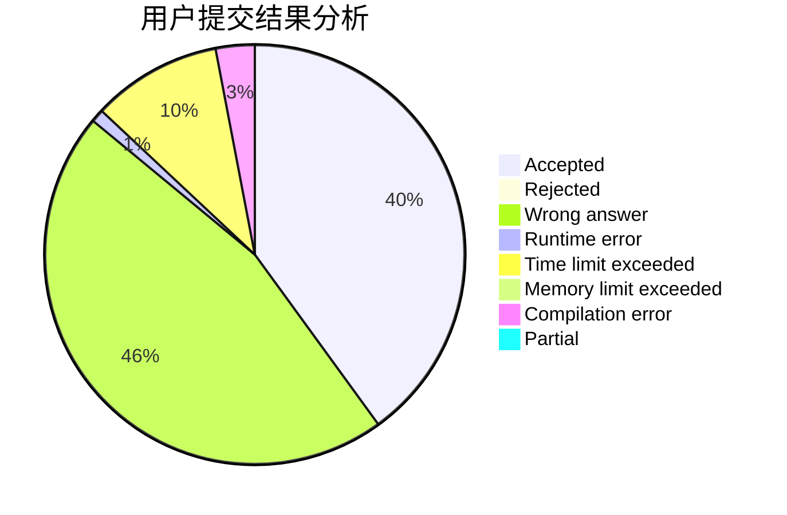
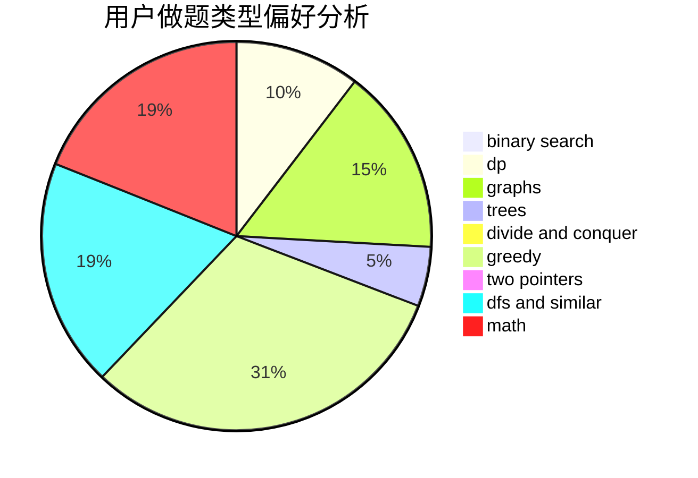

# _LittlePrincess

<!-- tabs:start -->

#### **用户提交结果分析**

#### **用户做题类型偏好分析**

<!-- tabs:end -->
# 推荐题目
[109A](https://codeforces.com/contest/109/problem/A)
[1041F](https://codeforces.com/contest/1041/problem/F)
[187C](https://codeforces.com/contest/187/problem/C)
[1423G](https://codeforces.com/contest/1423/problem/G)
[403C](https://codeforces.com/contest/403/problem/C)
[1119G](https://codeforces.com/contest/1119/problem/G)
[484A](https://codeforces.com/contest/484/problem/A)
[523D](https://codeforces.com/contest/523/problem/D)
[999E](https://codeforces.com/contest/999/problem/E)
[1031D](https://codeforces.com/contest/1031/problem/D)
