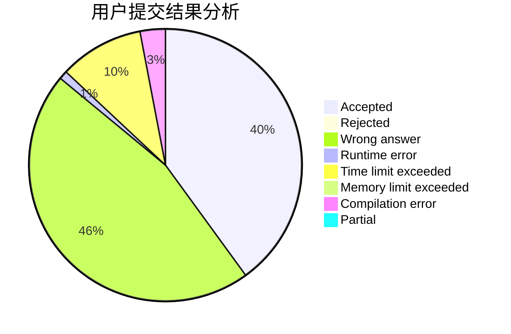
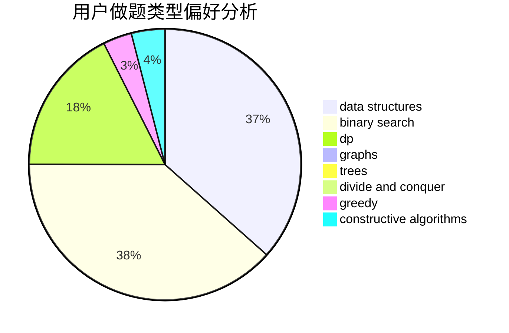
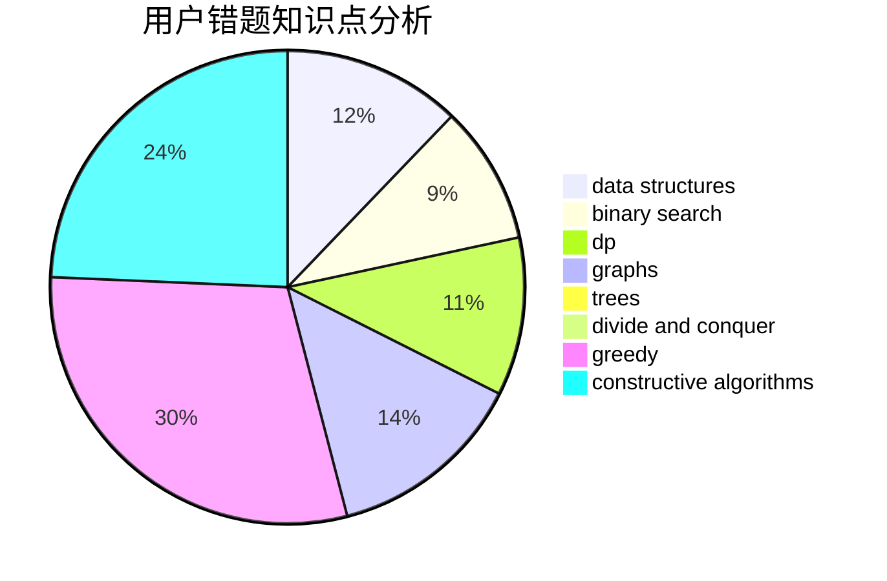

# _LittlePrincess

<!-- tabs:start -->

#### **用户提交结果分析**

#### **用户做题类型偏好分析**

#### **用户错题知识点分析**

<!-- tabs:end -->
# 推荐题目
[1099D](https://codeforces.com/contest/1099/problem/D)		dsu,graphs,sortings,trees		  
[1041C](https://codeforces.com/contest/1041/problem/C)		binary search,
                        data structures,
                        greedy,
                        two pointers		  
[161C](https://codeforces.com/contest/161/problem/C)		divide and conquer		  
[1415C](https://codeforces.com/contest/1415/problem/C)		brute force,
                        dp,
                        implementation		  
[375C](https://codeforces.com/contest/375/problem/C)		bitmasks,
                        shortest paths		  
[1118B](https://codeforces.com/contest/1118/problem/B)		implementation		  
[464B](https://codeforces.com/contest/464/problem/B)		brute force,
                        geometry		  
[501E](https://codeforces.com/contest/501/problem/E)		binary search,
                        combinatorics,
                        implementation		  
[984A](https://codeforces.com/contest/984/problem/A)		sortings		  
[1031A](https://codeforces.com/contest/1031/problem/A)		implementation,
                        math		  
