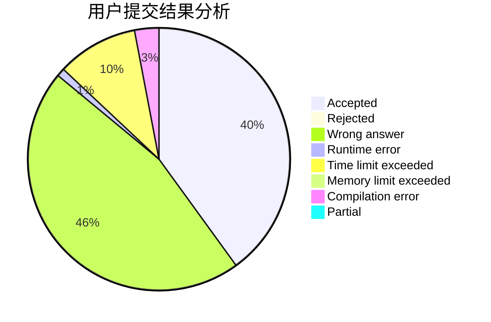
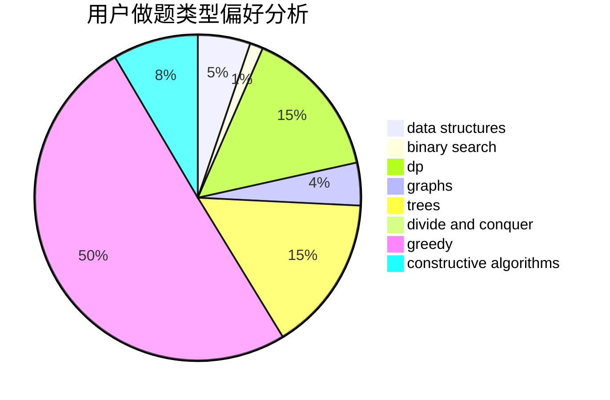
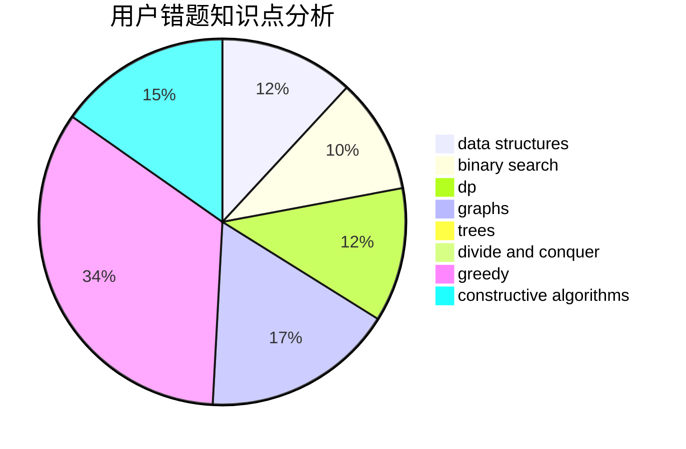

# _LittlePrincess

<!-- tabs:start -->

#### **用户提交结果分析**

#### **用户做题类型偏好分析**

#### **用户错题知识点分析**

<!-- tabs:end -->
# 推荐题目
[109A](https://codeforces.com/contest/109/problem/A)		brute force,
                        implementation		  
[1041F](https://codeforces.com/contest/1041/problem/F)		data structures,
                        divide and conquer,
                        dp,
                        math		  
[187C](https://codeforces.com/contest/187/problem/C)		dfs and similar,
                        dsu		  
[1423G](https://codeforces.com/contest/1423/problem/G)		data structures		  
[403C](https://codeforces.com/contest/403/problem/C)		dsu,graphs,sortings,trees		  
[1119G](https://codeforces.com/contest/1119/problem/G)		constructive algorithms,
                        implementation		  
[484A](https://codeforces.com/contest/484/problem/A)		bitmasks,
                        constructive algorithms		  
[523D](https://codeforces.com/contest/523/problem/D)		*special problem,
                        data structures,
                        implementation		  
[999E](https://codeforces.com/contest/999/problem/E)		dfs and similar,
                        graphs,
                        greedy		  
[1031D](https://codeforces.com/contest/1031/problem/D)		greedy		  
