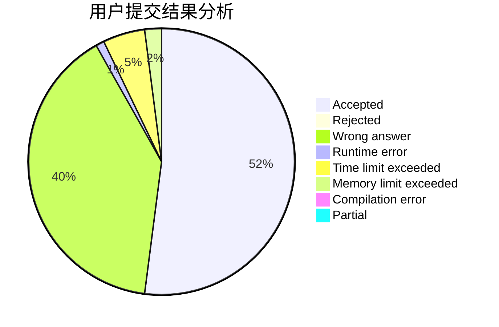
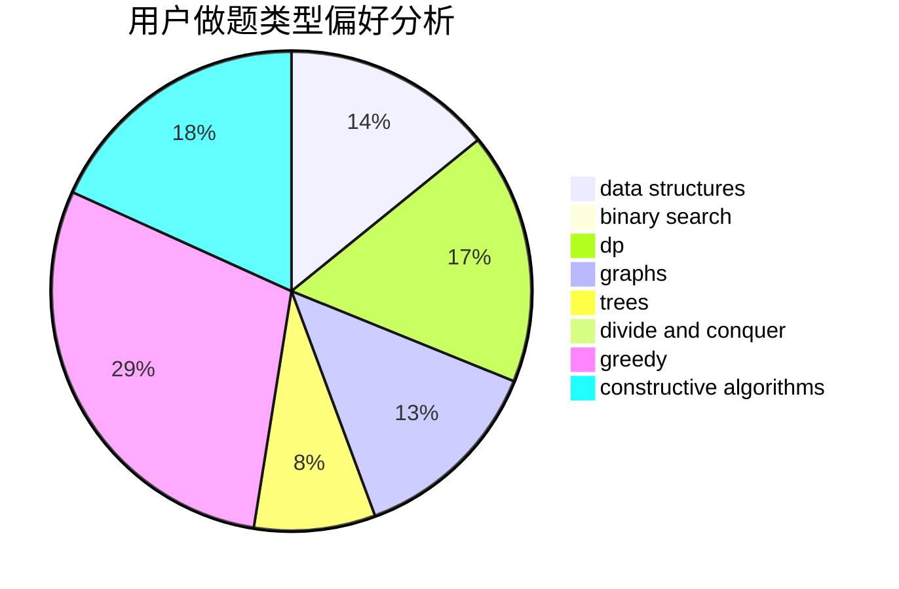
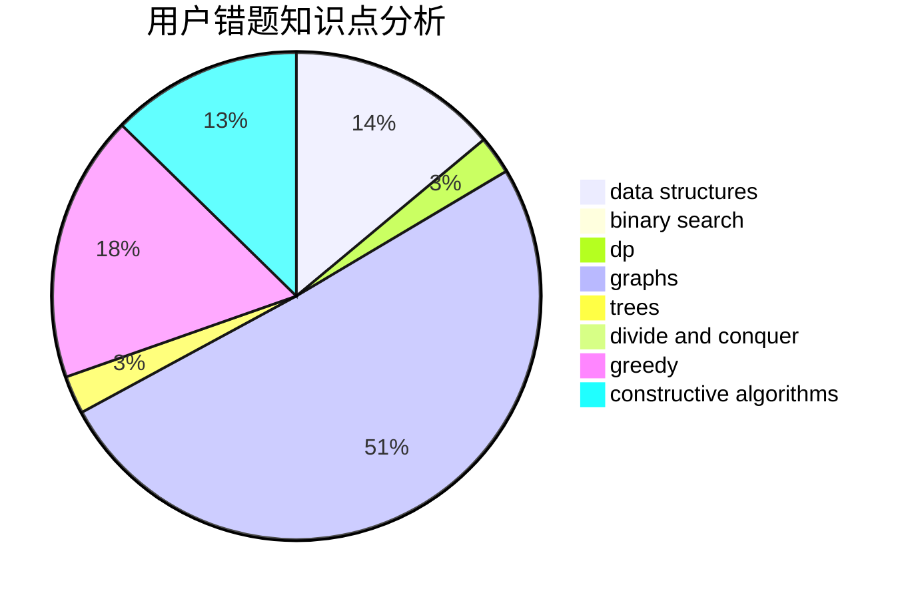

# _Redstone_c_

<!-- tabs:start -->

#### **用户提交结果分析**

#### **用户做题类型偏好分析**

#### **用户错题知识点分析**

<!-- tabs:end -->
# 推荐题目
[1217E](https://codeforces.com/contest/1217/problem/E)		data structures,
                        greedy,
                        implementation,
                        math		  
[238E](https://codeforces.com/contest/238/problem/E)		dp,
                        graphs,
                        shortest paths		  
[1129C](https://codeforces.com/contest/1129/problem/C)		binary search,
                        data structures,
                        dp,
                        hashing,
                        sortings,
                        string suffix structures,
                        strings		  
[1300E](https://codeforces.com/contest/1300/problem/E)		dsu,graphs,sortings,trees		  
[914E](https://codeforces.com/contest/914/problem/E)		bitmasks,
                        data structures,
                        divide and conquer,
                        trees		  
[70E](https://codeforces.com/contest/70/problem/E)		dp,
                        implementation,
                        trees		  
[1033B](https://codeforces.com/contest/1033/problem/B)		math,
                        number theory		  
[301C](https://codeforces.com/contest/301/problem/C)		constructive algorithms		  
[1006A](https://codeforces.com/contest/1006/problem/A)		implementation		  
[979D](https://codeforces.com/contest/979/problem/D)		binary search,
                        bitmasks,
                        brute force,
                        data structures,
                        dp,
                        dsu,
                        greedy,
                        math,
                        number theory,
                        strings,
                        trees		  
