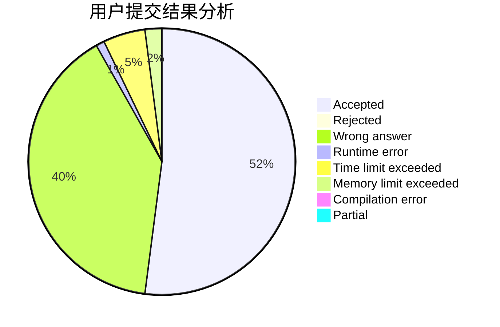
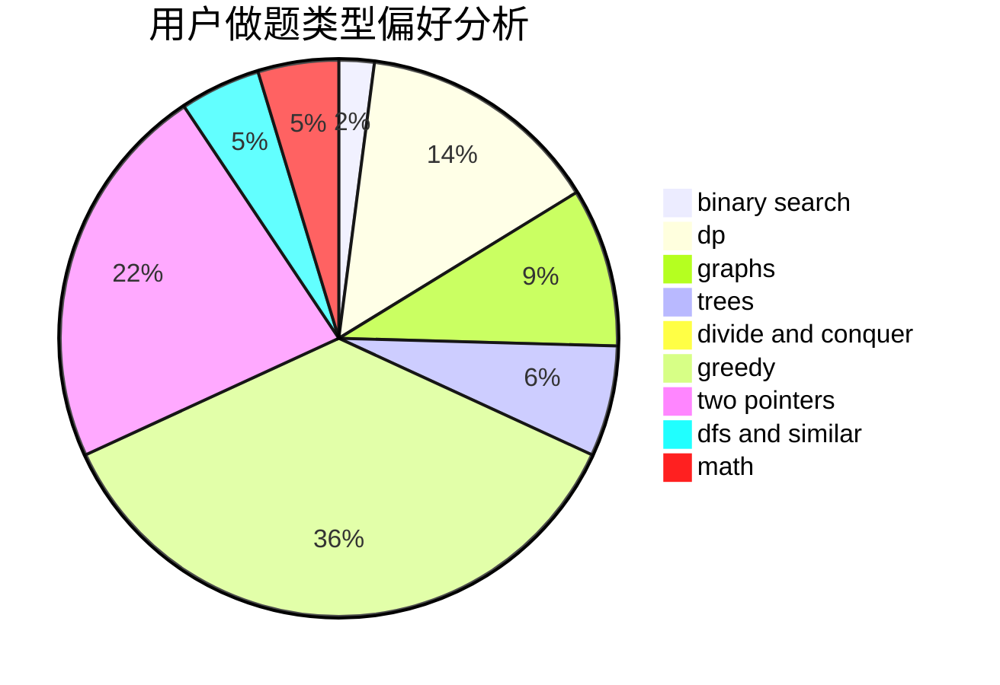

# _Redstone_c_

<!-- tabs:start -->

#### **用户提交结果分析**

#### **用户做题类型偏好分析**

<!-- tabs:end -->
# 推荐题目
[1217E](https://codeforces.com/contest/1217/problem/E)
[238E](https://codeforces.com/contest/238/problem/E)
[1129C](https://codeforces.com/contest/1129/problem/C)
[1300E](https://codeforces.com/contest/1300/problem/E)
[914E](https://codeforces.com/contest/914/problem/E)
[70E](https://codeforces.com/contest/70/problem/E)
[1033B](https://codeforces.com/contest/1033/problem/B)
[301C](https://codeforces.com/contest/301/problem/C)
[1006A](https://codeforces.com/contest/1006/problem/A)
[979D](https://codeforces.com/contest/979/problem/D)
