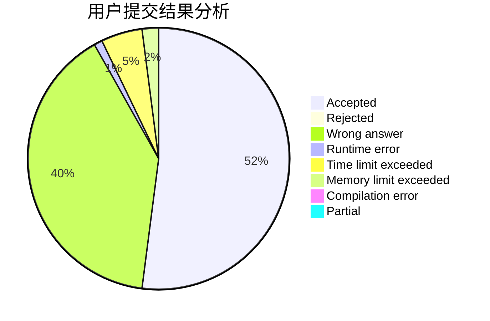
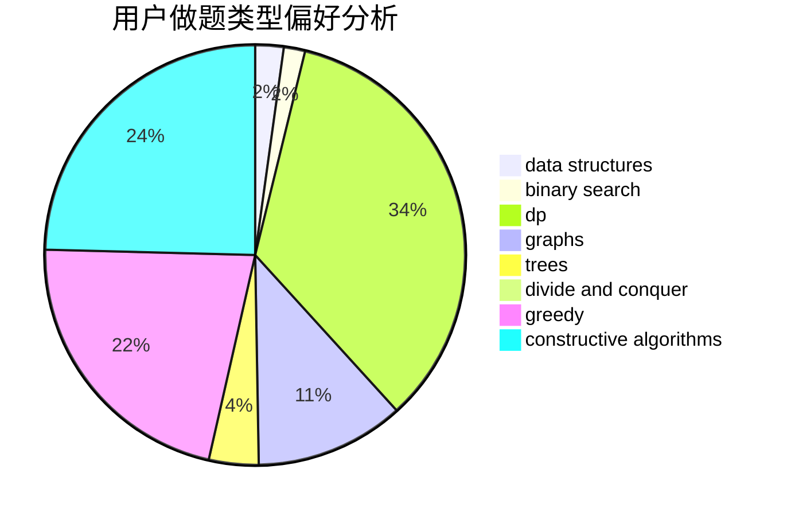
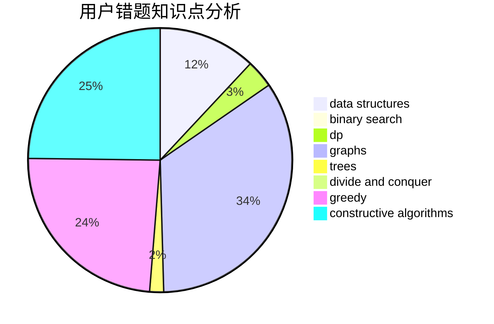

# _Redstone_c_

<!-- tabs:start -->

#### **用户提交结果分析**

#### **用户做题类型偏好分析**

#### **用户错题知识点分析**

<!-- tabs:end -->
# 推荐题目
[1213C](https://codeforces.com/contest/1213/problem/C)		math		  
[219D](https://codeforces.com/contest/219/problem/D)		dfs and similar,
                        dp,
                        graphs,
                        trees		  
[1119G](https://codeforces.com/contest/1119/problem/G)		constructive algorithms,
                        implementation		  
[1294C](https://codeforces.com/contest/1294/problem/C)		greedy,
                        math,
                        number theory		  
[898C](https://codeforces.com/contest/898/problem/C)		implementation,
                        strings		  
[689E](https://codeforces.com/contest/689/problem/E)		combinatorics,
                        data structures,
                        dp,
                        geometry,
                        implementation		  
[1032E](https://codeforces.com/contest/1032/problem/E)		dp,
                        math		  
[288B](https://codeforces.com/contest/288/problem/B)		combinatorics		  
[1005E1](https://codeforces.com/contest/1005E/problem/1)		sortings		  
[958B1](https://codeforces.com/contest/958B/problem/1)		implementation		  
