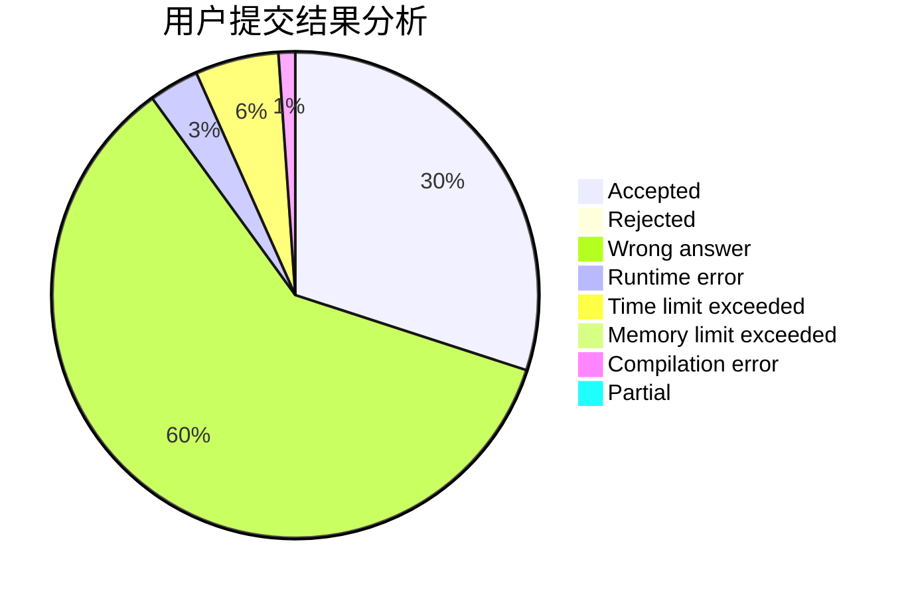
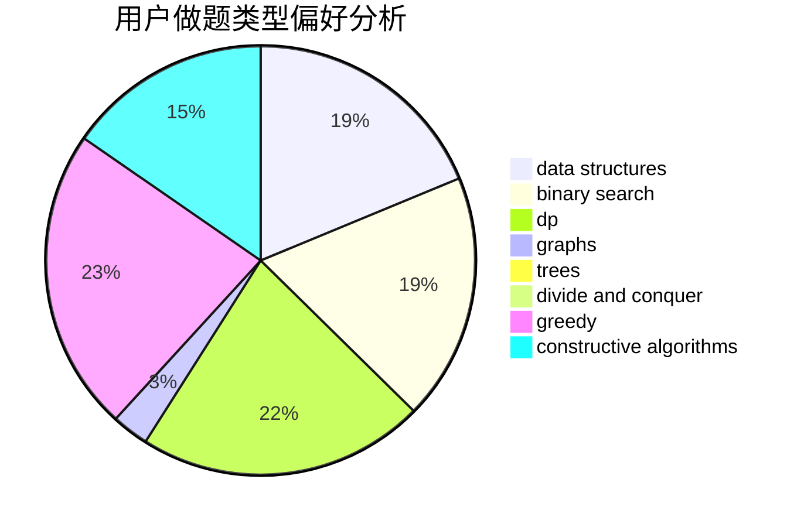

# _SmallY

<!-- tabs:start -->

#### **用户提交结果分析**

#### **用户做题类型偏好分析**

#### **用户错题知识点分析**

<!-- tabs:end -->
# 推荐题目
[1368C](https://codeforces.com/contest/1368/problem/C)		constructive algorithms		  
[1033D](https://codeforces.com/contest/1033/problem/D)		interactive,
                        math,
                        number theory		  
[1201A](https://codeforces.com/contest/1201/problem/A)		implementation,
                        strings		  
[446B](https://codeforces.com/contest/446/problem/B)		brute force,
                        data structures,
                        greedy		  
[1152F2](https://codeforces.com/contest/1152F/problem/2)		bitmasks,
                        dp,
                        matrices		  
[1110H](https://codeforces.com/contest/1110/problem/H)		dp,
                        strings		  
[839E](https://codeforces.com/contest/839/problem/E)		brute force,
                        graphs,
                        math,
                        meet-in-the-middle		  
[1473E](https://codeforces.com/contest/1473/problem/E)		graphs,
                        shortest paths		  
[1030E](https://codeforces.com/contest/1030/problem/E)		bitmasks,
                        dp		  
[1131D](https://codeforces.com/contest/1131/problem/D)		dfs and similar,
                        dp,
                        dsu,
                        graphs,
                        greedy		  
