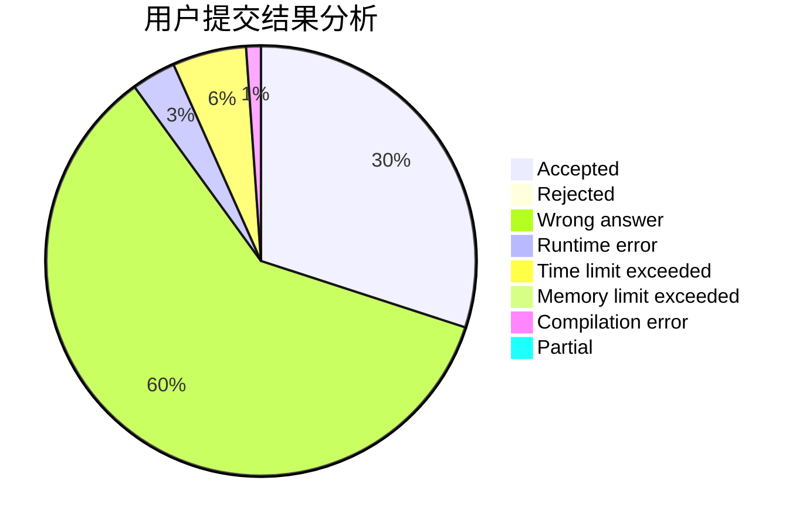
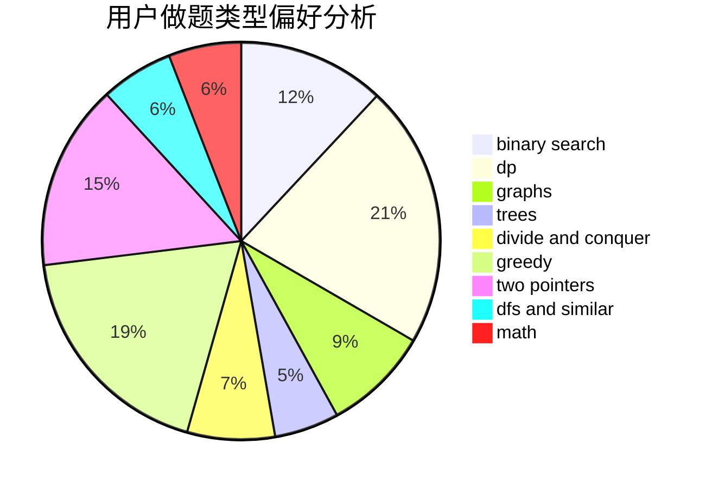

# _SmallY

<!-- tabs:start -->

#### **用户提交结果分析**

#### **用户做题类型偏好分析**

<!-- tabs:end -->
# 推荐题目
[1375B](https://codeforces.com/contest/1375/problem/B)
[1033G](https://codeforces.com/contest/1033/problem/G)
[1205E](https://codeforces.com/contest/1205/problem/E)
[466C](https://codeforces.com/contest/466/problem/C)
[1154G](https://codeforces.com/contest/1154/problem/G)
[1111C](https://codeforces.com/contest/1111/problem/C)
[859B](https://codeforces.com/contest/859/problem/B)
[1482B](https://codeforces.com/contest/1482/problem/B)
[1031B](https://codeforces.com/contest/1031/problem/B)
[1133A](https://codeforces.com/contest/1133/problem/A)
