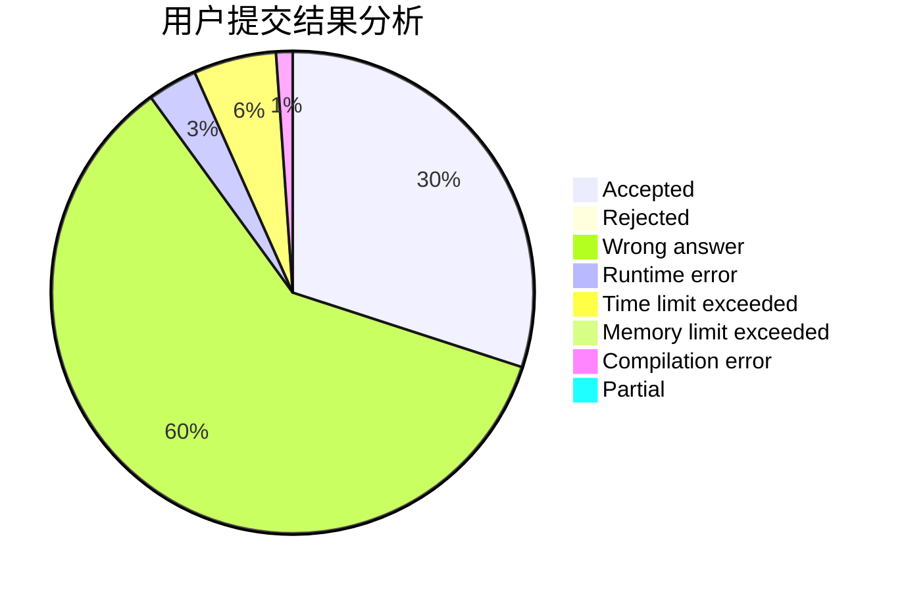
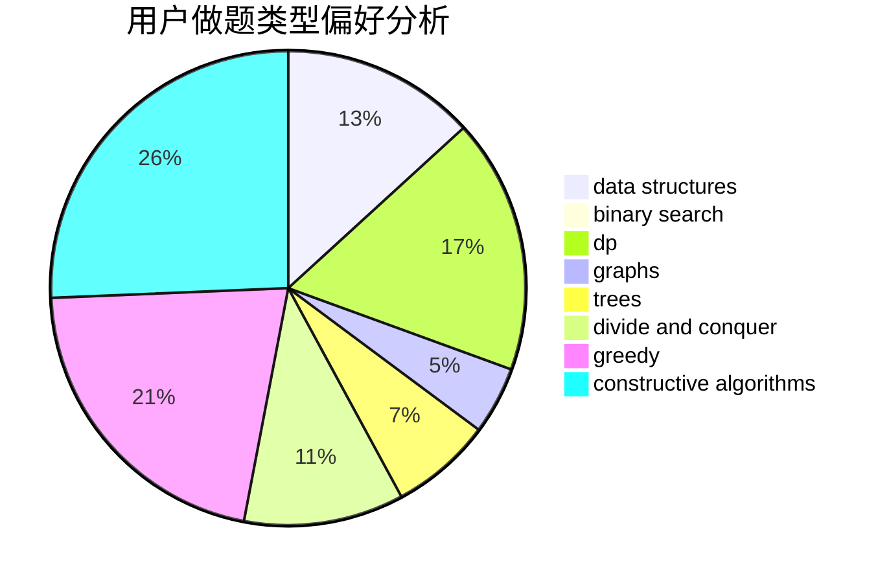

# _SmallY

<!-- tabs:start -->

#### **用户提交结果分析**

#### **用户做题类型偏好分析**

#### **用户错题知识点分析**

<!-- tabs:end -->
# 推荐题目
[1375B](https://codeforces.com/contest/1375/problem/B)		constructive algorithms,
                        greedy		  
[1033G](https://codeforces.com/contest/1033/problem/G)		games		  
[1205E](https://codeforces.com/contest/1205/problem/E)		combinatorics,
                        strings		  
[466C](https://codeforces.com/contest/466/problem/C)		binary search,
                        brute force,
                        data structures,
                        dp,
                        two pointers		  
[1154G](https://codeforces.com/contest/1154/problem/G)		brute force,
                        greedy,
                        math,
                        number theory		  
[1111C](https://codeforces.com/contest/1111/problem/C)		binary search,
                        brute force,
                        divide and conquer,
                        math		  
[859B](https://codeforces.com/contest/859/problem/B)		brute force,
                        geometry,
                        math		  
[1482B](https://codeforces.com/contest/1482/problem/B)		implementation,
                        math		  
[1031B](https://codeforces.com/contest/1031/problem/B)		nan		  
[1133A](https://codeforces.com/contest/1133/problem/A)		implementation		  
