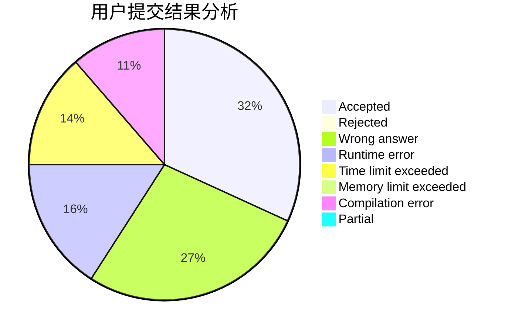
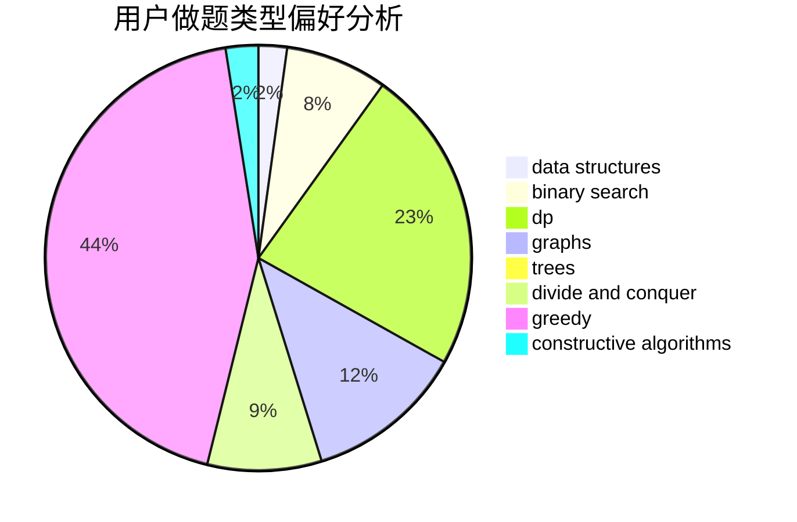
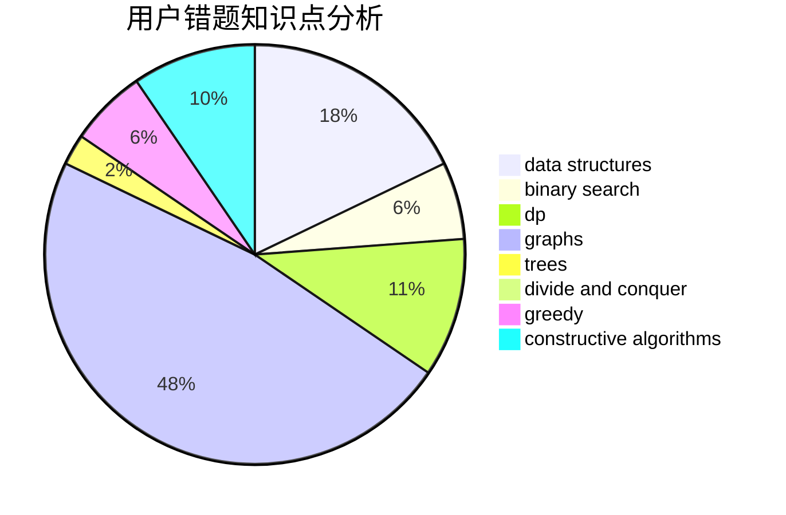

# _WD_

<!-- tabs:start -->

#### **用户提交结果分析**

#### **用户做题类型偏好分析**

#### **用户错题知识点分析**

<!-- tabs:end -->
# 推荐题目
[504E](https://codeforces.com/contest/504/problem/E)		binary search,
                        dfs and similar,
                        hashing,
                        string suffix structures,
                        trees		  
[249E](https://codeforces.com/contest/249/problem/E)		math		  
[920E](https://codeforces.com/contest/920/problem/E)		data structures,
                        dfs and similar,
                        dsu,
                        graphs		  
[1063B](https://codeforces.com/contest/1063/problem/B)		graphs,
                        shortest paths		  
[1195C](https://codeforces.com/contest/1195/problem/C)		dp		  
[145C](https://codeforces.com/contest/145/problem/C)		combinatorics,
                        dp,
                        math		  
[292A](https://codeforces.com/contest/292/problem/A)		implementation		  
[13682](https://codeforces.com/contest/1368/problem/2)		dsu,graphs,sortings,trees		  
[1229F](https://codeforces.com/contest/1229/problem/F)		dsu,graphs,sortings,trees		  
[1017E](https://codeforces.com/contest/1017/problem/E)		geometry,
                        hashing,
                        strings		  
