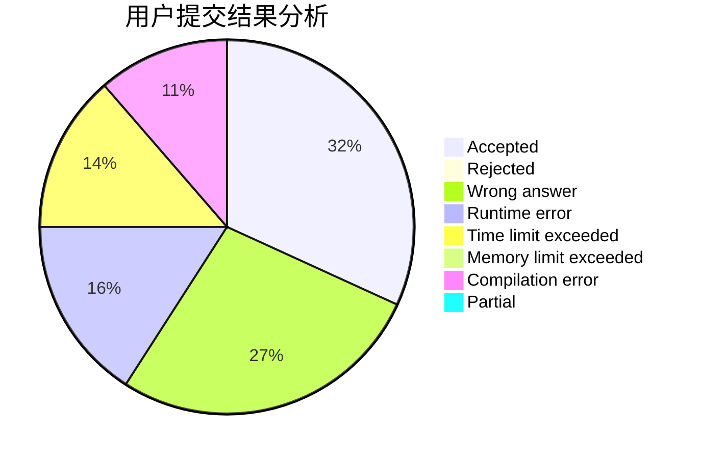
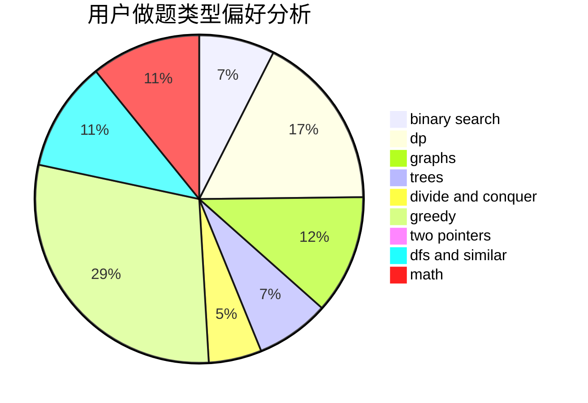

# _WD_

<!-- tabs:start -->

#### **用户提交结果分析**

#### **用户做题类型偏好分析**

<!-- tabs:end -->
# 推荐题目
[504E](https://codeforces.com/contest/504/problem/E)
[249E](https://codeforces.com/contest/249/problem/E)
[920E](https://codeforces.com/contest/920/problem/E)
[1063B](https://codeforces.com/contest/1063/problem/B)
[1195C](https://codeforces.com/contest/1195/problem/C)
[145C](https://codeforces.com/contest/145/problem/C)
[292A](https://codeforces.com/contest/292/problem/A)
[13682](https://codeforces.com/contest/1368/problem/2)
[1229F](https://codeforces.com/contest/1229/problem/F)
[1017E](https://codeforces.com/contest/1017/problem/E)
