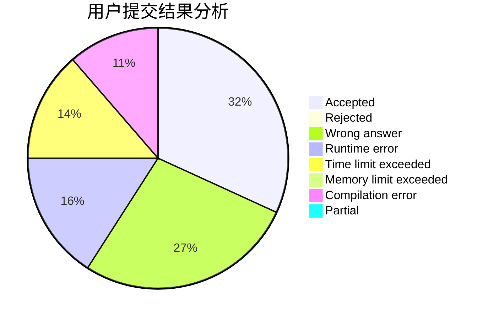
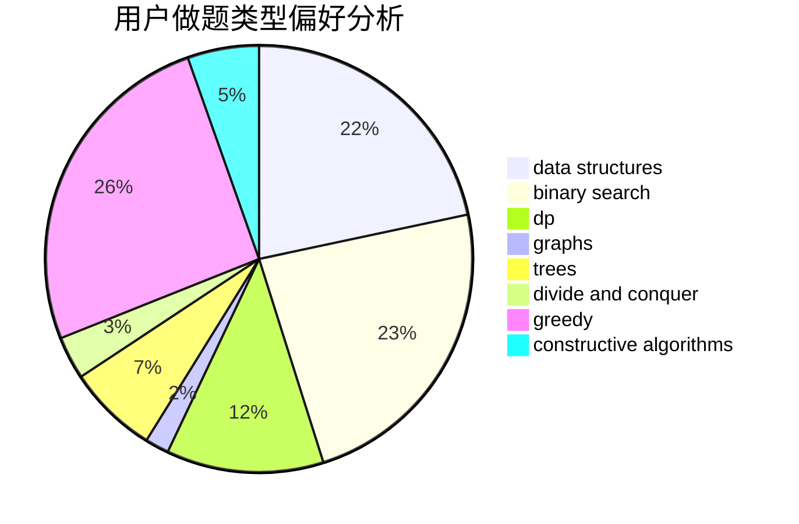
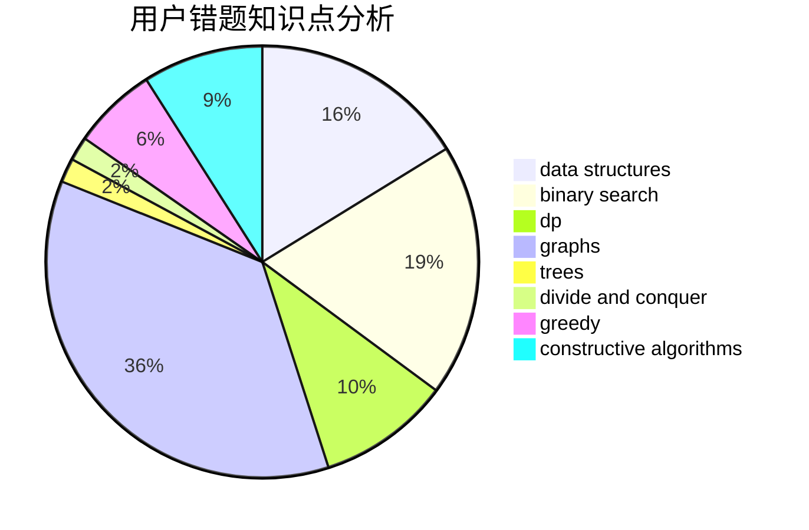

# _WD_

<!-- tabs:start -->

#### **用户提交结果分析**

#### **用户做题类型偏好分析**

#### **用户错题知识点分析**

<!-- tabs:end -->
# 推荐题目
[483D](https://codeforces.com/contest/483/problem/D)		dsu,graphs,sortings,trees		  
[229D](https://codeforces.com/contest/229/problem/D)		dp,
                        greedy,
                        two pointers		  
[907A](https://codeforces.com/contest/907/problem/A)		brute force,
                        implementation		  
[1062E](https://codeforces.com/contest/1062/problem/E)		binary search,
                        data structures,
                        dfs and similar,
                        greedy,
                        trees		  
[118C](https://codeforces.com/contest/118/problem/C)		brute force,
                        greedy,
                        sortings,
                        strings		  
[1451C](https://codeforces.com/contest/1451/problem/C)		dp,
                        greedy,
                        hashing,
                        implementation,
                        strings		  
[277B](https://codeforces.com/contest/277/problem/B)		constructive algorithms,
                        geometry		  
[1360A](https://codeforces.com/contest/1360/problem/A)		greedy,
                        math		  
[1221D](https://codeforces.com/contest/1221/problem/D)		dp		  
[1017B](https://codeforces.com/contest/1017/problem/B)		implementation,
                        math		  
