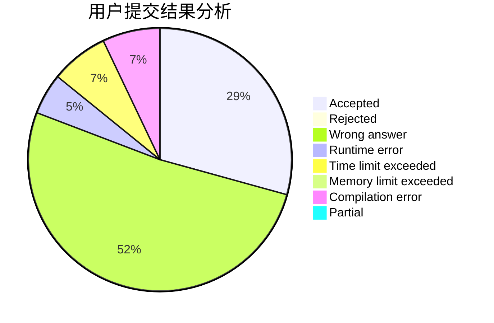
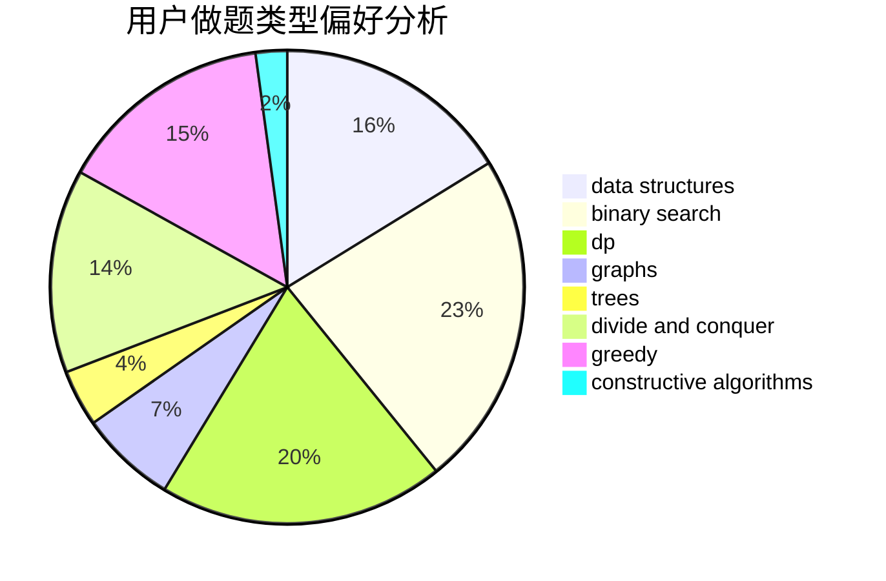
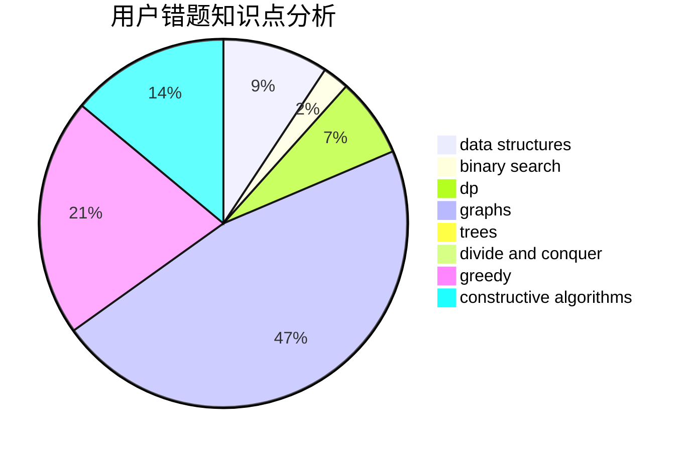

# _Wallace_61430

<!-- tabs:start -->

#### **用户提交结果分析**

#### **用户做题类型偏好分析**

#### **用户错题知识点分析**

<!-- tabs:end -->
# 推荐题目
[1452D](https://codeforces.com/contest/1452/problem/D)		combinatorics,
                        dp,
                        math		  
[1402B](https://codeforces.com/contest/1402/problem/B)		*special problem,
                        geometry,
                        sortings		  
[664A](https://codeforces.com/contest/664/problem/A)		math,
                        number theory		  
[294D](https://codeforces.com/contest/294/problem/D)		brute force,
                        implementation,
                        number theory		  
[856F](https://codeforces.com/contest/856/problem/F)		greedy		  
[935F](https://codeforces.com/contest/935/problem/F)		data structures,
                        greedy		  
[543B](https://codeforces.com/contest/543/problem/B)		constructive algorithms,
                        graphs,
                        shortest paths		  
[1076C](https://codeforces.com/contest/1076/problem/C)		binary search,
                        math		  
[329E](https://codeforces.com/contest/329/problem/E)		math		  
[1145C](https://codeforces.com/contest/1145/problem/C)		bitmasks,
                        brute force		  
