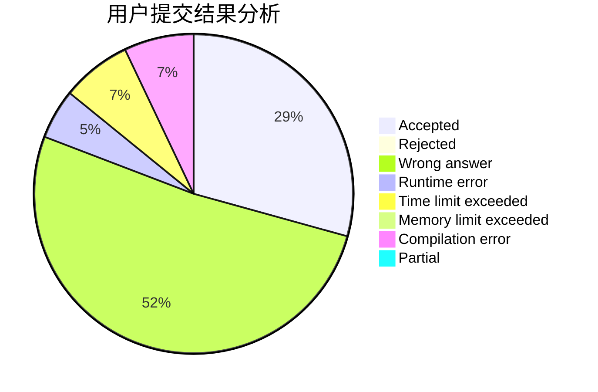
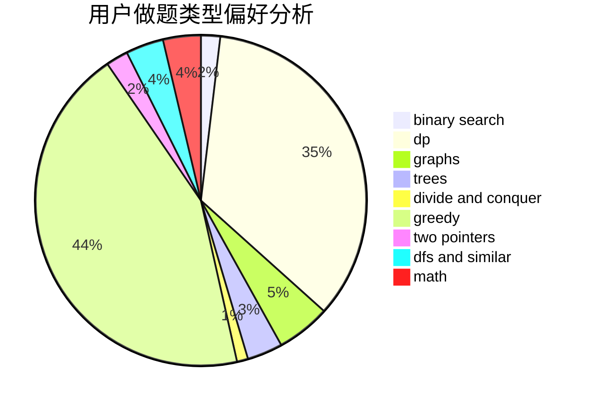

# _Wallace_61430

<!-- tabs:start -->

#### **用户提交结果分析**

#### **用户做题类型偏好分析**

<!-- tabs:end -->
# 推荐题目
[14621](https://codeforces.com/contest/1462/problem/1)
[1413D](https://codeforces.com/contest/1413/problem/D)
[683B](https://codeforces.com/contest/683/problem/B)
[311A](https://codeforces.com/contest/311/problem/A)
[875F](https://codeforces.com/contest/875/problem/F)
[957E](https://codeforces.com/contest/957/problem/E)
[567D](https://codeforces.com/contest/567/problem/D)
[1076F](https://codeforces.com/contest/1076/problem/F)
[357B](https://codeforces.com/contest/357/problem/B)
[1147D](https://codeforces.com/contest/1147/problem/D)
