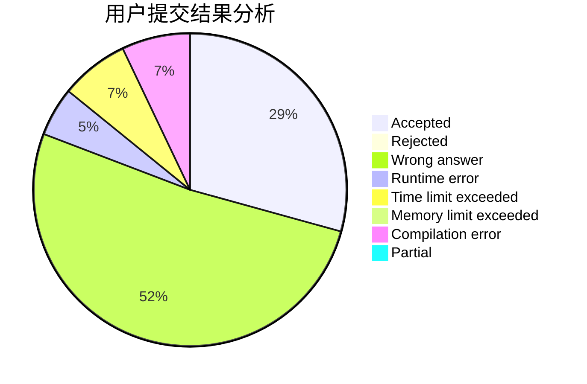
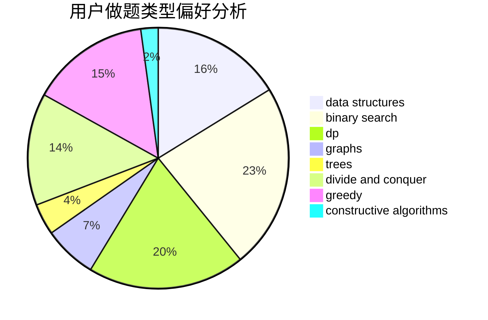
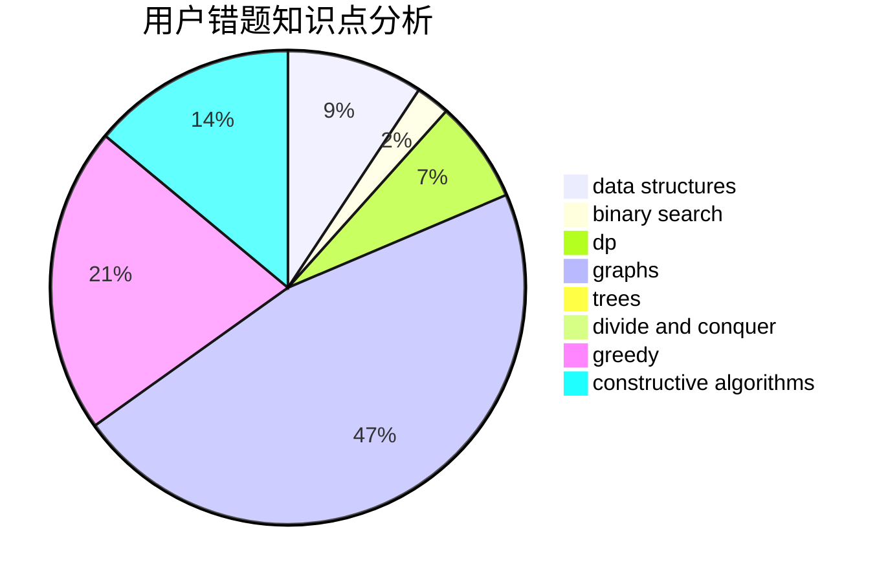

# _Wallace_61430
<!-- tabs:start -->
#### **用户提交结果分析**

#### **用户做题类型偏好分析**

#### **用户错题知识点分析**

<!-- tabs:end -->
# 推荐题目
[Complicated GCD](http://codeforces.com/problemset/problem/664/A)		math,
                        number theory		  
[Roads](http://codeforces.com/problemset/problem/1402/B)		*special problem,
                        geometry,
                        sortings		  
[To Play or not to Play](http://codeforces.com/problemset/problem/856/F)		greedy		  
[Anton and Polyhedrons](http://codeforces.com/problemset/problem/785/A)		implementation,
                        strings		  
[Shaass and Painter Robot](http://codeforces.com/problemset/problem/294/D)		brute force,
                        implementation,
                        number theory		  
[Mystery Circuit](http://codeforces.com/problemset/problem/1145/C)		bitmasks,
                        brute force		  
[Nested Segments](http://codeforces.com/problemset/problem/652/D)		data structures,
                        sortings		  
[Destroying Roads](http://codeforces.com/problemset/problem/543/B)		constructive algorithms,
                        graphs,
                        shortest paths		  
[Iterated Linear Function](http://codeforces.com/problemset/problem/678/D)		math,
                        number theory		  
[Appleman and Toastman](https://codeforces.com/contest/462/problem/C)		greedy,
                        sortings		  
<!-- tabs:start -->
#### **data structures**
[Complicated GCD](http://codeforces.com/problemset/problem/652/D)		data structures,
                        sortings		  
[Roads](http://codeforces.com/problemset/problem/935/F)		data structures,
                        greedy		  
[To Play or not to Play](http://codeforces.com/problemset/problem/1295/E)		data structures,
                        divide and conquer		  
[Anton and Polyhedrons](http://codeforces.com/problemset/problem/121/E)		data structures		  
[Shaass and Painter Robot](http://codeforces.com/problemset/problem/400/E)		binary search,
                        bitmasks,
                        data structures		  
[Mystery Circuit](http://codeforces.com/problemset/problem/1430/C)		constructive algorithms,
                        data structures,
                        greedy,
                        implementation,
                        math		  
[Nested Segments](http://codeforces.com/problemset/problem/1455/G)		data structures,
                        dp		  
[Destroying Roads](http://codeforces.com/problemset/problem/187/D)		data structures		  
[Iterated Linear Function](http://codeforces.com/problemset/problem/1491/C)		brute force,
                        data structures,
                        dp,
                        greedy,
                        implementation		  
[Appleman and Toastman](http://codeforces.com/problemset/problem/1089/K)		data structures		  
#### **binary search**
[Complicated GCD](http://codeforces.com/problemset/problem/1076/C)		binary search,
                        math		  
[Roads](http://codeforces.com/problemset/problem/371/C)		binary search,
                        brute force		  
[To Play or not to Play](http://codeforces.com/problemset/problem/152/B)		binary search,
                        implementation		  
[Anton and Polyhedrons](http://codeforces.com/problemset/problem/400/E)		binary search,
                        bitmasks,
                        data structures		  
[Shaass and Painter Robot](http://codeforces.com/problemset/problem/1475/D)		binary search,
                        dp,
                        sortings,
                        two pointers		  
[Mystery Circuit](http://codeforces.com/problemset/problem/1492/C)		binary search,
                        data structures,
                        dp,
                        greedy,
                        two pointers		  
[Nested Segments](http://codeforces.com/problemset/problem/1463/D)		binary search,
                        constructive algorithms,
                        greedy,
                        two pointers		  
[Destroying Roads](http://codeforces.com/problemset/problem/1490/G)		binary search,
                        data structures,
                        math		  
[Iterated Linear Function](http://codeforces.com/problemset/problem/1479/D)		binary search,
                        bitmasks,
                        brute force,
                        data structures,
                        probabilities,
                        trees		  
[Appleman and Toastman](http://codeforces.com/problemset/problem/1436/E)		binary search,
                        data structures,
                        two pointers		  
#### **dp**
[Complicated GCD](http://codeforces.com/problemset/problem/1452/D)		combinatorics,
                        dp,
                        math		  
[Roads](http://codeforces.com/problemset/problem/351/B)		combinatorics,
                        dp,
                        probabilities		  
[To Play or not to Play](http://codeforces.com/problemset/problem/550/C)		brute force,
                        dp,
                        math		  
[Anton and Polyhedrons](http://codeforces.com/problemset/problem/959/E)		bitmasks,
                        dp,
                        graphs,
                        implementation,
                        math		  
[Shaass and Painter Robot](http://codeforces.com/problemset/problem/1120/D)		dfs and similar,
                        dp,
                        dsu,
                        graphs,
                        greedy,
                        trees		  
[Mystery Circuit](http://codeforces.com/problemset/problem/1475/D)		binary search,
                        dp,
                        sortings,
                        two pointers		  
[Nested Segments](http://codeforces.com/problemset/problem/1455/G)		data structures,
                        dp		  
[Destroying Roads](http://codeforces.com/problemset/problem/364/B)		dp,
                        greedy		  
[Iterated Linear Function](http://codeforces.com/problemset/problem/1340/B)		bitmasks,
                        dp,
                        graphs,
                        greedy		  
[Appleman and Toastman](http://codeforces.com/problemset/problem/1491/C)		brute force,
                        data structures,
                        dp,
                        greedy,
                        implementation		  
#### **graph**
[Complicated GCD](http://codeforces.com/problemset/problem/543/B)		constructive algorithms,
                        graphs,
                        shortest paths		  
[Roads](http://codeforces.com/problemset/problem/46/F)		dsu,
                        graphs		  
[To Play or not to Play](http://codeforces.com/problemset/problem/959/E)		bitmasks,
                        dp,
                        graphs,
                        implementation,
                        math		  
[Anton and Polyhedrons](http://codeforces.com/problemset/problem/884/F)		flows,
                        graphs,
                        greedy		  
[Shaass and Painter Robot](http://codeforces.com/problemset/problem/1120/D)		dfs and similar,
                        dp,
                        dsu,
                        graphs,
                        greedy,
                        trees		  
[Mystery Circuit](http://codeforces.com/problemset/problem/1340/B)		bitmasks,
                        dp,
                        graphs,
                        greedy		  
[Nested Segments](http://codeforces.com/problemset/problem/1487/C)		brute force,
                        constructive algorithms,
                        dfs and similar,
                        graphs,
                        greedy,
                        implementation,
                        math		  
[Destroying Roads](http://codeforces.com/problemset/problem/1437/C)		dp,
                        flows,
                        graph matchings,
                        greedy,
                        math,
                        sortings		  
[Iterated Linear Function](http://codeforces.com/problemset/problem/1470/D)		constructive algorithms,
                        dfs and similar,
                        graph matchings,
                        graphs,
                        greedy		  
[Appleman and Toastman](http://codeforces.com/problemset/problem/1476/C)		dp,
                        graphs,
                        greedy		  
#### **trees**
[Complicated GCD](http://codeforces.com/problemset/problem/1120/D)		dfs and similar,
                        dp,
                        dsu,
                        graphs,
                        greedy,
                        trees		  
[Roads](http://codeforces.com/problemset/problem/1338/D)		constructive algorithms,
                        dfs and similar,
                        dp,
                        math,
                        trees		  
[To Play or not to Play](http://codeforces.com/problemset/problem/1479/D)		binary search,
                        bitmasks,
                        brute force,
                        data structures,
                        probabilities,
                        trees		  
[Anton and Polyhedrons](http://codeforces.com/problemset/problem/1511/C)		brute force,
                        data structures,
                        implementation,
                        trees		  
[Shaass and Painter Robot](http://codeforces.com/problemset/problem/1499/F)		combinatorics,
                        dfs and similar,
                        dp,
                        trees		  
[Mystery Circuit](http://codeforces.com/problemset/problem/1491/E)		brute force,
                        dfs and similar,
                        divide and conquer,
                        number theory,
                        trees		  
[Nested Segments](http://codeforces.com/problemset/problem/1466/D)		data structures,
                        greedy,
                        sortings,
                        trees		  
[Destroying Roads](http://codeforces.com/problemset/problem/1495/D)		combinatorics,
                        dfs and similar,
                        graphs,
                        math,
                        shortest paths,
                        trees		  
[Iterated Linear Function](http://codeforces.com/problemset/problem/1303/G)		data structures,
                        divide and conquer,
                        geometry,
                        trees		  
[Appleman and Toastman](http://codeforces.com/problemset/problem/1454/E)		combinatorics,
                        dfs and similar,
                        graphs,
                        trees		  
#### **divide and conquer**
[Complicated GCD](http://codeforces.com/problemset/problem/1295/E)		data structures,
                        divide and conquer		  
[Roads](http://codeforces.com/problemset/problem/1461/D)		binary search,
                        brute force,
                        data structures,
                        divide and conquer,
                        implementation,
                        sortings		  
[To Play or not to Play](http://codeforces.com/problemset/problem/1466/G)		combinatorics,
                        divide and conquer,
                        hashing,
                        math,
                        string suffix structures,
                        strings		  
[Anton and Polyhedrons](http://codeforces.com/problemset/problem/1490/D)		dfs and similar,
                        divide and conquer,
                        implementation		  
[Shaass and Painter Robot](https://codeforces.com/contest/1483/problem/C)		data structures,
                        divide and conquer,
                        dp		  
[Mystery Circuit](http://codeforces.com/problemset/problem/1491/E)		brute force,
                        dfs and similar,
                        divide and conquer,
                        number theory,
                        trees		  
[Nested Segments](http://codeforces.com/problemset/problem/1303/G)		data structures,
                        divide and conquer,
                        geometry,
                        trees		  
[Destroying Roads](http://codeforces.com/problemset/problem/1494/D)		constructive algorithms,
                        data structures,
                        dfs and similar,
                        divide and conquer,
                        dsu,
                        greedy,
                        sortings,
                        trees		  
[Iterated Linear Function](http://codeforces.com/problemset/problem/1482/E)		data structures,
                        divide and conquer,
                        dp		  
[Appleman and Toastman](http://codeforces.com/problemset/problem/566/C)		dfs and similar,
                        divide and conquer,
                        trees		  
#### **greedy**
[Complicated GCD](http://codeforces.com/problemset/problem/856/F)		greedy		  
[Roads](https://codeforces.com/contest/462/problem/C)		greedy,
                        sortings		  
[To Play or not to Play](http://codeforces.com/problemset/problem/935/F)		data structures,
                        greedy		  
[Anton and Polyhedrons](http://codeforces.com/problemset/problem/92/B)		greedy		  
[Shaass and Painter Robot](http://codeforces.com/problemset/problem/529/B)		brute force,
                        greedy,
                        sortings		  
[Mystery Circuit](http://codeforces.com/problemset/problem/884/F)		flows,
                        graphs,
                        greedy		  
[Nested Segments](https://codeforces.com/contest/1465/problem/E)		bitmasks,
                        greedy,
                        math,
                        strings		  
[Destroying Roads](http://codeforces.com/problemset/problem/1004/B)		constructive algorithms,
                        greedy,
                        implementation,
                        math		  
[Iterated Linear Function](http://codeforces.com/problemset/problem/1120/D)		dfs and similar,
                        dp,
                        dsu,
                        graphs,
                        greedy,
                        trees		  
[Appleman and Toastman](http://codeforces.com/problemset/problem/1430/C)		constructive algorithms,
                        data structures,
                        greedy,
                        implementation,
                        math		  
#### **constructive algorithms**
[Complicated GCD](http://codeforces.com/problemset/problem/543/B)		constructive algorithms,
                        graphs,
                        shortest paths		  
[Roads](http://codeforces.com/problemset/problem/443/A)		constructive algorithms,
                        implementation		  
[To Play or not to Play](http://codeforces.com/problemset/problem/1088/D)		bitmasks,
                        constructive algorithms,
                        implementation,
                        interactive		  
[Anton and Polyhedrons](http://codeforces.com/problemset/problem/1004/B)		constructive algorithms,
                        greedy,
                        implementation,
                        math		  
[Shaass and Painter Robot](http://codeforces.com/problemset/problem/1430/C)		constructive algorithms,
                        data structures,
                        greedy,
                        implementation,
                        math		  
[Mystery Circuit](http://codeforces.com/problemset/problem/878/A)		bitmasks,
                        constructive algorithms		  
[Nested Segments](http://codeforces.com/problemset/problem/1338/D)		constructive algorithms,
                        dfs and similar,
                        dp,
                        math,
                        trees		  
[Destroying Roads](http://codeforces.com/problemset/problem/1493/A)		constructive algorithms,
                        greedy		  
[Iterated Linear Function](http://codeforces.com/problemset/problem/1463/D)		binary search,
                        constructive algorithms,
                        greedy,
                        two pointers		  
[Appleman and Toastman](https://codeforces.com/contest/1456/problem/B)		bitmasks,
                        brute force,
                        constructive algorithms		  
#### **sortings**
[Complicated GCD](http://codeforces.com/problemset/problem/1402/B)		*special problem,
                        geometry,
                        sortings		  
[Roads](http://codeforces.com/problemset/problem/652/D)		data structures,
                        sortings		  
[To Play or not to Play](https://codeforces.com/contest/462/problem/C)		greedy,
                        sortings		  
[Anton and Polyhedrons](http://codeforces.com/problemset/problem/529/B)		brute force,
                        greedy,
                        sortings		  
[Shaass and Painter Robot](http://codeforces.com/problemset/problem/1475/D)		binary search,
                        dp,
                        sortings,
                        two pointers		  
[Mystery Circuit](http://codeforces.com/problemset/problem/1495/A)		geometry,
                        greedy,
                        math,
                        sortings		  
[Nested Segments](https://codeforces.com/contest/1496/problem/C)		geometry,
                        greedy,
                        math,
                        sortings		  
[Destroying Roads](http://codeforces.com/problemset/problem/1495/A)		geometry,
                        greedy,
                        math,
                        sortings		  
[Iterated Linear Function](http://codeforces.com/problemset/problem/1497/A)		brute force,
                        data structures,
                        greedy,
                        sortings		  
[Appleman and Toastman](http://codeforces.com/problemset/problem/1427/A)		math,
                        sortings		  
<!-- tabs:end -->
