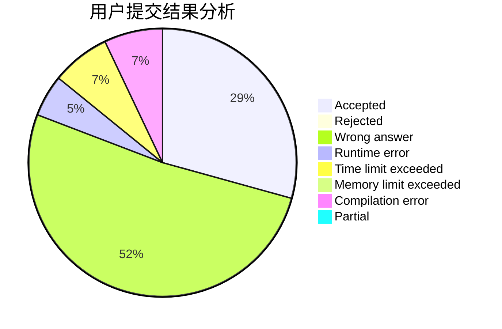
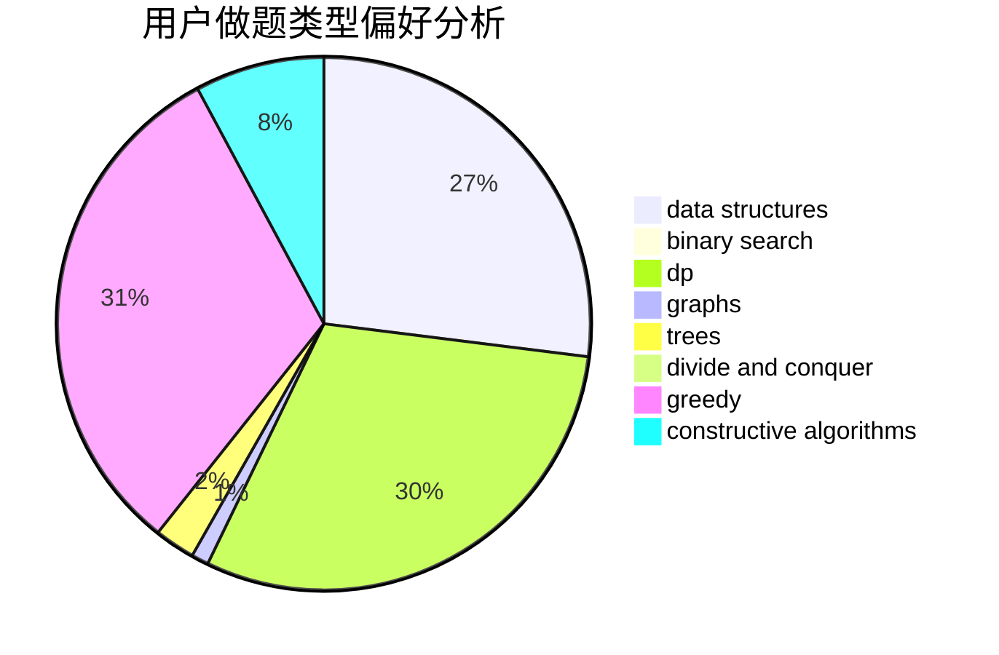
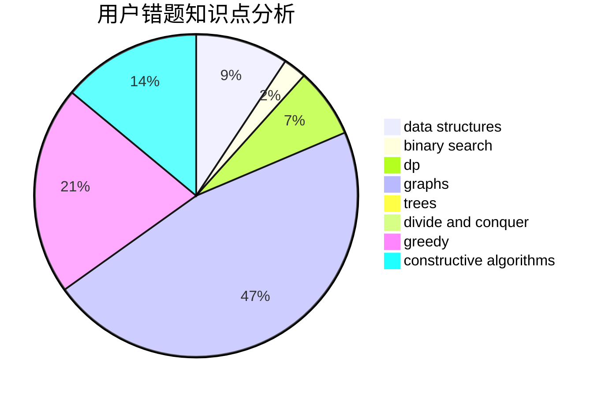

# _Wallace_61430

<!-- tabs:start -->

#### **用户提交结果分析**

#### **用户做题类型偏好分析**

#### **用户错题知识点分析**

<!-- tabs:end -->
# 推荐题目
[14621](https://codeforces.com/contest/1462/problem/1)		dsu,graphs,sortings,trees		  
[1413D](https://codeforces.com/contest/1413/problem/D)		data structures,
                        greedy,
                        implementation		  
[683B](https://codeforces.com/contest/683/problem/B)		*special problem		  
[311A](https://codeforces.com/contest/311/problem/A)		constructive algorithms,
                        implementation		  
[875F](https://codeforces.com/contest/875/problem/F)		dsu,
                        graphs,
                        greedy		  
[957E](https://codeforces.com/contest/957/problem/E)		dsu,graphs,sortings,trees		  
[567D](https://codeforces.com/contest/567/problem/D)		binary search,
                        data structures,
                        greedy,
                        sortings		  
[1076F](https://codeforces.com/contest/1076/problem/F)		dp,
                        greedy		  
[357B](https://codeforces.com/contest/357/problem/B)		constructive algorithms,
                        implementation		  
[1147D](https://codeforces.com/contest/1147/problem/D)		dfs and similar,
                        graphs		  
