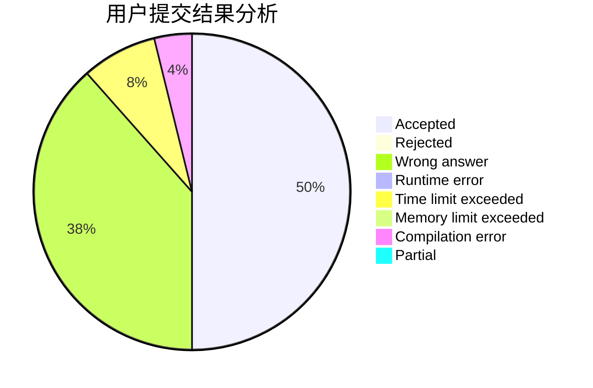
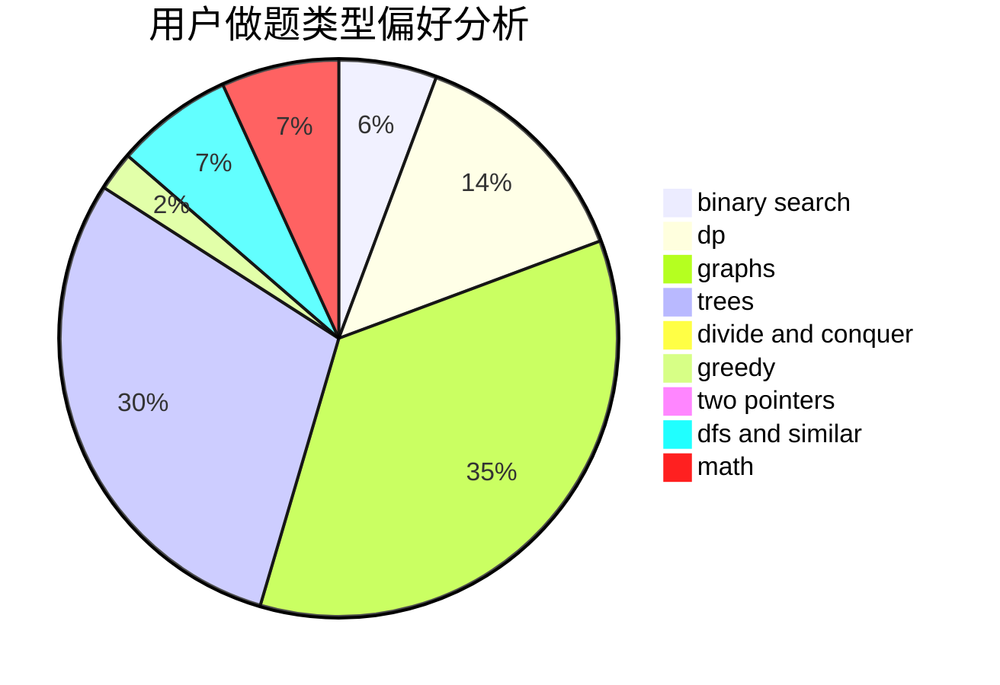

# _XCY_

<!-- tabs:start -->

#### **用户提交结果分析**

#### **用户做题类型偏好分析**

<!-- tabs:end -->
# 推荐题目
[798B](https://codeforces.com/contest/798/problem/B)
[1095A](https://codeforces.com/contest/1095/problem/A)
[85E](https://codeforces.com/contest/85/problem/E)
[518D](https://codeforces.com/contest/518/problem/D)
[10051](https://codeforces.com/contest/1005/problem/1)
[1490C](https://codeforces.com/contest/1490/problem/C)
[1497B](https://codeforces.com/contest/1497/problem/B)
[1491C](https://codeforces.com/contest/1491/problem/C)
[1484C](https://codeforces.com/contest/1484/problem/C)
[1480A](https://codeforces.com/contest/1480/problem/A)
