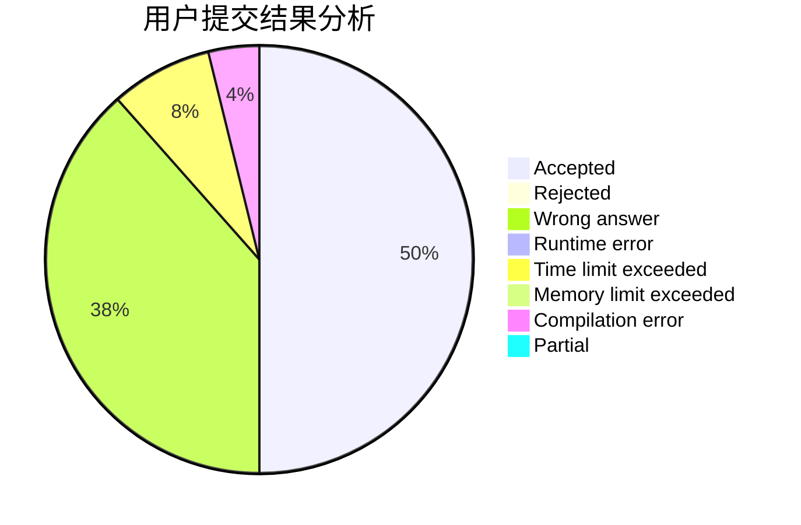
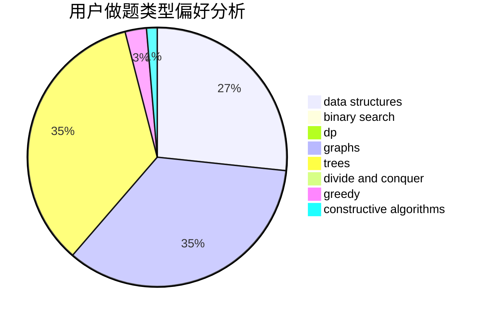
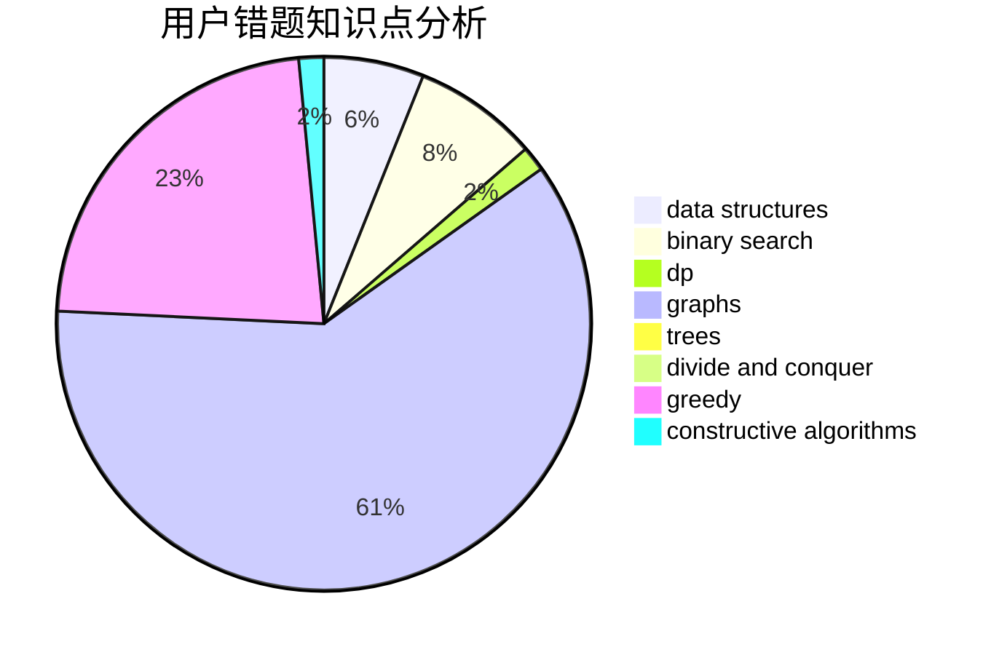

# _XCY_

<!-- tabs:start -->

#### **用户提交结果分析**

#### **用户做题类型偏好分析**

#### **用户错题知识点分析**

<!-- tabs:end -->
# 推荐题目
[798B](https://codeforces.com/contest/798/problem/B)		brute force,
                        dp,
                        strings		  
[1095A](https://codeforces.com/contest/1095/problem/A)		implementation		  
[85E](https://codeforces.com/contest/85/problem/E)		binary search,
                        dsu,
                        geometry,
                        graphs,
                        sortings		  
[518D](https://codeforces.com/contest/518/problem/D)		combinatorics,
                        dp,
                        math,
                        probabilities		  
[10051](https://codeforces.com/contest/1005/problem/1)		dsu,graphs,sortings,trees		  
[1490C](https://codeforces.com/contest/1490/problem/C)		binary search,
                        brute force,
                        brute force,
                        math		  
[1497B](https://codeforces.com/contest/1497/problem/B)		constructive algorithms,
                        greedy,
                        math		  
[1491C](https://codeforces.com/contest/1491/problem/C)		brute force,
                        data structures,
                        dp,
                        greedy,
                        implementation		  
[1484C](https://codeforces.com/contest/1484/problem/C)		dsu,graphs,sortings,trees		  
[1480A](https://codeforces.com/contest/1480/problem/A)		games,
                        greedy,
                        strings		  
