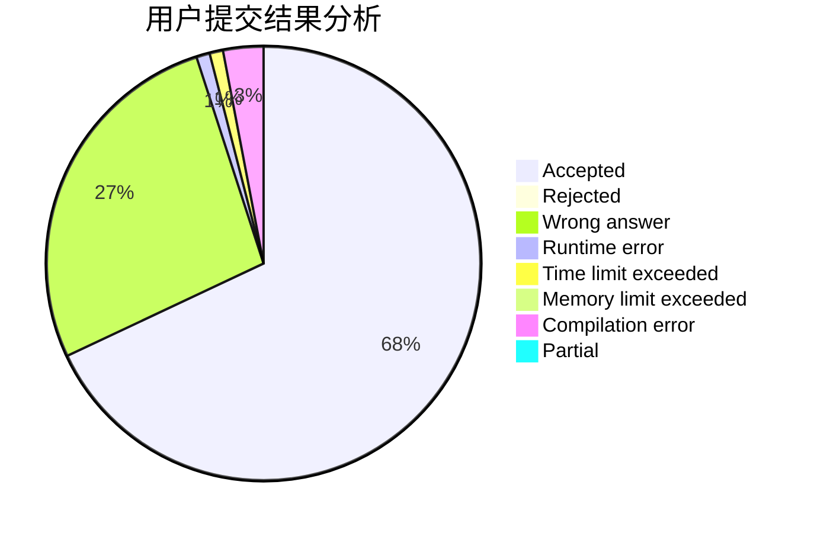
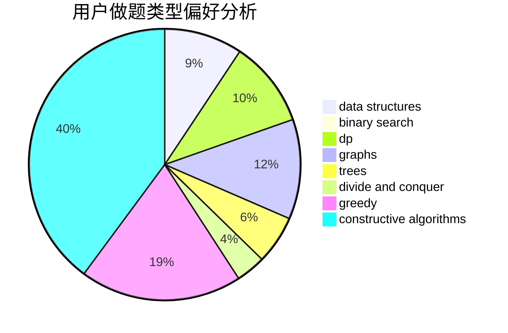
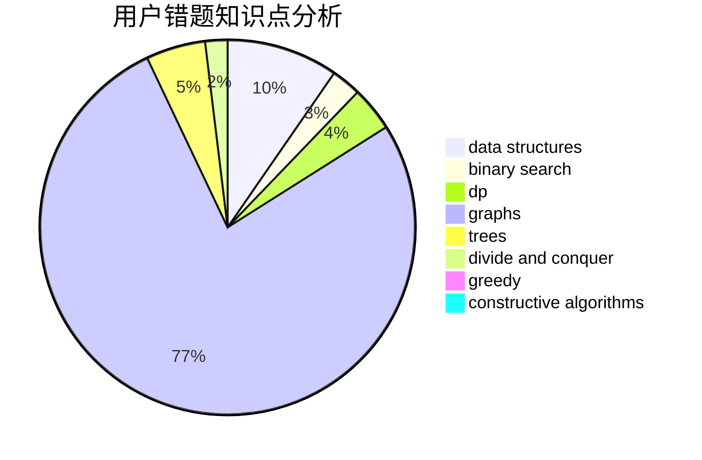

# _Yuanshuai_

<!-- tabs:start -->

#### **用户提交结果分析**

#### **用户做题类型偏好分析**

#### **用户错题知识点分析**

<!-- tabs:end -->
# 推荐题目
[46F](https://codeforces.com/contest/46/problem/F)		dsu,
                        graphs		  
[1382D](https://codeforces.com/contest/1382/problem/D)		dsu,graphs,sortings,trees		  
[895B](https://codeforces.com/contest/895/problem/B)		binary search,
                        math,
                        sortings,
                        two pointers		  
[908H](https://codeforces.com/contest/908/problem/H)		nan		  
[1190B](https://codeforces.com/contest/1190/problem/B)		games		  
[574D](https://codeforces.com/contest/574/problem/D)		dsu,graphs,sortings,trees		  
[965E](https://codeforces.com/contest/965/problem/E)		data structures,
                        dp,
                        greedy,
                        strings,
                        trees		  
[527B](https://codeforces.com/contest/527/problem/B)		greedy		  
[1294F](https://codeforces.com/contest/1294/problem/F)		dfs and similar,
                        dp,
                        greedy,
                        trees		  
[696A](https://codeforces.com/contest/696/problem/A)		brute force,
                        data structures,
                        implementation,
                        trees		  
