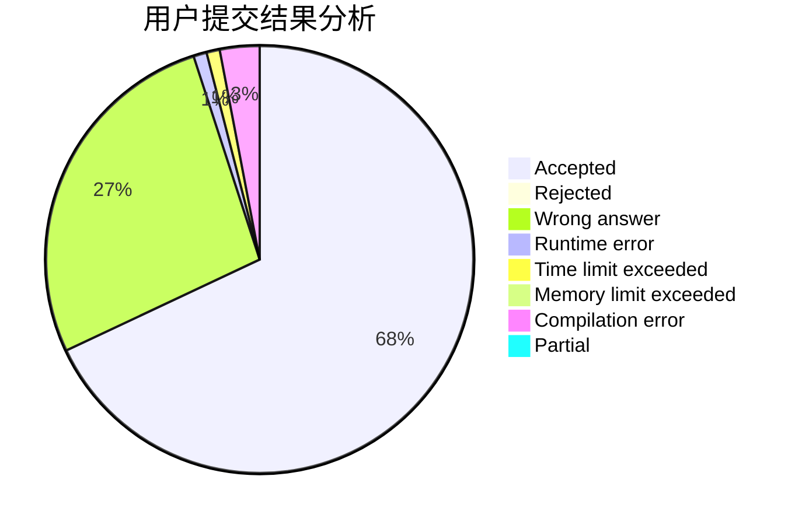
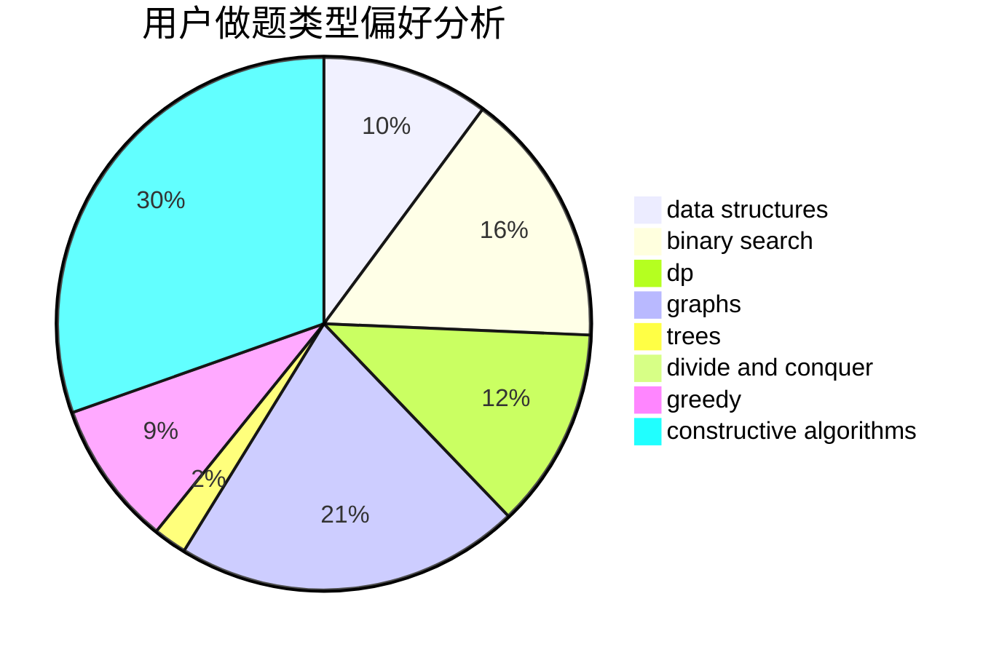
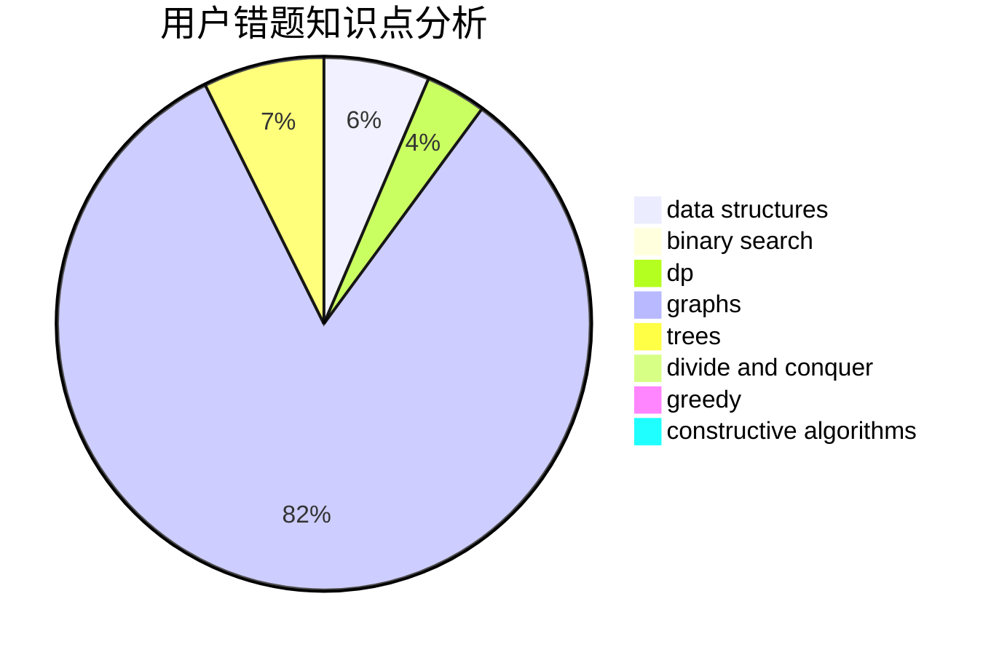

# _Yuanshuai_

<!-- tabs:start -->

#### **用户提交结果分析**

#### **用户做题类型偏好分析**

#### **用户错题知识点分析**

<!-- tabs:end -->
# 推荐题目
[489E](https://codeforces.com/contest/489/problem/E)		binary search,
                        dp		  
[1392G](https://codeforces.com/contest/1392/problem/G)		bitmasks,
                        dfs and similar,
                        dp,
                        math,
                        shortest paths		  
[912E](https://codeforces.com/contest/912/problem/E)		binary search,
                        dfs and similar,
                        math,
                        meet-in-the-middle,
                        number theory,
                        two pointers		  
[923C](https://codeforces.com/contest/923/problem/C)		data structures,
                        greedy,
                        strings,
                        trees		  
[11962](https://codeforces.com/contest/1196/problem/2)		dsu,graphs,sortings,trees		  
[594E](https://codeforces.com/contest/594/problem/E)		string suffix structures,
                        strings		  
[987E](https://codeforces.com/contest/987/problem/E)		dsu,graphs,sortings,trees		  
[551B](https://codeforces.com/contest/551/problem/B)		brute force,
                        constructive algorithms,
                        implementation,
                        strings		  
[1301C](https://codeforces.com/contest/1301/problem/C)		binary search,
                        combinatorics,
                        greedy,
                        math,
                        strings		  
[712C](https://codeforces.com/contest/712/problem/C)		greedy,
                        math		  
