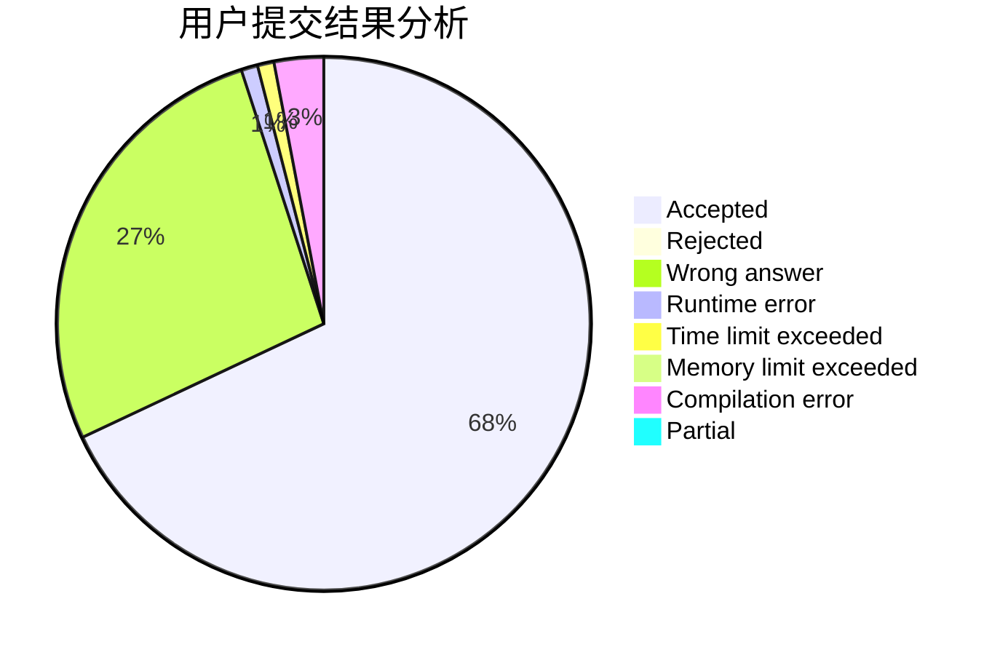
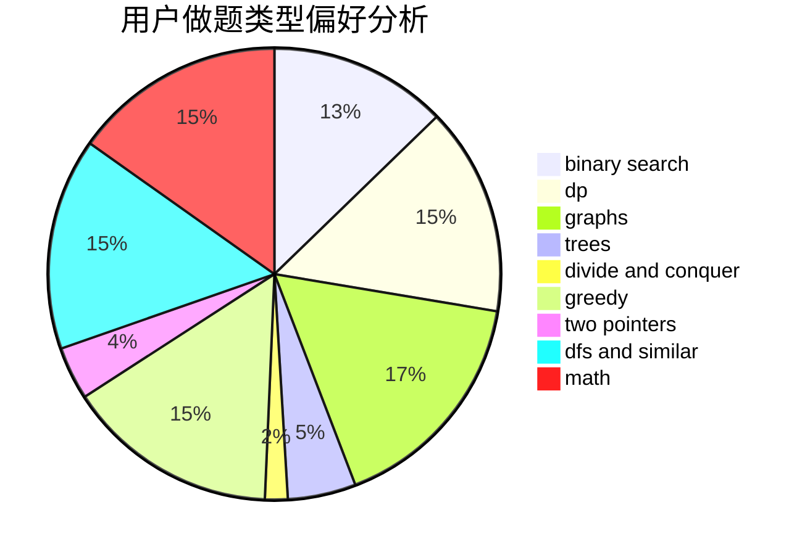

# _Yuanshuai_

<!-- tabs:start -->

#### **用户提交结果分析**

#### **用户做题类型偏好分析**

<!-- tabs:end -->
# 推荐题目
[489E](https://codeforces.com/contest/489/problem/E)
[1392G](https://codeforces.com/contest/1392/problem/G)
[912E](https://codeforces.com/contest/912/problem/E)
[923C](https://codeforces.com/contest/923/problem/C)
[11962](https://codeforces.com/contest/1196/problem/2)
[594E](https://codeforces.com/contest/594/problem/E)
[987E](https://codeforces.com/contest/987/problem/E)
[551B](https://codeforces.com/contest/551/problem/B)
[1301C](https://codeforces.com/contest/1301/problem/C)
[712C](https://codeforces.com/contest/712/problem/C)
