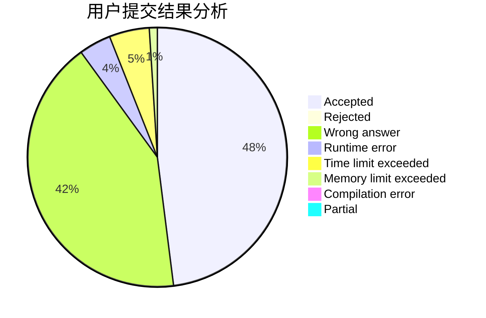
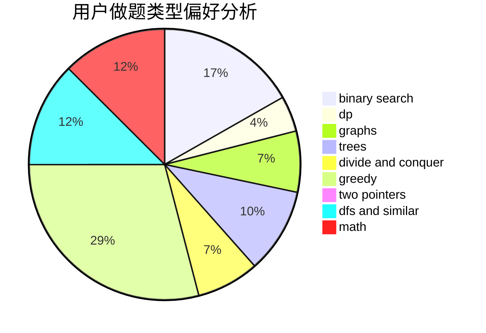

# _ZigZagKmp

<!-- tabs:start -->

#### **用户提交结果分析**

#### **用户做题类型偏好分析**

<!-- tabs:end -->
# 推荐题目
[1479A](https://codeforces.com/contest/1479/problem/A)
[1202A](https://codeforces.com/contest/1202/problem/A)
[1056D](https://codeforces.com/contest/1056/problem/D)
[427D](https://codeforces.com/contest/427/problem/D)
[628D](https://codeforces.com/contest/628/problem/D)
[1483C](https://codeforces.com/contest/1483/problem/C)
[501A](https://codeforces.com/contest/501/problem/A)
[1496F](https://codeforces.com/contest/1496/problem/F)
[4C](https://codeforces.com/contest/4/problem/C)
[1072B](https://codeforces.com/contest/1072/problem/B)
