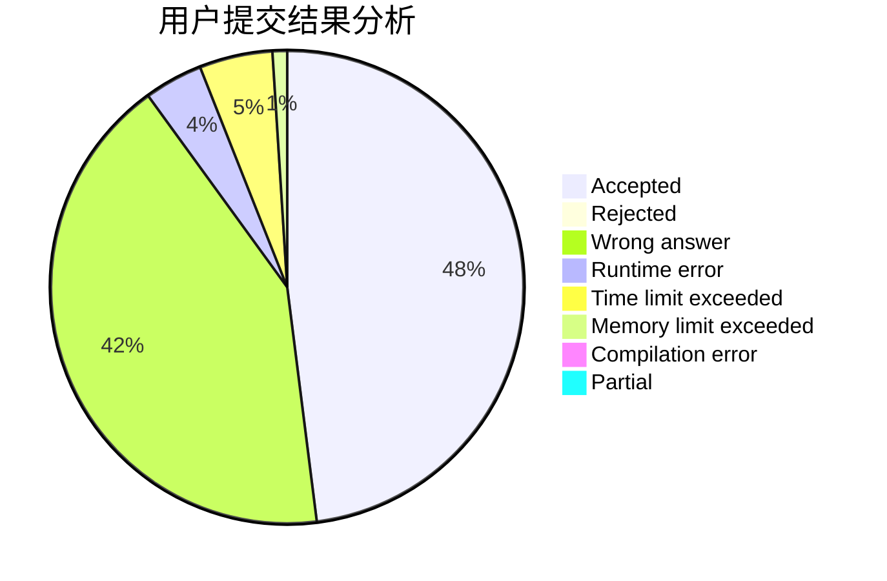
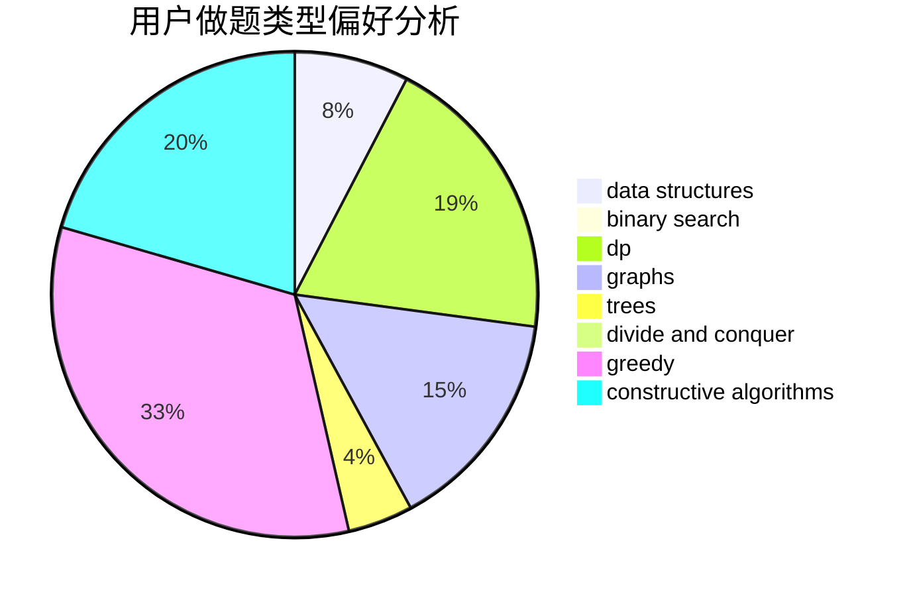

# _ZigZagKmp

<!-- tabs:start -->

#### **用户提交结果分析**

#### **用户做题类型偏好分析**

#### **用户错题知识点分析**

<!-- tabs:end -->
# 推荐题目
[1470F](https://codeforces.com/contest/1470/problem/F)		divide and conquer		  
[1198C](https://codeforces.com/contest/1198/problem/C)		constructive algorithms,
                        graphs,
                        greedy,
                        sortings		  
[1056A](https://codeforces.com/contest/1056/problem/A)		implementation		  
[39H](https://codeforces.com/contest/39/problem/H)		implementation		  
[609D](https://codeforces.com/contest/609/problem/D)		binary search,
                        greedy,
                        two pointers		  
[1474F](https://codeforces.com/contest/1474/problem/F)		dp,
                        math,
                        matrices		  
[482C](https://codeforces.com/contest/482/problem/C)		bitmasks,
                        dp,
                        probabilities		  
[1488H](https://codeforces.com/contest/1488/problem/H)		*special problem,
                        combinatorics,
                        data structures		  
[47B](https://codeforces.com/contest/47/problem/B)		implementation		  
[1071C](https://codeforces.com/contest/1071/problem/C)		dsu,graphs,sortings,trees		  
