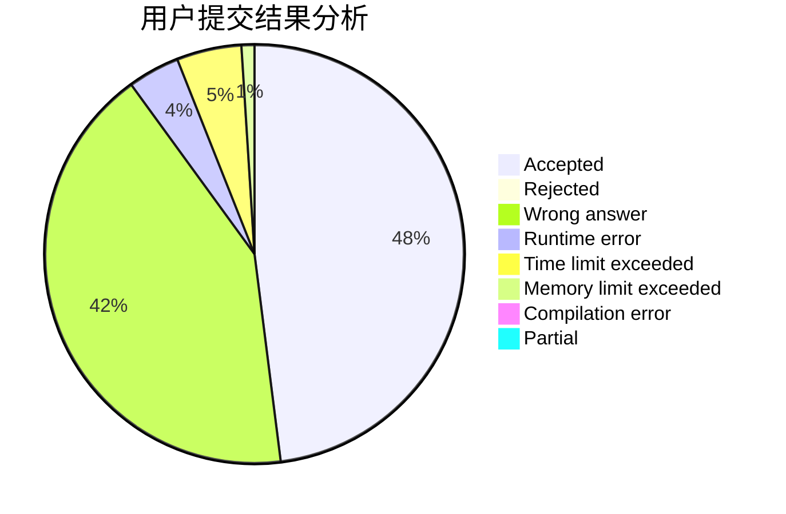
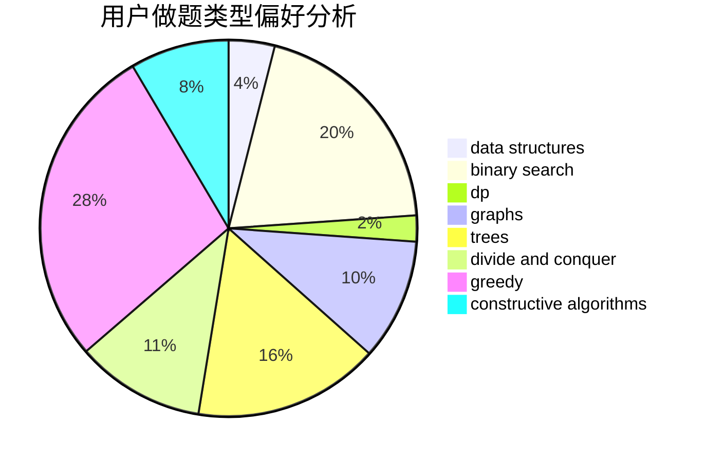

# _ZigZagKmp

<!-- tabs:start -->

#### **用户提交结果分析**

#### **用户做题类型偏好分析**

#### **用户错题知识点分析**

<!-- tabs:end -->
# 推荐题目
[1479A](https://codeforces.com/contest/1479/problem/A)		binary search,
                        interactive,
                        ternary search		  
[1202A](https://codeforces.com/contest/1202/problem/A)		bitmasks,
                        greedy		  
[1056D](https://codeforces.com/contest/1056/problem/D)		constructive algorithms,
                        dfs and similar,
                        dp,
                        graphs,
                        greedy,
                        sortings,
                        trees		  
[427D](https://codeforces.com/contest/427/problem/D)		dp,
                        string suffix structures,
                        strings		  
[628D](https://codeforces.com/contest/628/problem/D)		dp		  
[1483C](https://codeforces.com/contest/1483/problem/C)		dsu,graphs,sortings,trees		  
[501A](https://codeforces.com/contest/501/problem/A)		implementation		  
[1496F](https://codeforces.com/contest/1496/problem/F)		dsu,graphs,sortings,trees		  
[4C](https://codeforces.com/contest/4/problem/C)		data structures,
                        hashing,
                        implementation		  
[1072B](https://codeforces.com/contest/1072/problem/B)		dsu,graphs,sortings,trees		  
