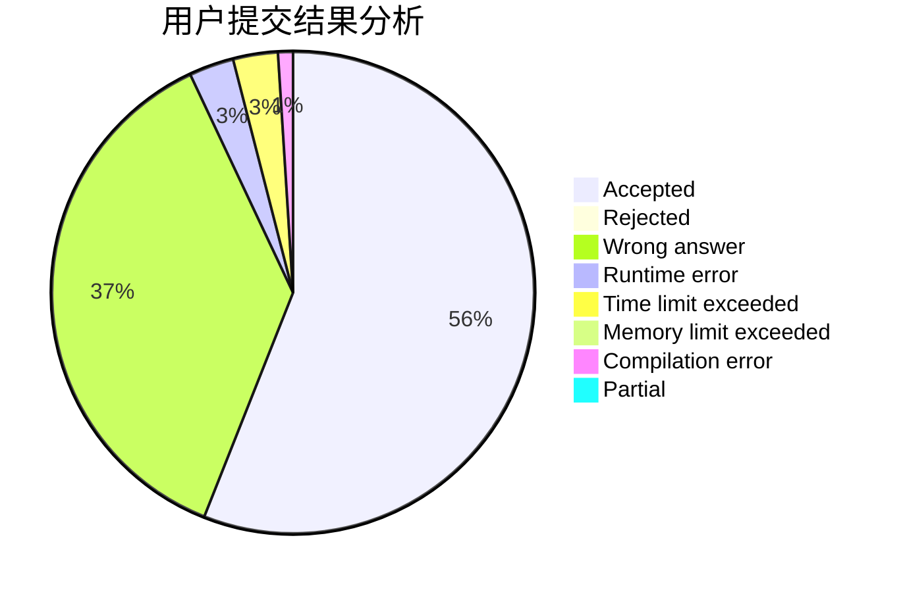
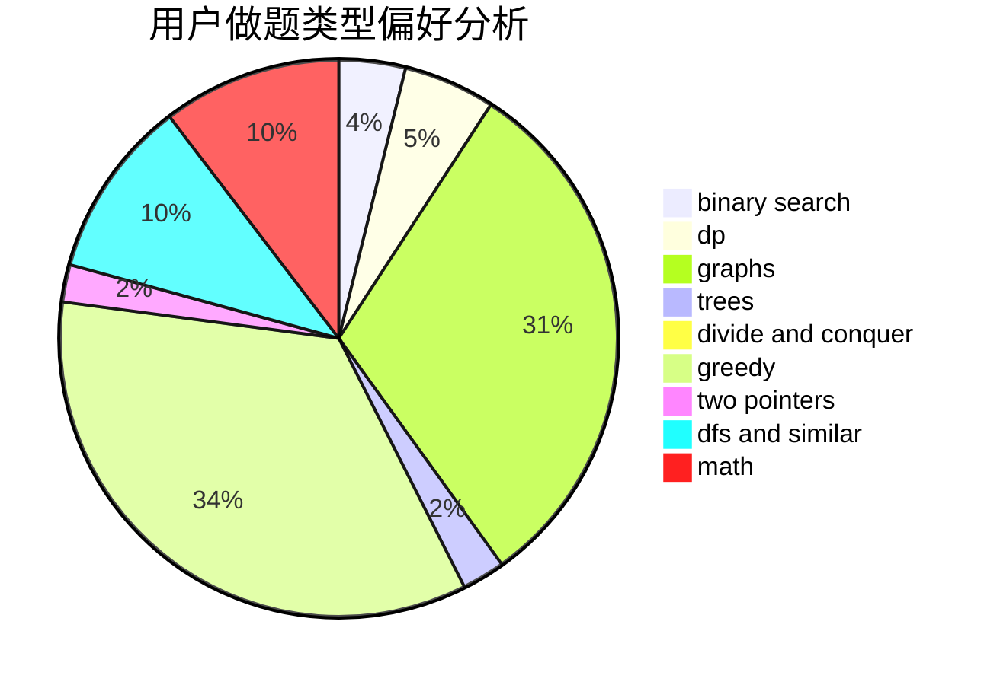

# Alsophila

<!-- tabs:start -->

#### **用户提交结果分析**

#### **用户做题类型偏好分析**

<!-- tabs:end -->
# 推荐题目
[304D](https://codeforces.com/contest/304/problem/D)
[1279E](https://codeforces.com/contest/1279/problem/E)
[304C](https://codeforces.com/contest/304/problem/C)
[300E](https://codeforces.com/contest/300/problem/E)
[1214C](https://codeforces.com/contest/1214/problem/C)
[1033B](https://codeforces.com/contest/1033/problem/B)
[300B](https://codeforces.com/contest/300/problem/B)
[300C](https://codeforces.com/contest/300/problem/C)
[303B](https://codeforces.com/contest/303/problem/B)
[1238E](https://codeforces.com/contest/1238/problem/E)
