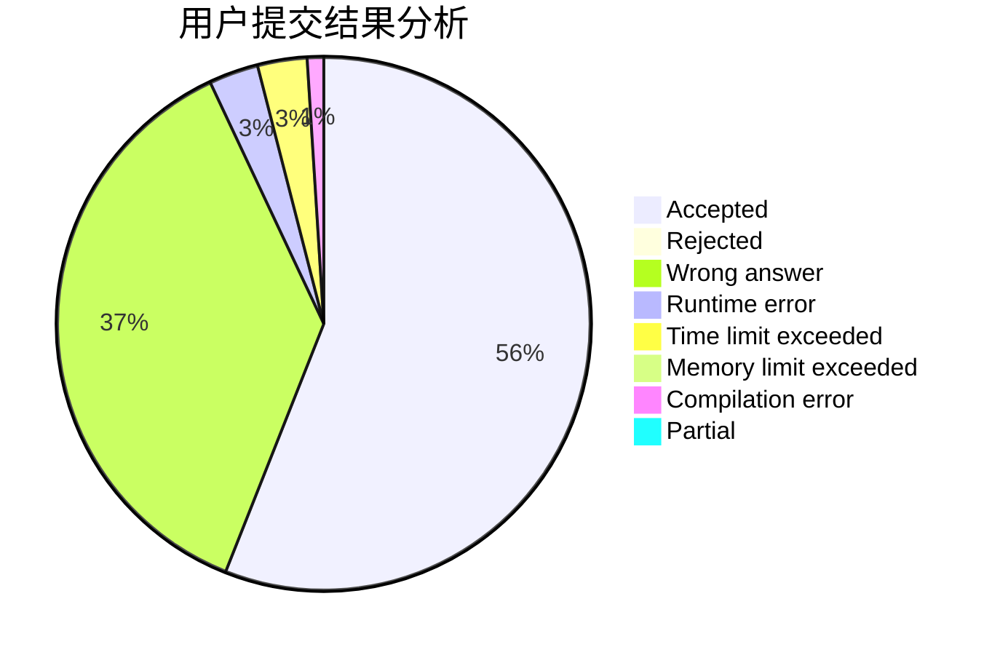
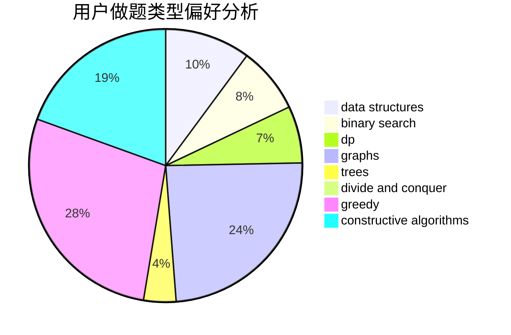
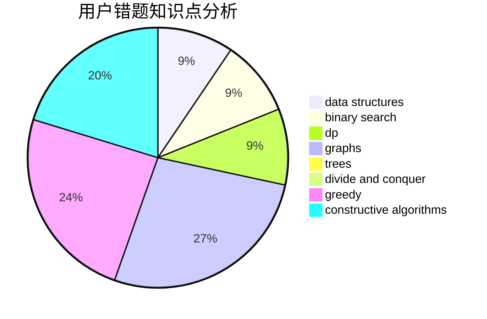

# Alsophila

<!-- tabs:start -->

#### **用户提交结果分析**

#### **用户做题类型偏好分析**

#### **用户错题知识点分析**

<!-- tabs:end -->
# 推荐题目
[304D](https://codeforces.com/contest/304/problem/D)		dsu,graphs,sortings,trees		  
[1279E](https://codeforces.com/contest/1279/problem/E)		combinatorics,
                        dp		  
[304C](https://codeforces.com/contest/304/problem/C)		dsu,graphs,sortings,trees		  
[300E](https://codeforces.com/contest/300/problem/E)		binary search,
                        math,
                        number theory		  
[1214C](https://codeforces.com/contest/1214/problem/C)		data structures,
                        greedy		  
[1033B](https://codeforces.com/contest/1033/problem/B)		math,
                        number theory		  
[300B](https://codeforces.com/contest/300/problem/B)		brute force,
                        dfs and similar,
                        graphs		  
[300C](https://codeforces.com/contest/300/problem/C)		brute force,
                        combinatorics		  
[303B](https://codeforces.com/contest/303/problem/B)		implementation,
                        math		  
[1238E](https://codeforces.com/contest/1238/problem/E)		bitmasks,
                        dp		  
