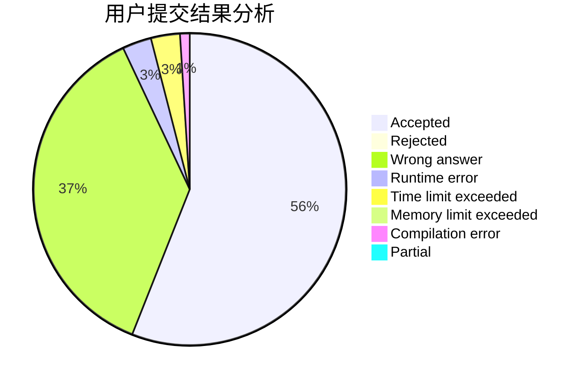
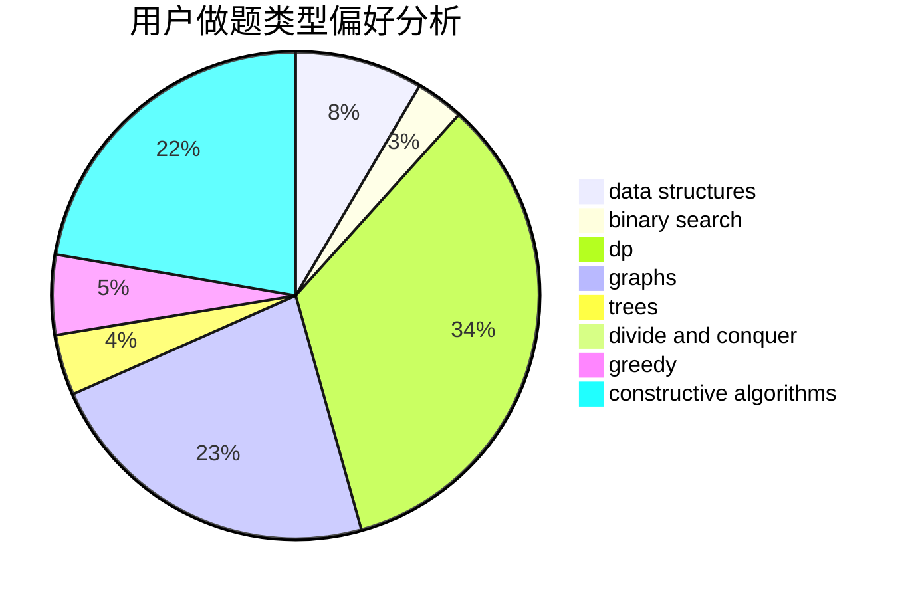
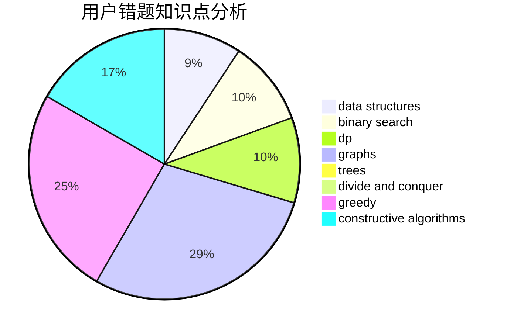

# Alsophila

<!-- tabs:start -->

#### **用户提交结果分析**

#### **用户做题类型偏好分析**

#### **用户错题知识点分析**

<!-- tabs:end -->
# 推荐题目
[28D](https://codeforces.com/contest/28/problem/D)		binary search,
                        data structures,
                        dp,
                        hashing		  
[1270E](https://codeforces.com/contest/1270/problem/E)		constructive algorithms,
                        geometry,
                        math		  
[28C](https://codeforces.com/contest/28/problem/C)		combinatorics,
                        dp,
                        probabilities		  
[286D](https://codeforces.com/contest/286/problem/D)		data structures,
                        sortings		  
[1208F](https://codeforces.com/contest/1208/problem/F)		bitmasks,
                        dfs and similar,
                        dp,
                        greedy		  
[1032E](https://codeforces.com/contest/1032/problem/E)		dp,
                        math		  
[286A](https://codeforces.com/contest/286/problem/A)		constructive algorithms,
                        math		  
[286B](https://codeforces.com/contest/286/problem/B)		implementation		  
[289B](https://codeforces.com/contest/289/problem/B)		brute force,
                        dp,
                        implementation,
                        sortings,
                        ternary search		  
[1230A](https://codeforces.com/contest/1230/problem/A)		brute force,
                        implementation		  
